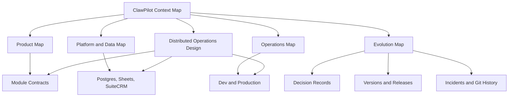

# ClawPilot Context Map

Use this note when the question spans more than one module. It is the root of the ClawPilot knowledge graph and links current behavior to the decisions and operating evidence that explain it.

## Start Here

- [Product Map](product-map.md): user journeys and module boundaries.
- [Platform and Data Map](platform-data-map.md): systems of record, identities, synchronization, and integration boundaries.
- [Operations Map](operations-map.md): environments, deployment, recovery, credentials, and provider runbooks.
- [Evolution Map](evolution-map.md): decisions, releases, incidents, and implementation evidence.
- [Decision Index](../decisions/index.md): accepted architecture and product decisions.
- [Distributed Operations Integration and Gap Map](distributed-operations-integration-gap-map.md): pre-activation DOM, WMS, 3PL, and adapter discovery.

## Context Graph

## Retrieval Rules

1. Start in the closest map rather than searching folders by name.
2. Read an active contract for current behavior.
3. Read a decision record when the reason or tradeoff matters.
4. Read the Versions surface and release contract for what shipped.
5. Use incidents, pull requests, and Git history only for implementation or historical evidence.

The in-app Docs catalog vectors every note marked `app_visible: true`. Maps and decision records are therefore retrieval anchors as well as Obsidian navigation pages.
