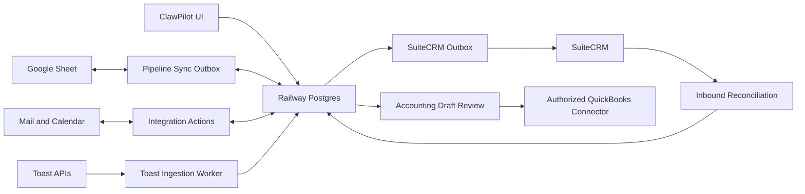

# Platform and Data Map

## Authority By Data Type

| Concern | Authority | Projection or operator surface |
| --- | --- | --- |
| Users, organizations, boards, tasks, docs, short links, audit, execution | Railway Postgres | ClawPilot UI |
| Pipeline operator rows | Managed Google Sheet | Postgres pipeline projection and CRM |
| CRM application modules and subpanels | ClawPilot Postgres model | SuiteCRM |
| Calendar and email provider state | Connected user account | ClawPilot CRM interactions and meetings |
| Deployment history | Postgres release entries | Versions and Build Brief |
| Repository knowledge | Git-tracked Markdown | Owner Docs catalog and vectors |
| Toast restaurant sales and orders | Toast read-only APIs | Immutable snapshots, daily projections, and accounting drafts in Postgres |
| Posted accounting transactions | Connected QuickBooks company | Approved accounting outbox and provider transaction reference |

## Identity Graph

- Workspace organizations and app users have permanent random Global IDs.
- CRM accounts, contacts, products, leads, opportunities, meetings, interactions, and campaigns use module-specific Global IDs.
- Global IDs are never reused after archive or deletion.
- Organization membership defines data scope; global application permissions are a separate control.
- See [Organization-Rooted Tenancy](../decisions/0002-organization-rooted-tenancy.md) and [CRM Global Identity and Synchronization](../decisions/0003-crm-global-identity-and-sync.md).

## Synchronization Graph

## Connected Contracts

- [Pipeline and Synchronization](../modules/pipeline-and-sync.md)
- [CRM and Workbook Reporting](../modules/crm-and-reporting.md)
- [User Integrations and Credentials](../modules/user-integrations.md)
- [Toast Sales and Accounting](../modules/toast-and-accounting.md)
- [Shared Short Links](../modules/short-links.md)
- [Postgres and Sheets Authority](../decisions/0001-postgres-and-sheets-authority.md)
- [Google Workspace Integration](../operations/google-workspace-integration.md)
- [SuiteCRM Railway Runbook](../operations/suitecrm.md)
