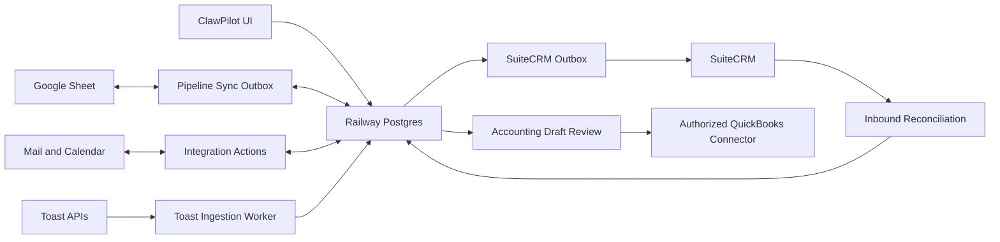

# Platform and Data Map

## Authority By Data Type

| Concern | Authority | Projection or operator surface |
| --- | --- | --- |
| Users, organizations, boards, tasks, docs, short links, audit, execution | Railway Postgres | ClawPilot UI |
| Pipeline operator rows | Managed Google Sheet | Postgres pipeline projection and CRM |
| CRM application modules and subpanels | ClawPilot Postgres model | SuiteCRM |
| Calendar and email provider state | Connected user account | ClawPilot CRM interactions and meetings |
| Deployment history | Postgres release entries | Versions and Build Brief |
| Repository knowledge | Git-tracked Markdown | Owner Docs catalog and vectors |
| Toast restaurant sales and orders | Toast read-only APIs | Immutable snapshots, sanitized POS orders, daily projections, and accounting drafts in Postgres |
| Posted accounting transactions | Connected QuickBooks company | Approved accounting outbox and provider transaction reference |
| Planned distributed operations state and evidence | Railway Postgres operations domain | Native operations UI, read models, and idempotent provider adapters |

## Identity Graph

- Workspace organizations and app users have permanent random Global IDs.
- CRM accounts, contacts, products, leads, opportunities, meetings, interactions, and campaigns use module-specific Global IDs.
- Global IDs are never reused after archive or deletion.
- A user may belong to multiple independent root workspace organizations. The active browser-session membership defines data scope; global application permissions are a separate control.
- See [Organization-Rooted Tenancy](../decisions/0002-organization-rooted-tenancy.md) and [CRM Global Identity and Synchronization](../decisions/0003-crm-global-identity-and-sync.md).
- See [Multi-Workspace User Membership](../decisions/0005-multi-workspace-membership.md) for peer-business isolation and switching.
- Planned operations aggregates extend the same permanent registry and reference existing CRM customer/product Global IDs; see the [distributed operations contract](../modules/distributed-operations.md).

## Planned Distributed Operations Boundary

The accepted [operations authority decision](../decisions/0006-native-distributed-operations-authority.md) makes Postgres authoritative for canonical orders, inventory ledger and positions, reservations, plans, warehouse execution, shipments, and billable facts. Commerce, carrier, optimizer, printer, and accounting systems connect through narrow adapters and cannot mutate domain state directly. The [integration and gap map](distributed-operations-integration-gap-map.md) distinguishes current platform reuse from migration `0081` proposals and runtime gaps.

## Synchronization Graph

## Connected Contracts

- [Pipeline and Synchronization](../modules/pipeline-and-sync.md)
- [CRM and Workbook Reporting](../modules/crm-and-reporting.md)
- [User Integrations and Credentials](../modules/user-integrations.md)
- [Toast POS and Accounting](../modules/toast-and-accounting.md)
- [QuickBooks Accounting Connector](../modules/quickbooks-accounting.md)
- [Shared Short Links](../modules/short-links.md)
- [Postgres and Sheets Authority](../decisions/0001-postgres-and-sheets-authority.md)
- [Google Workspace Integration](../operations/google-workspace-integration.md)
- [SuiteCRM Railway Runbook](../operations/suitecrm.md)
- [Distributed Operations](../modules/distributed-operations.md)
- [Native Distributed Operations Authority and Adapter Boundaries](../decisions/0006-native-distributed-operations-authority.md)
