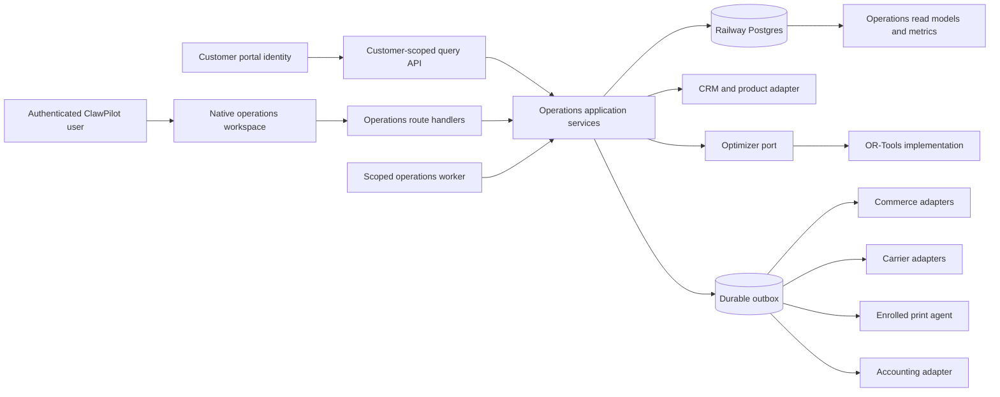
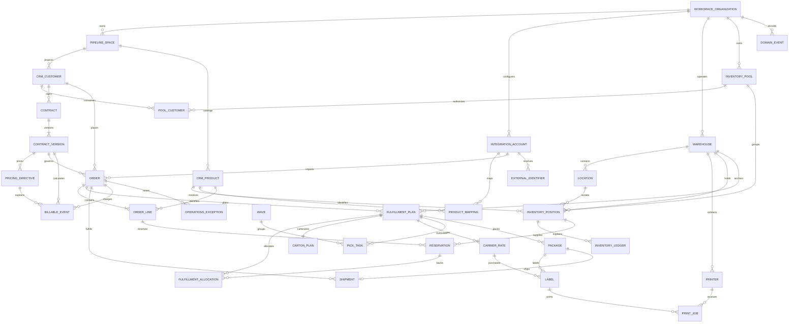
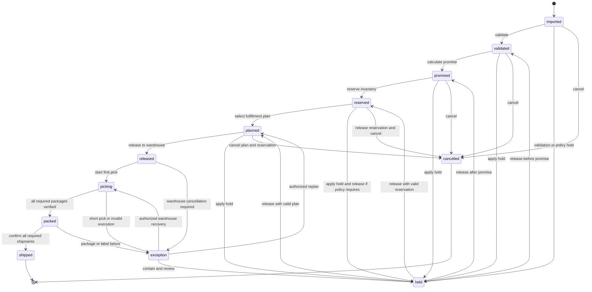
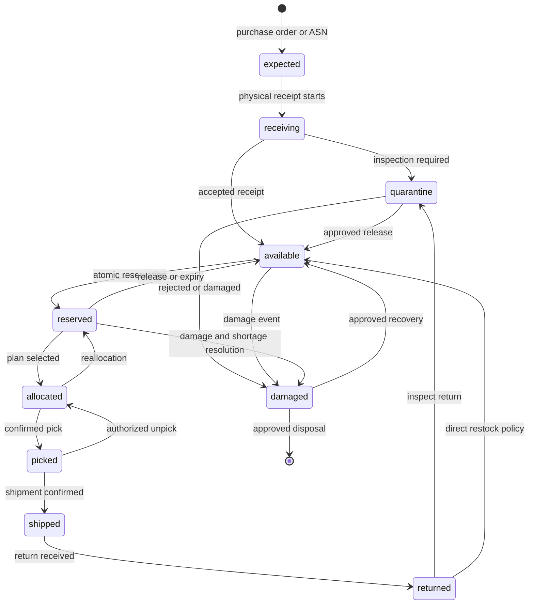
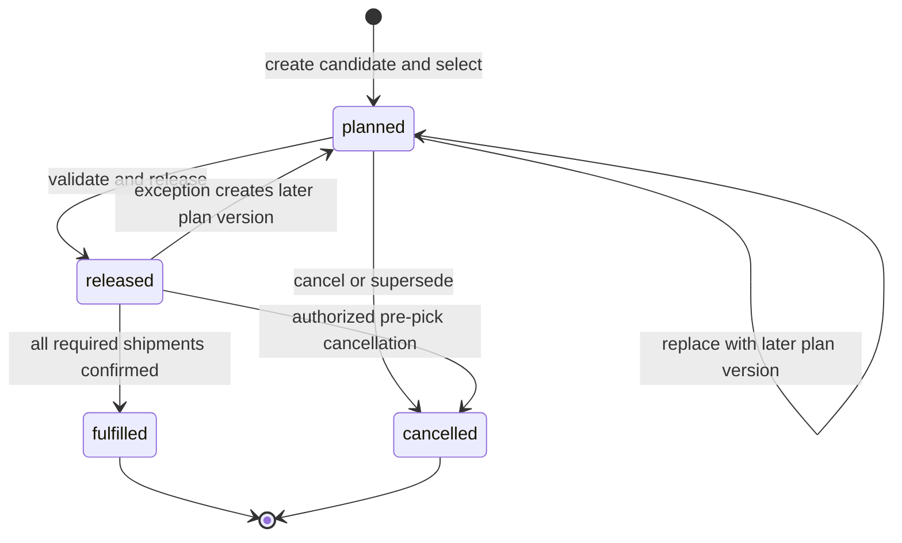
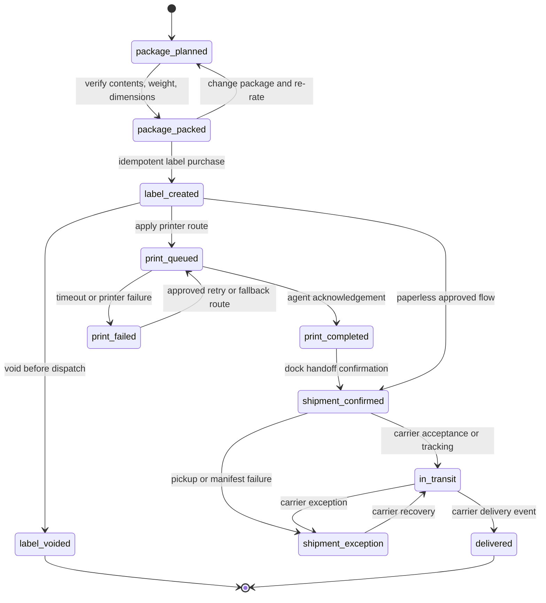
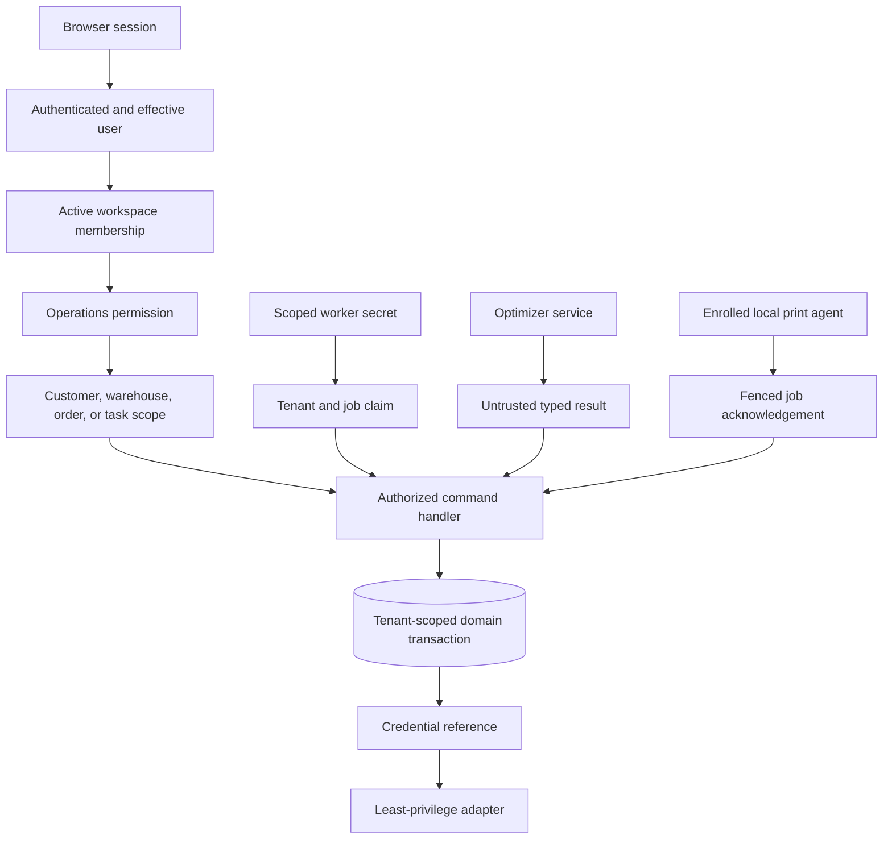

# Distributed Operations

## Purpose And Activation Status

Provide native distributed order management, warehouse execution, carrier shipping, and 3PL billing inside ClawPilot. The module serves 3PL operators, retailers, distributors, manufacturers, and fulfillment operators without creating a second application or duplicating CRM, product, identity, audit, task, document, notification, or accounting masters.

This document remains the **target contract** for the full module. The current development slice includes migrations `0081_distributed_operations_foundation.sql` and `0082_operations_activation_and_command_safety.sql`, a tenant-scoped order workbench, a deterministic 20-step mock order-to-ship proof, a durable exception queue, scoped activation controls, canonical CRM catalog projection, provider-customer resolution, and command receipts. These features prove PostgreSQL authority and application boundaries; they do not establish a production commerce, carrier, printer, optimizer, warehouse, or accounting provider.

## Current Development Slice

The implemented slice provides:

- Postgres-only operations access scoped to the active workspace and explicit `viewOperations`, `manageOperations`, and execution permissions;
- CRM organization and `gp` product resolution without cloning customer or catalog masters;
- one explicit CRM data pipeline per workspace, deduplicated customer and product catalogs by permanent Global ID, and deterministic provider-customer matching with review-required staging for ambiguous or unmatched identities;
- idempotent mock order import, reservation, deterministic warehouse planning, cartonization, carrier selection, pick/pack/ship, inventory-ledger evidence, billable facts, domain events, audit, and fulfillment outbox intent;
- organization-scoped `disabled`, `shadow`, `read_only`, `active`, and `frozen` activation state with revision, reason, actor, and audit history;
- durable command receipts that bind idempotency key, request hash, actor, correlation, status, result, attempts, and safe failure evidence;
- responsive Orders and Exceptions views with permanent `gor` and `gex` identities;
- audited exception transitions for acknowledge, resolve, dismiss, and reopen, with tenant isolation and retained resolution history;
- an in-module guide that clearly labels all active providers as mocks;
- disposable PostgreSQL acceptance coverage that applies the full migration chain and validates atomic writes, replay, rollback, append-only evidence, money totals, and cross-workspace isolation.

Production activation remains out of scope until later delivery gates verify provider credentials, webhook receipts, provider attempts, reconciliation, complete operational health, recovery commands, and an explicitly approved integration and warehouse cohort.

Normative terms in this document use **must** for an invariant, **should** for the default, and **may** for an allowed option.

## Architectural Principles

1. ClawPilot and Railway Postgres own operational state and evidence. Google Sheets has no write authority for orders, inventory, fulfillment, shipments, or charges.
2. The active workspace organization is the tenant boundary. An authorized pipeline binds the first slice to current CRM customer and product projections, but it does not own operations data.
3. CRM organizations, contacts, and products retain their existing `ga`, `gc`, and `gp` identities and SuiteCRM authority. Operations reference them; operations do not clone them.
4. UUIDs are internal relational keys. Permanent Global IDs are the public and cross-module business identities. Provider IDs, SKUs, order numbers, tracking numbers, emails, and warehouse codes are aliases only.
5. Inventory ledger entries, domain events, billable facts, pricing snapshots, provider responses used for decisions, and audit records are immutable. Corrections use compensating records.
6. Consequential commands are authenticated, tenant-scoped, authorized, idempotent, concurrency-safe, audited, and observable.
7. Provider calls occur behind adapters. A provider adapter cannot select policy, mutate domain tables, or authorize itself.
8. Optimization is advisory computation behind a replaceable interface. Hard constraints, state transitions, permissions, and financial calculations remain deterministic application responsibilities.
9. An AI feature may explain or recommend. It cannot own inventory, calculate authoritative charges, buy labels, confirm shipments, or execute an override.
10. The first production slice is outbound parcel fulfillment. Advanced inbound, returns, lot/serial control, kitting, freight, and labor planning activate only after their own data and operating gates pass.

## System Context



The route handler authenticates and validates transport. The application service owns policy, transactions, state transitions, and idempotency. Persistence adapters own SQL. External adapters own protocol translation only.

## Bounded Contexts And Authority

| Context | Owns | References or publishes | Does not own |
| --- | --- | --- | --- |
| Order intake | Canonical order snapshot, source identifiers, validation, holds, edits, cancellations | CRM customer/product IDs, contract version, `order.*` events | CRM customer master, provider order record |
| Inventory | Pools, eligibility, physical positions, reservations, immutable ledger, reconciled balances | CRM product and inventory-owner IDs, `inventory.*` events | Product master, provider inventory counter |
| Promise and fulfillment | Promise explanation, candidate plans, selected plan, allocations, overrides, variance | Inventory, facilities, package/rate snapshots, contract policies | Inventory ledger or carrier transaction |
| Warehouse execution | Waves, pick tasks, scans, short-pick decisions, packs, station work | Plans, locations, Tasks for exception work | Generic project/task lifecycle |
| Shipping | Carrier rates, package facts, label attempts, labels, print jobs, shipments, tracking observations | Carrier account, documents, `shipment.*` events | Carrier account master or printer transport |
| Contracts and 3PL billing | Native contract versions, pricing directives, estimated/accrued/final billable facts, credits | CRM customer, operational source, accounting export | CRM customer master, accounting ledger, invoice provider |
| Exceptions | Operations exception status, severity, source, recommendation, resolution evidence | Projects task link and future Case link | Project task or CRM Case data |
| Integration control | Operations account metadata, capability/version, external IDs, cursors, receipts, attempts, health | Secret reference and adapter outbox | Plaintext credentials |
| Reporting | Tenant-scoped order, inventory, service, cost, margin, and exception projections | Immutable facts and versioned snapshots | Source-of-truth mutations |

## Identity, Units, And Time

- Every aggregate and externally referenced child receives one immutable Global ID from the shared registry. `0081` proposes `gor`, `gol`, `gwh`, `gwl`, `gip`, `giv`, `gld`, `grs`, `gct`, `gcv`, `gpd`, `gfp`, `gfa`, `gcp`, `grt`, `gwv`, `gpk`, `gpa`, `glb`, `gsh`, `gpr`, `gpj`, `gbe`, `gia`, `gpm`, `gex`, `gev`, and `grl`.
- Quote, return, inventory unit/LPN, lot, serial, receipt, manifest, and any separate fulfillment-order identities must be allocated before those aggregates ship.
- Cross-module payloads carry Global IDs. Database relationships also carry tenant-scoped UUID foreign keys for integrity.
- Money uses integer minor units plus ISO 4217 currency. Percentage and quantity calculations use PostgreSQL `numeric`; binary floating point is forbidden for authoritative results.
- Weight, dimensions, volume, quantity, and UOM are explicit. The first slice normalizes weight to grams and dimensions to millimeters but retains source unit and conversion provenance.
- Canonical timestamps are UTC. Warehouse calendars, cutoffs, and display calculations name an IANA facility timezone.
- Address, product, contract, inventory, carton, rate, and rule inputs used for a promise or charge are versioned snapshots; later master-data edits do not rewrite history.

## Logical Entity Relationship Model

This diagram shows the foundation relationship model. The [gap map](../maps/distributed-operations-integration-gap-map.md) names target entities that are not present in `0081`.



Every entity with a Global ID also references the shared Global ID registry. `organization_id` is required on every tenant-owned table even when another relationship implies it. Composite foreign keys prevent a child row from crossing organizations.

## Aggregate Invariants

| Aggregate | Transaction boundary | Required invariant |
| --- | --- | --- |
| Order | Order, lines, source receipt, external IDs, first event | One canonical order per organization, integration account, and provider order ID. Lines resolve to authorized CRM products before reservation. |
| Inventory position | Position, reservation, ledger row, event | `available = on_hand - reserved - damaged - quarantine - other unavailable`; no committed mutation may make any protected bucket negative. |
| Contract version | Version, directives, approval evidence | Published terms are immutable, effective ranges do not overlap for the same scope/precedence, and historical facts retain the exact version. |
| Fulfillment plan | Input snapshot, candidates, selected plan, allocations, promise, explanation | Every allocation is backed by an active reservation; selected plans satisfy hard constraints unless an explicit authorized exception records the violation. |
| Package and label | Package version, rate snapshot, provider attempt, label | One idempotent purchase result per package version and carrier account. A package change invalidates the selected rate and unshipped label. |
| Shipment | Shipment, package/label links, inventory consume/ship ledger, event, outbox | Confirmation happens once, only for packed/labeled packages, and atomically consumes the reserved inventory represented by the plan. |
| Billable fact | Operational source, contract version, directive, calculation snapshot | The same source/directive/charge kind emits at most one fact. Correction uses credit/rebill facts, never mutation. |

## Order State Machine

The foundation order statuses are the first-slice vocabulary. Holds and exceptions are explicit states with reason and prior-state evidence. A transition command must validate the current `row_version`, actor permission, required children, and idempotency receipt.



Order edits before release create a new order revision, invalidate affected promises/plans, and adjust reservations in one command. Edits after release require a warehouse exception workflow. Shipped quantity is never reversed by changing order status; returns use a separate aggregate.

## Inventory State Machine

Inventory is event-sourced by quantity segment, not by mutating a single unit status. The ledger is authoritative and positions are materialized balances. The full target vocabulary below exceeds `0081`, which currently projects only on-hand, reserved, and damaged quantities.



Every transition writes balanced quantity deltas with before/after values, source Global ID, actor, reason, and idempotency key. Ownership, pool eligibility, lot/serial, expiration, UOM, facility, and location remain attached throughout movement. Borrowing or cross-allocation is a separate authorized ledger event with source owner, consumer, contract rule, approval, and charge.

## Fulfillment State Machine

A fulfillment plan is immutable by version after release. Re-optimization or manual override creates a later version with a link to the prior plan and a quantified financial effect.



Wave state is `planned -> released -> in_progress -> completed`, with `cancelled` allowed before completion. Pick-task state is `ready -> in_progress -> picked`, with `short` and `cancelled` as explicit outcomes. A short pick never silently decrements the requested quantity; it triggers deterministic reallocation or an exception.

## Shipment State Machine

Package, label, print, and shipment states remain distinct. A print confirms document delivery to an enrolled agent; it does not confirm the parcel shipped.



A package edit before confirmation creates a new package version, voids or supersedes any unshipped label through an idempotent carrier command, re-cartonizes as needed, re-rates, and recalculates estimated charge and margin. A provider timeout produces an unknown outcome until reconciliation proves whether a label exists; retrying with the same provider idempotency key cannot purchase a second label.

## Event Contract

Domain events record business facts. Audit events record who invoked or observed a consequential action. Outbox rows deliver side effects. These are related but not interchangeable.

```json
{
  "eventGlobalId": "gev1234567",
  "eventType": "inventory.reserved",
  "eventVersion": 1,
  "organizationId": "internal-organization-uuid",
  "organizationGlobalId": "ga1234567",
  "aggregateType": "operations.reservation",
  "aggregateGlobalId": "grs1234567",
  "correlationId": "request-or-workflow-uuid",
  "causationEventGlobalId": "gev7654321",
  "occurredAt": "2026-07-22T12:00:00.000Z",
  "actor": { "type": "user", "globalId": "gu1234567" },
  "idempotencyKey": "reserve:gor1234567:revision-3",
  "payload": { "schema": "operations.inventory.reserved.v1" }
}
```

Event payloads use allowlisted, versioned schemas and Global IDs. They exclude credentials, full addresses, raw labels, unrestricted provider payloads, and unnecessary personal data. A consumer must reject an unsupported major version and deduplicate on event Global ID or the consumer-specific idempotency key.

| Event family | Required events | Primary consumers |
| --- | --- | --- |
| Order | `order.imported`, `order.validated`, `order.held`, `order.released`, `order.cancelled` | Workbench projection, exception policy, commerce export |
| Promise and inventory | `promise.calculated`, `inventory.reserved`, `inventory.reservation_failed`, `inventory.released`, `inventory.reconciled` | Availability projection, plan service, alerts |
| Allocation and plan | `allocation.completed`, `allocation.failed`, `fulfillment.plan_selected`, `fulfillment.plan_overridden` | Warehouse release, margin variance, audit |
| Warehouse | `wave.created`, `wave.released`, `pick.started`, `pick.completed`, `pick.short` | Work queues, billable facts, exceptions |
| Package and shipping | `package.cartonized`, `package.repacked`, `shipment.rated`, `label.created`, `label.voided`, `shipment.dispatched`, `tracking.updated` | Print, carrier reconciliation, commerce export, customer view |
| Billing and exception | `billable_event.created`, `charge.calculated`, `invoice.ready`, `exception.created`, `exception.resolved`, `print_job.failed` | Billing projection, Tasks bridge, notifications, operations health |
| Returns, later phase | `return.authorized`, `return.received`, `return.inspected`, `return.disposed` | Inventory, billing, customer service |

Aggregate mutation, domain-event insert, audit insert, and required outbox insert must commit together. Publishing reads only committed rows. Event replay rebuilds read models but never repeats external actions without the target consumer's idempotency boundary.

## Security Boundaries



### Authorization Contract

The working-tree `viewOperations`, `manageOperations`, and `executeWarehouse` flags are bootstrap categories, not the final authorization contract. They still require route-level enforcement and tests. Server types and route guards must expose explicit capabilities for:

- viewing orders, inventory, costs, margin, contracts, charges, integrations, and audit;
- editing orders, applying/releasing holds, reserving/allocating inventory, and overriding ownership;
- releasing waves, confirming picks/packs/shipments, and making inventory adjustments;
- changing packages or services, voiding/reprinting labels, and managing printers;
- editing contracts/directives, approving billing adjustments, and exporting charges;
- managing provider accounts, webhook configuration, reconciliation, and replay.

An owner receives the full organization capability set. Administrators receive only explicitly delegated capabilities. Warehouse roles receive facility-scoped execution without contract, margin, credential, or tenant-administration access. Customer portal identities receive read access only to approved fields for their CRM customer and allowed subaccounts; tenant membership alone is insufficient.

### Service Boundaries

- Commerce webhooks authenticate by verified provider signature, resolve one integration account and organization, store a bounded receipt, and enqueue a command. A webhook never carries a ClawPilot user permission.
- Workers authenticate with a dedicated operations secret or service identity, claim only tenant-bound jobs, and use lease tokens for every completion update.
- The optimizer receives no database URL, provider credential, user session, or unrestricted address. Its output is validated like any external response.
- The local print agent uses enrollment and rotating credentials, can claim only approved printers/documents for its warehouse, and cannot buy or void labels.
- Secret stores retain ciphertext or provider connection IDs. `credential_reference` is opaque to clients and never appears in API, event, audit, or log payloads.

## Idempotency And Concurrency

Every consequential command accepts a caller-stable `Idempotency-Key`. The application derives a scoped key from organization, command type, aggregate Global ID, and client key. A command receipt stores request hash, actor, first response, status, and timestamps. Reusing a key with the same request returns the first result; reusing it with different input returns `409 IDEMPOTENCY_KEY_REUSED`.

| Operation | Primary deduplication boundary | Concurrency control |
| --- | --- | --- |
| Commerce webhook | integration account + provider event ID; fallback payload hash only when provider lacks an event ID | Unique receipt insert, then leased processing |
| Canonical order import | organization + integration account + external order ID | Unique order key and source-revision check |
| Order edit/transition | organization + command key | `row_version` compare-and-swap |
| Reservation | organization + order-line intent key | Position rows locked in stable Global ID order; conditional quantity update; one transaction with ledger and event |
| Reservation release/consume | reservation Global ID + command kind | Reservation row lock and legal-state transition |
| Plan selection/override | order Global ID + order revision + optimizer input hash | Order lock plus monotonic plan version |
| Label purchase | organization + package version + carrier account + purchase intent | Durable provider attempt and stable provider key; unknown outcomes reconcile before retry |
| Print job | organization + label/document version + route version | Leased claim with lock token; retry never creates a label |
| Shipment confirmation | package Global ID + package version | Shipment/package lock; unique package shipment; inventory consume in same transaction |
| Billable fact | source Global ID + contract version + directive + charge kind | Unique fact key; corrections are new credit/rebill facts |
| Outbox delivery | target system + target operation key | `FOR UPDATE SKIP LOCKED`, lease token, bounded retries, dead letter |

### Atomic Reservation Algorithm

1. Validate organization, customer, product, pool membership, ownership, status, lot/serial, expiry, contract, and channel eligibility outside no transaction assumptions; repeat mutable checks inside the transaction.
2. Insert or load the command receipt.
3. Lock candidate positions in ascending position Global ID order to avoid deadlocks.
4. Recompute available quantity from the locked rows. Never trust a pre-query availability number.
5. Conditionally increment reserved quantity and position version only when every resulting balance remains valid.
6. Insert reservation rows and matching append-only ledger entries with before/after balances.
7. Insert the domain event, audit event, and any required outbox intent.
8. Commit, then return the stored command result. On insufficient stock, commit a deduplicated failure fact or exception without changing inventory.

The operation must be tested with two independent database connections racing for the final unit. Exactly one may succeed and the ledger must reconcile to the materialized position afterward.

### Optimistic And Pessimistic Use

- Use optimistic `row_version` checks for human edits, order transitions, package revisions, and rule/contract drafts.
- Use row locks or one conditional SQL update for scarce inventory, one-time shipment confirmation, provider-attempt ownership, and work-queue claims.
- Acquire multiple locks in stable Global ID order. Keep provider/network calls outside database transactions.
- Persist a provider intent before the call and finalize it with the same lease token after the call. An ambiguous timeout enters `unknown`, not `failed`, until reconciliation.

## Optimizer Interface

The application depends on a transport-neutral port. OR-Tools is one implementation and a deterministic heuristic is another. Both receive the same immutable, versioned input and return the same result schema.

```ts
type OptimizationStatus = 'optimal' | 'feasible' | 'infeasible' | 'timeout' | 'error'

interface FulfillmentOptimizer {
  optimize(
    input: FulfillmentOptimizationInput,
    options: { deadlineMs: number; maxCandidates: number },
  ): Promise<FulfillmentOptimizationResult>
}

interface FulfillmentOptimizationInput {
  schemaVersion: 1
  inputSnapshotGlobalId: string
  organizationGlobalId: string
  orderGlobalId: string
  orderRevision: number
  evaluatedAtUtc: string
  lines: ReadonlyArray<OrderLineRequirement>
  eligiblePositions: ReadonlyArray<InventoryCandidate>
  warehouses: ReadonlyArray<WarehouseCandidate>
  packageAndRateOptions: ReadonlyArray<RatedPackagePlan>
  hardConstraints: ReadonlyArray<VersionedConstraint>
  objectivePolicy: VersionedObjectivePolicy
  contractPolicy: VersionedContractPolicy
  splitPolicy: { allowed: boolean; maxWarehouses: number }
}

interface FulfillmentOptimizationResult {
  schemaVersion: 1
  status: OptimizationStatus
  method: 'or_tools' | 'deterministic_fallback'
  algorithmVersion: string
  inputHash: string
  durationMs: number
  selectedPlan: CandidatePlan | null
  candidates: ReadonlyArray<CandidatePlan>
  rejectedAlternatives: ReadonlyArray<RejectedPlan>
  fallbackReason: string | null
  explanation: ReadonlyArray<DecisionFact>
}
```

The input uses integer minor-unit costs, normalized integer measurements, stable Global IDs, explicit calendars/cutoffs, and versioned policy references. It is canonically serialized and hashed before invocation. The result must echo the hash. The application rejects unknown references, negative values, missing allocations, quantity imbalance, promise violations, and any constraint result inconsistent with the input.

### Objective Contract

Hard constraints are filters, not weighted preferences. Feasible plans are ranked lexicographically in this order unless a versioned policy explicitly changes a lower-priority item:

1. Meets the customer delivery promise.
2. Violates no inventory, ownership, contract, carrier, warehouse, handling, or regulatory hard constraint.
3. Uses one warehouse.
4. Minimizes total fulfillment cost in minor units.
5. Minimizes shipment and warehouse count.
6. Maximizes contribution margin in minor units.
7. Balances versioned capacity utilization.
8. Applies inventory aging and customer preferences.
9. Breaks any remaining tie by warehouse Global ID, carrier/service code, position Global ID, and package-plan Global ID.

Margin can never compensate for a missed promise or hard-constraint violation. An authorized manual exception creates a new plan version with actor, reason, previous and new plans, violated constraint, financial effect, and audit/event evidence.

## Deterministic Fallback

The fallback is a pure, versioned function. The same canonical input and fallback version must produce the same output on every replay.

1. Reject positions, warehouses, package plans, and services that violate any hard constraint.
2. Build complete single-warehouse candidates that cover every line from eligible reserved/available inventory.
3. For each candidate, use the lowest-cost package and carrier service that meets the promise. Rank candidates by the objective tuple above and select the first.
4. If no single warehouse is feasible and split fulfillment is forbidden, return `infeasible` with explicit rejected constraints and create the configured exception.
5. If split fulfillment is explicitly allowed, sort order lines by fewest eligible warehouses, then product Global ID and line Global ID. Assign each line to the feasible warehouse that adds the least promise-safe cost, preferring a warehouse already used; break ties by warehouse Global ID. Stop if the plan exceeds `maxWarehouses`.
6. Re-cartonize and re-rate the complete proposed split. Reject it if any shipment misses the promise or violates a hard constraint.
7. Return `feasible` with `method=deterministic_fallback`, algorithm version, solver timeout/error reason, input hash, selected plan, costs, revenue, margin, constraint evidence, and rejected alternatives.

Fallback must not use current time, random values, unordered map iteration, provider calls, or database reads that are absent from the input snapshot. Missing required dimensions follows a versioned conservative package profile or returns manual review; it never silently invents a favorable estimate.

## External Adapter Contracts

### Commerce Provider

Each adapter declares versioned capabilities: authentication, webhook verification/registration, product and inventory sync, order/cancellation/refund import, checkout rates, fulfillment/tracking export, returns, cursors, and reconciliation. The adapter translates a verified provider message into a canonical command and translates an authorized outbox intent into a provider request. Initial production targets are Shopify, BigCommerce, and Etsy; mocks and sandboxes do not count as production verification.

### Carrier Provider

Each adapter declares accounts, services, negotiated/published rates, transit estimates, address validation, labels, voids, tracking, manifests, pickups, customs, proof of delivery, idempotency, and reconciliation capabilities. USPS, UPS, and FedEx are initial targets. Calls use controlled parallelism, per-provider timeout and circuit-breaker policy, bounded response storage, and exact account/service snapshots.

### Printer Gateway

The gateway accepts a durable document reference and route, not a carrier purchase request. It exposes printer capability/health, leased job claim, print acknowledgement, bounded retry, and approved fallback. Reprints are separate auditable commands with permission and reason.

### Accounting Export

The adapter reads approved immutable billable facts and credits, produces a versioned export, and stores the provider reference. It does not recalculate the contract, merge tenants, infer customers, or make an unapproved external write.

## API And Command Boundary

- Browser and partner APIs are versioned under `/api/operations/v1` and use Global IDs in resource paths and payloads.
- Commands require `Idempotency-Key`, reject unsupported fields, cap request size, return stable machine error codes, and use `Cache-Control: no-store`.
- Queries return only the active workspace and authorized customer/facility scope. Cost and margin fields require separate permissions.
- Public commerce webhooks use provider-specific signature authentication and never share browser-session routes.
- Checkout quote requests use a separate bounded contract with expiration, caller identity, rate limits, and an immutable quote snapshot.
- Bulk exports are asynchronous jobs; they do not hold request transactions open.
- Scanner commands support client operation IDs and ordered offline replay. Server state and permission are revalidated on reconnect.

## Required Observability And Reconciliation

- Migration and operations feature activation state appear in `/api/health`.
- Queue health exposes pending, failed, dead, stale-processing, oldest due age, throughput, and last success by target.
- Adapter health exposes verified account, environment, capability version, webhook/reconciliation cursor, last success, safe error code, and circuit state.
- Metrics cover import latency/deduplication, reservation conflicts, ledger drift, promise attainment, optimizer duration/fallback, split rate, pick/pack performance, carrier/label outcomes, printer failures, shipment exceptions, unbilled facts, and quoted-to-actual margin variance.
- A scheduled ledger reconciliation compares every materialized bucket to immutable ledger deltas. Any nonzero drift is critical, freezes affected inventory commands, and follows the [runbook](../operations/distributed-operations-runbook.md).
- Commerce, carrier, tracking, print, and accounting reconciliation detect missed or ambiguous external outcomes without blindly repeating side effects.
- Logs use correlation IDs, Global IDs, safe error codes, adapter version, and duration. They exclude credentials, label payloads, full addresses, and unrestricted provider bodies.

## Foundation Limitations

Before this contract can become active, implementation must close the blockers in the [integration and gap map](../maps/distributed-operations-integration-gap-map.md), especially typed permissions, atomic reservation commands, webhook/provider attempt evidence, quote and optimizer snapshots, split-plan representation, advanced inventory dimensions, billable lifecycle separation, and shared-service adapters.

## Connected Notes

- [Distributed Operations Integration and Gap Map](../maps/distributed-operations-integration-gap-map.md)
- [Distributed Operations Delivery, Migration, and Test Plan](../architecture/distributed-operations-delivery-plan.md)
- [Distributed Operations Runbook](../operations/distributed-operations-runbook.md)
- [Native Distributed Operations Authority and Adapter Boundaries](../decisions/0006-native-distributed-operations-authority.md)
- [CRM and Workbook Reporting](crm-and-reporting.md)
- [Projects and Tenancy](projects-and-tenancy.md)
- [Application Shell and Access](application-shell-and-access.md)
- [User Integrations and Credentials](user-integrations.md)
