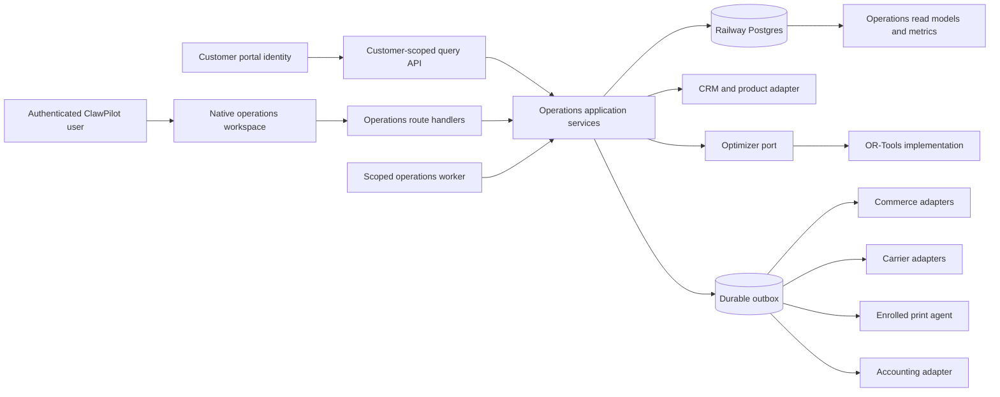
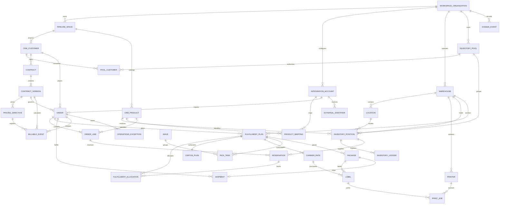
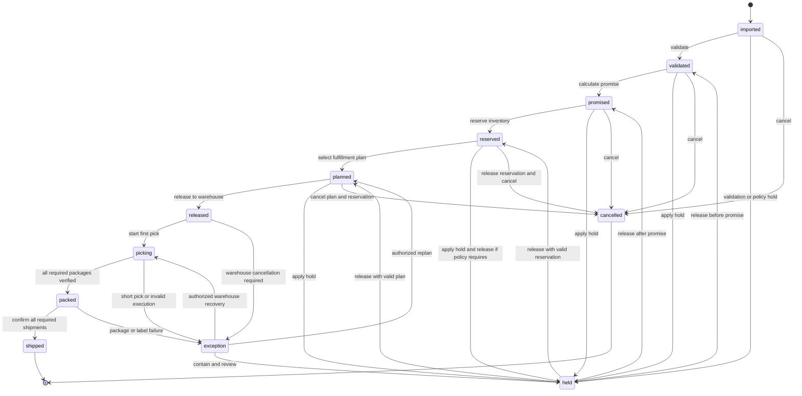
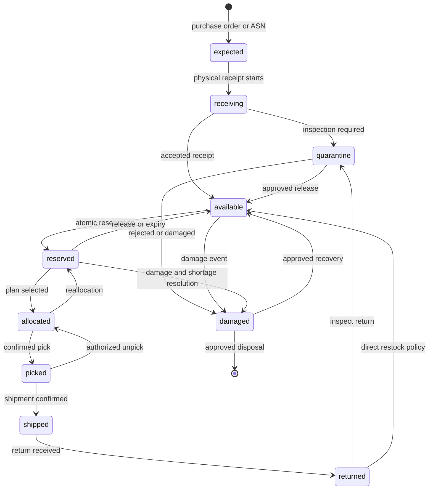
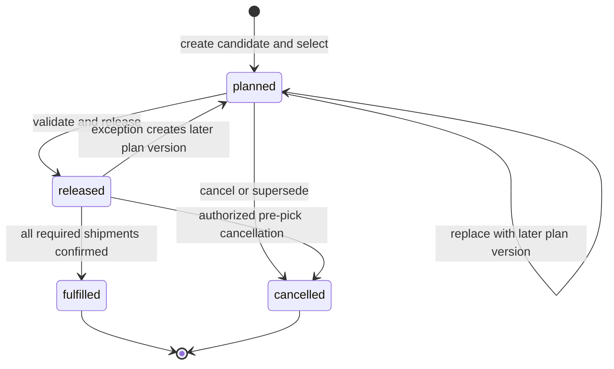
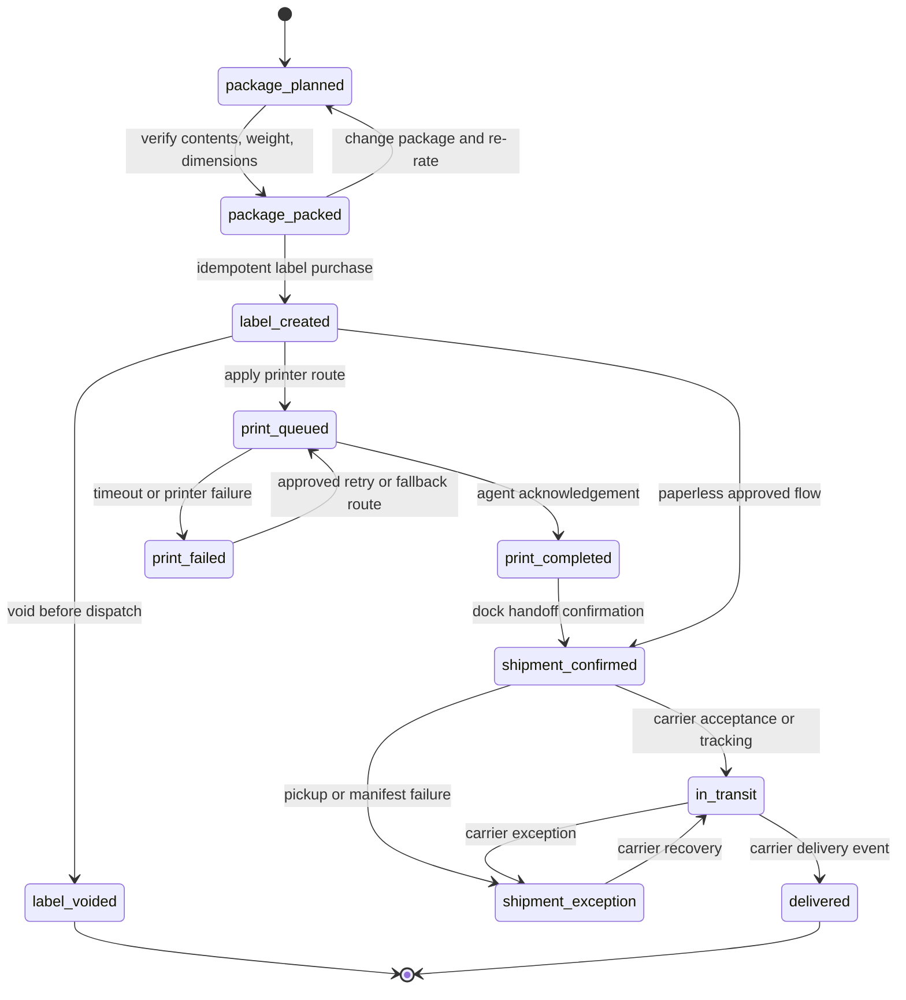
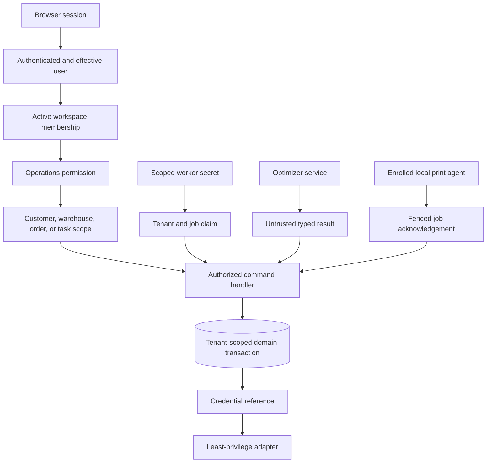

# Distributed Operations

## Purpose And Activation Status

Provide native distributed order management, warehouse execution, carrier shipping, and 3PL billing inside ClawPilot. The module serves 3PL operators, retailers, distributors, manufacturers, and fulfillment operators without creating a second application or duplicating CRM, product, identity, audit, task, document, notification, or accounting masters.

This document remains the **target contract** for the full module. The current development slice includes operations migrations `0081` through `0094`, `0097` through `0101`, and `0107` through `0160`; a tenant-scoped order workbench; explicit idempotent warehouse-release, bulk all-ready pick-confirmation, pack-verification, sandbox-label-create, and sandbox-label-void commands for eligible non-archived orders; a durable exception queue; scoped activation controls; canonical CRM catalog projection; provider-customer resolution; team-managed product/package imports; warehouse-scoped Packaging Materials management; versioned Product each/case profiles and separately evidenced exact-case and loose-each recipes; retained Shopify/Faire channel taxonomy; immutable CRM Product image assets; an exact resource-scoped Shadow Shopify image-publish command; organization-scoped direct carrier credential administration; UPS and FedEx sandbox rating with an account-derived origin and editable test destination; a separate rate-selected diagnostic label-create with customer-selected provider-native output, stored-label download/print, and void workflow; immutable provider-source bytes plus an explicit derivative-artifact provenance boundary; append-only redacted provider evidence; carrier-rate delegation; direct multi-account carrier CSV import; selected-batch GL Coding; separate financial review; billed-actual Triangle/Square/Circle settlement evidence; append-only settlement status transitions; capability-aware printer configuration; enrolled local print-agent delivery with controlled reprints, same-warehouse fallback, and agent-declared format/media/document capabilities; shipment- and exact-package-specific PDF packing-list renderers, immutable artifact-payload store, authenticated artifact stream, tracking-observation schema, and commerce-fulfillment export state model; a Shopify/Faire sales-channel control plane; a bounded development-only Shopify held-order preview; leased development-only full-product-catalog reconciliation and current-order staging workers; guarded development-only product-catalog mapping and operational-order workflows with durable pre-call read intents, resource-scoped encrypted continuations, first-class rejection dispositions, and canonical promotion; a bounded, manager-triggered, read-only Shopify inventory reconciliation for one eligible location and warehouse; a strict development-only Shopify cartonization preview; a recipe-first, assumption-watermarked sandbox package-and-rate evidence workflow; an executable development-only two-pass pack-and-rate replay workbench; and active-workspace measurement-presentation and product-currency defaults. The deterministic mock flow remains an internal automated-test harness only. Hosted mock generation is disabled and historical mock artifacts are archived. These features prove PostgreSQL authority and application boundaries; they do not establish historical closed-order commerce import, continuous or production provider inventory synchronization, production commerce workers, production carrier mutation, tracking ingestion, commerce-export dispatch, pickup scheduling, accounting export, invoice/AR workflow, payment adapters, or production fulfillment-optimizer activation.

Migrations `0128` through `0145` extend this slice with the pack hierarchy,
CRM CSV transfer evidence, durable sales-channel lifecycle and offer
projection, guarded canonical Product identity reconciliation, and
database-enforced packaging-dimension evidence described below.
Additive migrations `0146` and `0147` correct the development pricing
vocabulary and add append-only billing-time MUD evidence. They preserve legacy
replay rows, require new replay rows to keep MUD empty, and allow a MUD result
only after imported carrier-billing evidence has an approved exact shipment
match and an applicable approved `actual_cost` directive. These migrations are
development evidence, not production billing activation.

Migrations `0148` through `0150` add the provider-effect fence,
customer-neutral Shopify checkout-rate configuration and evidence,
deterministic quote-to-order reconciliation, and the historical
CarrierService authorization schema. Operations `shadow` remains
provider-write-ineligible without exception: simulation cannot create or
consume a provider-write authorization, decrypt the Shopify credential for
that mutation, or call Shopify.

Migration `0156` introduced the single-consumption CarrierService mutation
attempt, exact provider evidence, and local-only finalization contract.
Pre-`0156` Shadow authorization rows remain immutable audit evidence and cannot
be claimed.

Migration `0159` removes the false dependency between signed Shopify webhook
receipt intake and checkout-rate activation. The verified API connection,
signed-receipt queue/hold policy, CarrierService registration, callback
readiness, and global Operations mode are independent facts. After an exact
zero-write Shadow simulation, an owner or authorized administrator may confirm
one short-lived, resource-scoped grant for one exact CarrierService operation
while global Operations remains `shadow`. The resource-scoped Shadow revision
is a pre-call write fence, not a post-call local-finalization dependency. The
grant is bound to the current verified credential generation. The attempt is
claimed before credential decryption or network I/O, cannot be reused, and
permits only sandbox create or exact sandbox/production delete.
Unknown provider outcomes become reconciliation-only and are never retried
blindly. A verified Shopify connection may remain generic-status `disabled`
and keep signed receipts held; `error` still fails closed. The grant does not
authorize product, inventory, order, fulfillment, label, tracking, webhook
subscription, or any other provider mutation. Once an immutable succeeded
outcome or confirmed-applied resolution exists, an unchanged CarrierService
configuration can link that exact evidence even if later activation or
credential state drifts. That local-only link cannot authorize another
provider call or retry. Inserting the single-consumption attempt is the
provider-authority cutoff. Callback readiness remains a separate live
predicate recalculated from the current verified credential generation,
configuration revision, Shadow activation revision, warehouse, packaging
stock, and carrier facts; it never depends on the signed-receipt queue/hold
switch.

Migration `0160` applies the same resource-scoped Shadow authority pattern to
Shopify Product image publishing. The operator must first run an exact
zero-write Shadow simulation, then an owner or administrator may issue one
short-lived authorization for that same ClawPilot Product, Shopify parent
Product GID and variant listing, active channel-state revision, primary image
asset revision, credential generation, and global Shadow revision. The
five-minute authorization and its provider effect are single-use and cannot be
replayed for another Product, listing, image revision, channel state, or
provider effect. The immutable delivery grant and signed URL remain usable only
to serve the same verified image bytes during Shopify's bounded 15-minute
asynchronous fetch window; a hash-only source binding ties that exact URL to
the authorization, grant, Product, and image revision before effect
preparation.
If one Shopify parent Product GID maps to a second ClawPilot Product, grant
preparation, authorization, and effect claim all fail closed. Global
Operations remains `shadow`; there is no generic Active Product-image path.
Authenticated image upload and publication commands also recognize the
configured ClawPilot HTTPS public origin and an unambiguous proxy-routed
origin when a hosted platform terminates TLS ahead of the application.
Missing origins, unrelated origins, ambiguous forwarding headers, and browser
requests marked `cross-site` still fail closed.
The same configured public origin is used for the exact signed Shopify media
delivery URL; an internal bind address is never projected to Shopify.

Migration `0157` treats a Shopify CarrierService receipt as reusable immutable
rate evidence because Shopify may cache one exact callback response across
multiple identical checkout requests. Each order still must match exactly one
receipt by account, time window, shippable quantities, destination, currency,
selected stable service code, and customer charge. Multiple matching receipts
remain ambiguous and fail closed; the first imported order no longer consumes
the receipt and arbitrarily blocks a later identical order. A pre-`0157`
rejected or expired decision remains immutable; the migration appends a
separate matched supersession only when the database recomputes exactly one
current receipt offer, and the current-decision projection then exposes that
successor to intake and warehouse release. Zero or multiple matches create no
successor. Migration `0158` adds the account/resource/provider-identity index
used by the current-issue projection while preserving append-only rejection
history.

Migration `0126` is the bounded, owner-safe data correction that renames only
the exact original imperial-named `starter_assortment` records to unit-neutral
labels. It preserves material codes, canonical dimensions and weights, cost,
stock, status, and every operator-edited name.

## Current Development Slice

The implemented slice provides:

- Postgres-only operations access scoped to the active workspace and explicit `viewOperations`, `manageOperations`, and execution permissions;
- CRM organization and `gp` product resolution without cloning customer or catalog masters;
- one explicit CRM data pipeline per workspace, deduplicated customer and product catalogs by permanent Global ID, and deterministic provider-customer matching with review-required staging for ambiguous or unmatched identities;
- an internal test-only deterministic order, reservation, planning, cartonization, carrier, and print harness that cannot create hosted workspace records without an explicit automated-test feature flag;
- operator-controlled warehouse release with exact-version concurrency, readiness and exception checks, one released wave, ready pick tasks, domain event, audit evidence, and replay-safe command receipts;
- operator-controlled bulk pick confirmation with exact-version concurrency, affected-position locks, all-ready validation, one completed wave, picked tasks, retained reservations, immutable pick ledger evidence, domain event, audit evidence, and replay-safe exact result payloads;
- operator-controlled pack verification with exact-version concurrency, released-plan and completed-pick validation, one packed package, retained reservations for shipment consumption, immutable pack-fee evidence, domain event, audit evidence, and replay-safe exact result payloads;
- a shared CRM product catalog that authorized pipeline editors can maintain individually or import from CSV, with a permanent `gp` product identity, duplicate prevention by SKU or case-insensitive name, per-row validation, and bounded partial-import results;
- one organization-scoped default package profile per product in this slice, with permanent `gpp` identity, package type, unit of measure, units per package, preferred metric or imperial entry system, dimensions, weight, active state, source, optimistic row version, and audit history; fulfillment planning consumes canonical millimeters and grams from the active profile and records its provenance, while products without a profile retain the explicit conservative fallback;
- an active-session-scoped measurement presentation preference with an organization default and nullable per-user-per-workspace override; any active member may update only their own override, only an effective owner or administrator may update the organization default, organization writes require an exact optimistic revision, and the response identifies whether the effective system came from the user, organization, or compatibility fallback; a runtime with no active organization uses the compatibility fallback without a persistence request or save attempt;
- an organization ISO 4217 currency default, initially USD, used only when a new ClawPilot Product or product CSV row has no record currency; existing CRM products and Shopify, Faire, carrier, order, and imported money retain their own currencies, and no preference change converts an amount or relabels a source fact;
- archived legacy hosted mock proof records with reservations released and immutable ledger, domain-event, audit, billable, and Global ID evidence retained;
- an exact-scenario development WMS simulator retirement command that releases active reservations with compensating ledger entries, cancels linked execution, dismisses linked open exceptions, archives the 21 synthetic orders, deactivates scenario fixtures, preserves evidence tombstones, and removes retired scenario orders, facilities, pools, products, and customer fixtures from the default Operations workspace; retirement is terminal for the organization-scoped simulator singleton and its order lineage, so no later scenario version can reseed it;
- a guarded development-only establishment command that retains the existing Suburbia Sandwich Co and Express Parcel International DBA EPISCS workspaces, creates AG Alchemy, LLC as a separate switchable nondefault test workspace, re-establishes the AG Alchemy Shopify credential under that workspace without moving Express evidence, preserves the Express UPS, FedEx, physical Zebra, print-agent, and bound warehouse identities, and retires only the exact synthetic warehouse/mock operating state through compensating facts and tombstones; plus a separate plan-first command that projects exactly one AG warehouse from its sole active Shopify fulfillment/shipping location and refuses zero, multiple, or mismatched origins;
- a separate guarded Railway-development delegation that leaves EPISCS as the unchanged UPS/FedEx credential owner, creates fresh AG-scoped encrypted sandbox identities, projects AG warehouse `gwh5366613` as sender origin, and grants AG only the `sandbox_rate` capability while credential reveal, carrier-account mutation, label, void, pickup, manifest, shipment, and provider-write paths remain blocked;
- organization-scoped `disabled`, `shadow`, `read_only`, `active`, and `frozen` activation state with revision, reason, actor, and audit history;
- organization-, provider-, and environment-scoped UPS REST, FedEx REST, and USPS REST credential administration with candidate OAuth verification, AES-256-GCM persistence, masked metadata, rotation versions, audited activation and disconnect, and no cross-tenant or production/sandbox fallback;
- manager-triggered UPS CIE and FedEx Sandbox rating that uses the selected active billing account's sender identity and registered address as the read-only origin, an operator-editable validated U.S. destination, and one fixed `Test Product` parcel, with normalized quote-only results and append-only PII-redacted `grq` evidence; production rating remains disabled;
- a separate execution-authorized Settings diagnostic that selects one exact evidenced rate, durably prepares and finalizes the carrier sandbox Ship API call, validates and stores decoded provider label bytes under permanent test-label and attempt identities, routes those stored bytes to a compatible printer without another carrier call, and voids through the exact persisted account; rating itself never returns label media or tracking;
- manager-triggered UPS CIE and FedEx Sandbox order-bound label creation and immediate void for the fixed synthetic packed-order shipment, with immutable `gla` prepare/call/finalize attempts, one active label per package, exact carrier-account reuse on void, redacted provider evidence, domain and audit events, and retry blocking whenever the provider result is unknown;
- post-commit routing of a successfully persisted sandbox shipping label into one idempotent durable print job; replay of the original label command can recover a missing print job without calling the carrier again, while print retry and reprint remain separate from label purchase;
- a strict sandbox boundary: Settings diagnostics and order-bound label create/void can never create an `operations_shipments` row, mark an order shipped, consume or release inventory, append a tracking observation, create a commerce-fulfillment export, or render a packing slip; the Settings diagnostic additionally creates no order, package, or fulfillment-plan record;
- working-tree shipment-completion evidence contracts in `0099`: immutable packing-slip payloads, append-only `gto` tracking observations, and durable `gfe` commerce-fulfillment export intents with explicit `queued`, `processing`, `succeeded`, `failed`, and `unsupported` states;
- deterministic PDF packing-list renderers with content hash, byte length, safe filename, template version, and immutable render snapshot; an exact package renderer whose durable package-content rows allocate every order-line quantity to one physical package, paginate without line truncation, and support package-specific generate, download, and print without a carrier call; organization-scoped authenticated exact-byte ZPL/PDF/PNG artifact download with safe MIME/extension, SHA-256 validation, and ETag; and local print-agent claims that preserve label text as `utf8` while encoding binary artifacts as `base64`;
- explicit Triangle, optional Square, and Circle rate-path evidence; address-bound multi-account carrier identities; immutable customer-facing checkout shipping-charge evidence kept separate from checkout and pre-label carrier estimates; direct checksum-bound carrier CSV import; selected-batch shipment GL Coding; versioned shipper-assignment rules; independent shipment matches and shipper assignments; manual orphan assignment; separate run approval; exact matched carrier-billed actuals; billing-time MUD evaluation only for an effective approved `actual_cost` directive with immutable provenance, with explicit `not_configured` evidence otherwise; billed-actual reimbursement and payable entries; disputes; references; and append-only settlement transitions;
- organization- and warehouse-scoped thermal and nonthermal printer profiles with connection mode, supported formats, supported media, supported document types, document defaults, priority, status, same-warehouse fallback selection, enrolled local print agents, fenced claims, bounded retries, and reasoned reprints; a printer bound to an agent must be a subset of that agent's explicit capabilities, and each claim repeats the runtime capabilities so a mismatched worker fails before receiving bytes; browser delivery remains best effort;
- a print-job operator drill-down with source order, shipment, carrier label, tracking, destination, package measurements, warehouse/station/printer routing, artifact integrity, authenticated exact-artifact download, retry and reprint lineage, safe failure evidence, and every agent/device delivery attempt; live agent heartbeat is reported separately from the printer's last acknowledged document handoff;
- durable command receipts that bind idempotency key, request hash, actor, correlation, status, exact result payload, attempts, and safe failure evidence;
- a **Settings > Integrations > Sales channels** control plane for one Shopify store and one Faire brand per organization/environment, with live identity verification before AES-256-GCM persistence, masked-by-default credential identifiers, an audited 30-second reveal of the current application credential for an authorized owner or administrator, explicit disabled-by-default state, immutable provider identity, monotonic credential generations, adapter/API version, scope and capability evidence, and audit history;
- a Shopify Dev Dashboard client-credentials exchange for an installed same-organization store, with 24-hour access tokens acquired only when needed and never persisted; an Admin GraphQL client pinned to `2026-07`; strict canonical `*.myshopify.com` endpoints; bounded requests/responses; reported-scope inspection; raw-body HMAC verification; a narrowly public account-specific receipt URL; event-ID deduplication; encrypted webhook bodies; durable cursor/retry/dead-letter structures; and an explicit receipt-intake-only activation label;
- a feature-gated, manager-triggered Shopify held-order preview for a configured and verified `sandbox` store: it reads at most the newest 25 non-test orders, retains only minimized diagnostic fields for no more than 24 hours, compares line SKUs with existing local product mappings and package-profile readiness, and records explicit zero canonical-order, zero Shopify-write, and no-cursor-advance evidence;
- separate feature-gated Shopify/Faire catalog and operational-order workflows for configured and verified accounts: each provider read first persists a fixed idempotent intent, bounded product pages stage map/create/exclude candidates, bounded nonterminal order pages stage resolve/validate/promote candidates, continuations are encrypted and resource scoped, Shopify pages are time-fenced, Faire order candidates require exact refresh, and every rejection exposes exact order retry or audited exclusion; a leased development-only order worker automatically stages current order pages under the same read/capture/normalize path without canonical promotion, inventory mutation, shipment creation, cursor advance, or provider write;
- a feature-gated, manager-triggered Shopify inventory reconciliation for a configured and verified account with `read_inventory`, `read_locations`, and `read_products`: it durably prepares the provider read, captures the bounded complete response before applying it, maps one eligible Shopify location to the workspace's one active warehouse and selected reserve/storage location, retains all eight requested Shopify quantity states and operational product facts, projects only exact product mappings into Shopify-authoritative Operations balances, and performs no provider write, order mutation, shipment creation, or fulfillment export;
- a manager-triggered, development-only Shopify cartonization preview that requires the exact current order-candidate revision, one active warehouse, account-bound inventory evidence captured from Shopify within 24 hours, exact product mappings and package measurements, explicit per-line committed-quantity assumptions, and one to eight active, priced, positively stocked packaging materials; inventory-run completion remains separate evidence and cannot make a replayed stale provider capture fresh; it calls only the authenticated OR-Tools service, uses fixed-axis conservative fit, excludes transport and handling costs, and returns a point-in-time in-memory fit/material recommendation with explicit zero database, provider, rate, label, and shipment writes; product-level committed attribution is displayed once and remains ineligible while more than one current inventory position exists; each optimizer package is surfaced as one planned shipment, but the preview cannot accept or persist that split, allocate durable package contents, or generate the future shipment-partitioned packing documents; Faire remains blocked until account-bound inventory reconciliation exists;
- a canonical **Operations > Commerce imports** submodule at `#operations/imports`, also available from the collapsed-navigation flyout, that selects a configured and verified active-workspace Shopify/Faire account and opens the same Overview/Products/Orders/Issues workbench as the compact Settings launcher; product decision CSV is account/candidate/row-version fenced, while order and issue exports are sanitized and no CSV order import or provider-write path exists;
- a canonical **Operations > Pack & rate replay** submodule at `#operations/replays` that lets a manager execute and reload sanitized historical scenarios across checkout quote, post-intake CRM resolution, fulfillment rerun, checkout-to-pre-label estimated variance, recorded label finalization, and tracking-gated package documents. It retains immutable checkout and fulfillment runs, exact line-to-package quantity conservation, all bounded recorded UPS/FedEx whole-shipment choices, one selected service for the complete package set, the unchanged checkout shipping charge, the separate checkout and pre-label carrier estimates, their signed estimated variances, and zero provider, postage, label, inventory, order, or commerce writes. It never calls an estimated replay delta a MUD and cannot establish carrier-billed actual cost. A successful fulfillment run may remain pre-label; finalized replay packages use recorded tracking facts and create one real immutable, downloadable PDF packing-slip artifact whose bytes and render snapshot are database-bound to that package's exact allocation. Shopify scenarios replay a recorded callback fixture without making a live callback, while Faire scenarios begin from a captured marketplace checkout shipping estimate and never claim that Faire called ClawPilot;
- a reusable progressive-disclosure setup journey across Commerce, carrier, Google Workspace, QuickBooks, Toast, and Maton Settings panels, with provider-specific ordered steps and copyable nonsecret operational facts derived only from each panel's existing organization-scoped state;
- a Faire External API v2 brand client for the fixed production origin, brand/product/order and selector-based inventory reads plus documented processing/cancellation/availability/shipment request translations; Faire is explicitly recorded as production-only and polling-only, with no public webhook, sandbox, retailer custom API, or return-write claim;
- responsive Orders and Exceptions views with permanent `gor` and `gex` identities, plus stable hash-addressed, horizontally scrollable Orders, Exceptions, Commerce imports, Receiving, Warehouses, Packaging materials, Carrier invoicing, Shipment pricing & GL, and Printing subpanel navigation with touch panning and accessible edge scroll controls on narrow screens; the expanded left-navigation Operations submenu and collapsed flyout expose that same complete submodule set without changing existing permission boundaries. Packaging materials owns organization-scoped cartons, poly mailers, padded mailers, dimensions, tare and maximum weights, unit cost, draft/active state, and per-existing-warehouse availability/on-hand/reorder facts. Its six-item starter assortment is draft-only and cannot become optimizer-eligible until real costs and positive available stock are recorded. Carrier invoicing owns immutable source-file evidence; carrier-billed actual exists only after its charges are exactly matched and the GL review is approved. Shipment pricing & GL owns shipment-to-shipper assignment, the separate checkout-charge and carrier-estimate comparisons, approved billing-time MUD calculations, variance and settlement review, and GL outputs; shipper-assignment rules do not replace or mutate an independently versioned MUD directive;
- incomplete customer-supplied packaging-material drafts that retain only the supplied dimensions, explicit inner/outer/unconfirmed basis, evidence type/reference, and source while leaving unknown depth, tare, maximum weight, cost, currency, and stock null; activation fails closed until verified usable inner dimensions and every operating fact are present. A separate trusted-development, plan-first AG Alchemy command stages the four customer-supplied material drafts and six explicit provider sell-unit pack classes only after an administrator supplies exact `gp` Product Global IDs and an explicit active owner/admin actor. It verifies the Railway environment name and database identity, binds apply to the exact fresh plan fingerprint, projects every assigned Product's current exact channel state to the class's default pack version with retained provider source revision/hash, and fails if that provider evidence is absent. Its title/SKU suggestions are discovery aids only. Guarded apply may replace the six exact untouched or legacy-equivalent synthetic starter drafts and their empty stock placeholders, but fails on partial, active, edited, referenced, or otherwise conflicting starter state. It never activates a material, profile, relationship, or recipe or infers intact-case inventory;
- audited exception transitions for acknowledge, resolve, dismiss, and reopen, with tenant isolation and retained resolution history;
- an in-module guide that directs carrier sandbox testing to **Settings > Integrations > Shipping** and identifies deterministic mocks as automated-test-only;
- disposable PostgreSQL acceptance coverage that applies the full migration chain and validates atomic writes, replay, rollback, append-only evidence, money totals, and cross-workspace isolation.

Production domain activation remains out of scope until later delivery gates verify provider credentials, processed webhook and polling imports, canonical mappings, provider attempts, reconciliation/replay, complete operational health, recovery commands, and an explicitly approved integration and warehouse cohort. Enabling Shopify signed receipt intake still accepts only its enumerated receipt topics; order and customer webhook topics remain rejected until their retention/privacy lifecycle and canonical processor exist. The separately gated held-order preview can inspect minimized recent order facts while the `sandbox` account remains receipt-disabled, but it does not import an order, create or change a customer, product, or mapping, reserve or export inventory, export a fulfillment, register webhooks, advance a cursor, or authorize any provider write. A verified product-readable Shopify or Faire connection authorizes the distinct development-only catalog worker without a second user approval and initializes its policy as resumed in an eligible runtime. A verified order-readable connection separately authorizes the development-only current-order staging worker when Operations is `shadow` or `active`; that worker follows bounded encrypted pages and creates held candidates or rejections only. Catalog policy initialization does not prove queueing, and neither worker is production enabled. The catalog worker may create ClawPilot product masters and exact mappings but never reads or changes orders or inventory and never writes to the provider. The order worker never creates canonical orders, customers, products, reservations, packages, shipments, inventory changes, or provider writes. Interactive commerce intake may separately promote a manager-reviewed ready order; promotion itself does not alter provider inventory or deduct order demand from a separately reconciled Shopify-authoritative balance. The manager-triggered Shopify inventory command is an independent read-only development control, not a production or unattended worker. Sandbox rating and label evidence do not authorize production rating, label creation, pickup scheduling, shipment confirmation, or inventory consumption. `app_documents` is not used as a substitute for logistics artifacts.

### Product And Package Catalog Workflow

The shared catalog is managed from **Pipeline > Configure > Products** because CRM products remain the product authority for both sales and operations. An authorized editor may add or update one product at a time or import a CSV containing at most 500 rows and 1 MB. The product template includes name, SKU, type, category, status, price, cost, currency, URL, description, active state, package name, package type, unit of measure, units per package, measurement system, length, width, height, weight, and package active state. A new blank Product or truly currency-less CSV row receives the active organization's currency default. When SKU or name matches an existing Product, its record currency wins over that default; an explicit row currency is the only way to change it. Metric entry uses centimeters and kilograms; imperial entry uses inches and pounds. The service converts both to canonical millimeters and grams for cartonization and carrier adapters while retaining the team's preferred entry system.

An import updates an existing product when its SKU matches case-insensitively or, when no SKU resolves it, its name matches case-insensitively. A product name and SKU cannot identify different existing records. Every invalid row is reported without discarding valid rows, and spreadsheet-formula-prefixed text is rejected. Package length, width, height, and weight must be supplied together. Team edits reuse the same product and default package Global IDs, increment the package row version, and append audit evidence instead of creating duplicate catalog records.

The current vertical slice intentionally maintains one editable default package profile per product. The schema leaves room for multiple named profiles and facility-specific packaging in a later cartonization slice, but the application must not imply that those choices are available yet.

Migration `0128` and `scripts/stage-ag-alchemy-pack-hierarchy.mjs` add a
separate evidence-staging boundary behind that existing product editor. The AG
command can stage customer-confirmed `each`, `inner_pack`, and `case` versions,
their exact contains relationships, and approved-but-nonactive recipes for
loose carton packing:

- loose 6 oz bag listings as recipe-only eaches, with an `AG12V2`
  customer-confirmed range of 12 through 18 and a customer-named 20 lb box
  maximum of 30 whose minimum remains unknown and therefore unusable until
  confirmed;
- explicit prepackaged 6 oz case-of-12 listings as a separate default sell
  unit in `AG12V2`, represented by its contains relationship and never by an
  assembly recipe;
- loose 2 oz bag listings as eaches with a prepackaged case-of-36 relationship
  in `AG12V2`, without an assembly recipe;
- explicit prepackaged 2 oz display-carton listings as a separate default sell
  unit containing 6 bags, plus an assembly-allowed outer shipping box holding
  up to 6 complete display cartons;
- one 10 lb bulk unit in `AG12V2`; and
- one 20 lb bulk unit in the customer-named 20 lb box.

The command does not apply a classification from title or SKU. It prioritizes
explicit `2 oz Carton` and `6 oz 12pk` discovery suggestions so those listings
cannot inherit loose-bag dimensions, but apply still requires an explicit,
nonduplicated `gp` assignment. The assignment is not accepted as evidence by
itself: each current Shopify/Faire variant must be mapped to the class's
explicit default sell-unit profile using its durable source revision/hash.
Net-content names such as `10 lb` and `20 lb` are not treated as gross shipping
weights.

Migration `0134` connects an exact current Shopify or Faire variant-pack
mapping to new order candidates without activating the staged Product profile
or any incomplete packaging material. Automatic resolution accepts only a
current `customer_confirmed` or `active` pack version with complete **outer**
dimensions and measured, customer-confirmed, or provider evidence. The mapping
and current channel-state source revision and hash must still match, and a
provider-supplied pack multiplier must equal the mapped base-each quantity.
Candidate lines retain mapping/profile-version Global IDs, row-version fences,
package level, base-each quantity, and the explicit weight source.

Gross shipping weight is never inferred from Product names or nominal content.
Resolution uses an explicit pack-version gross weight first, an exact
provider-order package weight second, or the matching current provider-catalog
weight third. If weight is absent, pack quantities conflict, or provider
dimensions conflict with the customer-confirmed pack, the otherwise eligible
association remains review evidence but the line stays blocked for package
resolution. Changed or ineligible source evidence is not associated.
One narrow recipe-first exception prevents false product measurements: a
current customer-confirmed provider sell-unit profile marked
`approved_recipe_only` may intentionally omit item dimensions while retaining
its exact variant-pack association and current provider-catalog weight. The
candidate remains unresolved for ordinary package promotion and geometric
preview. The hybrid planner may consume that association only when a current
customer-confirmed recipe for the exact captured input-profile revision
supplies the outbound material and package geometry. This is the supported
model for 10 lb and 20 lb bulk sell units; ClawPilot does not copy the
shipping-carton dimensions onto the unmeasured inner product.
Promotion revalidates every mapping, version, source, dimension,
weight, and active Product mapping under row locks; a stale fact requires a
fresh order intake. Manual or compatibility-profile resolution clears mapped
pack provenance. The optimizer input schema remains unchanged: cartonization
consumes the ordinary resolved candidate-line dimension and weight snapshot.
For an association-only recipe input, the same repeatable read instead retains
the exact mapping/profile revisions and matching channel source revision/hash,
uses that source-bound catalog weight, and obtains outbound geometry only from
the current recipe and selected material. Draft materials still fail closed
until verified inner dimensions, tare, capacity, cost/currency, and positive
warehouse stock make them active outside the explicit sandbox evidence path.

Migration `0135` makes recipe-driven cartonization explicit. A max-capacity
recipe records a nullable customer-approved minimum, a normalized content
compatibility key, and whether fit evidence permits compatible Products to
share one outbound material. Mixed pooling requires a max-capacity recipe,
nonexclusive contents, the exact same compatibility key, and timestamped
customer-confirmed or measured fit evidence. An active max-capacity recipe
cannot retain an unknown minimum. A profile marked `approved_recipe_only`
requires timestamped referenced evidence and can never silently fall back to
geometric fitting.

The pure hybrid planner runs the approved-recipe phase before exposing
remaining `rigid_3d` or `compressible` lines to the geometric optimizer. Every
Product in a mixed pool must expose the same material, capacity, applied
minimum, compatibility key, and current row-version evidence. Stale profiles,
recipes, or materials block; missing recipe evidence blocks recipe-only
flexible items. The AG loose 6 oz recipes share
`ag-alchemy.loose-six-ounce-bags.v1` and may pool flavors, but `AG12V2` retains
the customer-confirmed 12-unit minimum. A smaller order such as six bags is
only an assumption-backed **read-only sandbox** option when the caller supplies
an explicit minimum override with a reason and evidence reference. Production
planning rejects all such overrides, and the 20 lb box remains blocked until
its currently unknown minimum is confirmed.

Hybrid output includes policy and algorithm versions, canonical input/result
hashes, stable package keys and sequence, exact material/profile/recipe row
versions, customer material dimensions and evidence, recipe minimum/maximum,
line/Product/title/quantity allocations, and content weight. Rating readiness
is separate: missing rated outer dimensions or tare weight is returned as a
package-level blocker rather than invented from inner dimensions. This pure
planner performs no database, provider, inventory, shipment, rate, label, or
packing-list write.

Migration `0151` adds a product-level management surface for versioned each
and case profiles, exact provider-variant mapping purposes, and active
approved recipes. Checkout context resolves only a current mapping whose
purpose is explicitly `shopify_checkout`; a separate current `catalog`
mapping for the same variant cannot satisfy or duplicate the checkout join.
That checkout mapping follows the same registered-ready CarrierService
predicate as the public callback: a verified Shopify account may remain
generic-status `disabled` while signed receipts are held, but an `error`
account remains ineligible. Channel lifecycle, exact source revision/hash,
pack-version weight, recipe or self-package, configuration, warehouse,
material stock, carrier, credential-generation, and Shadow-revision fences
remain mandatory.
An exact-case recipe and a loose-each max-capacity recipe are independent
evidence. For the 6 oz test path, an operator may retain exact 12 as the case
path and separately activate a customer-confirmed 1-through-12 loose-pick
range. The planner deterministically uses exact case for a complete 12, uses
the loose-each rule for 1, and splits 13 into exact 12 plus loose 1, without
geometric fallback. The UI never derives that lower minimum from case-only
evidence: production eligibility requires a separate evidence reference
confirming the complete loose-each range. Existing AG recipes whose confirmed
minimum is 12 remain unchanged until that explicit evidence is supplied.

An active case profile with `baseEachQuantity > 1` and
`shipsAsOwnPackage = true` is already a sealed carrier parcel and therefore
does not require or synthesize an assembly recipe. Its exact current profile
revision supplies the rated outer dimensions and gross weight. Checkout
quantity 1 creates one parcel; quantity 2 creates two parcels, each allocated
to exactly one provider sell unit. Receipt persistence keeps this
`self_package` evidence separate from `approved_recipe` cartons, while loose
eaches continue to require an approved recipe and selected material stock.

Migration `0136` adds a distinct `cartonization_package_rate` purpose to the
existing UPS and FedEx sandbox adapters. The caller supplies the exact planned
parcel exterior and gross weight; omitting that parcel preserves the separate
fixed diagnostic rate test. A cartonization quote cannot enter the diagnostic
label-create workflow.

Migration `0137` seals a reloadable `gcte` evidence aggregate after every
planned package has exactly one immutable UPS and one immutable FedEx `grq`
edge. One repeatable-read transaction binds the exact organization, commerce
account and candidate revision, active warehouse, latest successful
account-plus-warehouse inventory run, current variant mapping and pack-profile
row, selected material row, and every matching current recipe. Each shipping
line retains an explicit committed-inventory quantity, including zero; the
assumed total may not exceed provider-committed evidence, and demand may not
exceed operational availability plus that retained attribution.

The development sandbox proof may use current customer-confirmed profiles and
recipes plus a draft customer-supplied material. Rated exterior dimensions,
tare, and any below-minimum recipe quantity require an explicit operator
acknowledgement and are stored only in the evidence aggregate. The UI
watermarks that aggregate as **assumption-backed sandbox evidence, not
executable or actual billed cost** and exposes a direct reload link under
**Operations > Commerce imports**. It never activates or mutates Product,
material, recipe, inventory, order, shipment, label, print, or provider
records; only append-only ClawPilot evidence and carrier-rate request rows are
written.

For `sandbox_demo` only, mapped `negative_available` inventory evidence may
retain its exact provider-committed quantity while operational ATP remains
zero. The operator must still attribute that committed quantity explicitly per
line, and the assumption cannot exceed provider evidence. Production remains
fail closed to `projected` inventory evidence only. This exception never turns
negative availability into ATP and performs no inventory or provider write.

Migration `0138` closes three evidence-integrity gaps. Every planned package
now retains immutable child rows for all contributing approved recipes,
Products, and input-profile revisions, including mixed-product cartons. The
header stores the confirmed destination fingerprint, each package stores the
exact normalized carrier parcel, and each quote stores the linked carrier
request hash plus a package-rate-context hash. A deferred database check
requires the linked `grq` destination and parcel to match that saved package
proof exactly. A durable semantic command reservation is claimed before either
carrier read: a completed retry reloads the sealed `gcte`, a concurrent retry
remains pending, and neither path creates additional carrier request rows.

Migration `0139` keeps fully fulfilled provider lines as source evidence
without falsely requiring an operator-selected order-time price. The database
continues to require `line_price_required` whenever an unresolved-price line
has positive unfulfilled demand; zero-remaining lines remain excluded from
operational readiness and canonical fulfillment work.

Migration `0140` removes PostgreSQL's truncated legacy four-value
`packaging_source` check left behind by migration `0134`, then re-establishes
the named five-value constraint that admits exact `variant_pack_mapping`
evidence. Hosted migration health now requires both this repair and the
fulfilled-line price-state repair before reporting current schema.

Migration `0141` makes the recipe-only association state
database-authoritative. Exact `variant_pack_mapping` evidence may remain
`unresolved` only with the complete mapping/profile association, null item
dimensions and weight, and the ordinary `packaging_required` blocker still
present. Resolved mapped packages continue to require an explicit weight
source. The runtime admits the unresolved form only for a current
source-bound `approved_recipe_only` profile whose dimensions are all absent;
the sandbox hybrid reader retains its mapping/profile row versions and channel
source revision/hash, derives unit weight only from that positive current
catalog observation, and still requires the saved recipe/material proof before
it can rate a parcel.

The AG staging command has one guarded compatibility repair for bulk profiles
created before the recipe-only rule was introduced. A fresh plan may supersede
only an untouched version-1, row-version-0, customer-confirmed
`rigid_3d` profile whose dimensions and weights are all absent and whose other
facts exactly match the customer-supplied bulk manifest. Apply creates a
version-2 `approved_recipe_only` profile, retires and recreates the affected
relationship and recipe against that version, and versions the exact provider
variant mapping while retaining the current channel source revision and hash.
The old rows remain as history. Any extra version, changed fact, stale channel
evidence, or concurrent row-version change blocks the repair. The command
remains restricted to the trusted development database, exact Product Global
ID assignment, active AG administrator, and fresh plan fingerprint; it performs
zero provider, inventory, order, package, shipment, or carrier writes.

Confirmed US ship-to snapshots may retain a provider-native state or territory
name for audit display. The carrier sandbox boundary converts recognized names
such as `Wisconsin` to the canonical postal code (`WI`) before fingerprinting
and rating. An unknown subdivision now fails with
`CARTONIZATION_RATE_DESTINATION_INVALID` instead of being reported as a
generic evidence outage.

Operators may select at most eight packaging material types for one
cartonization run, while one saved read-only carrier comparison may retain up
to 50 resulting physical packages. This distinction lets a high-unit order
reuse a small controlled material catalog without truncating its actual carton
plan while remaining inside the UPS `Shop` one-request package limit shared by
the UPS/FedEx comparison boundary.

Every selected material in that comparison carries its own explicitly
acknowledged rated exterior dimensions and sandbox-only tare. Those assumptions
are normalized, bound to the exact material Global ID and row version, retained
in the semantic request hash, and rechecked against every resulting package
before evidence can seal. Cartonization completes first. ClawPilot then sends
the complete ordered physical-package list in exactly one UPS multi-package
shipment-rate request and one FedEx multi-piece shipment-rate request. A
shipment-level option is eligible only when that carrier returned the service
for the entire package list; one carrier service applies to every package in
the shipment and package-by-package service splitting is not allowed. The
optimizer counts one shipment per selected ship-from warehouse, while
`cartonCount` remains the number of physical packages; AG Alchemy's one
warehouse therefore produces one potentially multi-package shipment. A future
multi-warehouse plan must partition packages by ship-from warehouse before
rating, because each warehouse has a different sender address; ClawPilot then
sends one shipment-level request per warehouse group to each carrier and never
combines origins in one request. Each
physical package retains its own allocation, recipe, normalized parcel, and
edge to the shared immutable provider request so an administrator can audit the
two carrier reads without mistaking package evidence for separate rate choices.
The workflow is read-only at both providers and performs no shipment, label,
postage, inventory, or sales-channel write.
Migration `0144` removes the legacy inline single-package quote-purpose check
left by migration `0137`; the purpose-aware shipment/package constraint from
`0143` remains authoritative, so whole-shipment quote edges can seal without
weakening legacy evidence validation.

Migration `0145` adds the append-only development replay boundary rather than
activating a live checkout or fulfillment path. Checkout quotes remain
customer-neutral and expiring. A Shopify replay executes the current
`planHybridCartonization` policy at checkout and again at fulfillment; the
bounded approved-recipe fixtures fail closed if the current optimizer no
longer produces their exact package oracle. Faire has no ClawPilot checkout
callback: its first stage retains only the captured marketplace customer
estimate, with zero ClawPilot packages or UPS/FedEx choices, and the first
ClawPilot cartonization and carrier comparison occurs after order intake. CRM
resolution occurs only after that customer-neutral intake boundary; one
created or reused CRM organization is required before a successful fulfillment
rerun, while an ambiguous match persists as an expected blocker with no
invented downstream package, rate, label, or document facts. Each successful
pack-and-rate run binds the optimizer policy, algorithm, input/result hashes,
exact package-plan hash, exact bounded rate-choice count, UPS and FedEx
recorded responses, and exactly one selected whole-shipment service.
Fulfillment references its exact checkout predecessor and records
database-derived allocation, material, service, and carrier-cost variance
causes without overwriting the quote. Recorded label finalization is a later,
optional stage; a final packing slip cannot exist until that exact package has
unique tracking, the selected carrier/service, a unique recorded label
reference, and a content-addressed PDF payload. This replay does not establish
Shopify quote-to-canonical-order reconciliation, a production checkout
callback, live carrier pricing, label purchase, or a Faire checkout callback.
Those remain separate activation gates.

Migration `0146` is an additive correction to that development replay
boundary. Existing version-1 rows remain immutable legacy fixture evidence.
New version-2 rows preserve the checkout shipping charge through fulfillment,
record the checkout carrier estimate and pre-label carrier estimate as
different facts, and store their signed differences only as **estimated
variance**. Version-2 replay rows require `mud_markup_minor` to remain null:
neither estimate is a carrier invoice, realized margin, or a MUD calculation.

Migration `0147` adds the separate append-only carrier-billing MUD boundary.
Carrier-billed actual exists only after an imported CSV statement and all
included charges are retained, exactly and currently matched to one shipment,
assigned to the exact shipper, and included in an approved GL Coding review.
Only then may ClawPilot calculate MUD from an approved, effective,
currency-matched, current directive whose calculation basis is `actual_cost`.
For this slice, current means the terminal applicable version as of the
shipment timestamp, not the newest version created later. Exactly one direct
grant to the assigned shipper may contribute applicable actual-cost
directives; grants without such a directive do not create ambiguity, while
multiple eligible direct grants fail closed as `blocked`.
The calculation retains the statement lineage, exact charge set, quote,
account authorization, grant, contract and directive versions, calculation
snapshot, input hash, and actor. When no such directive applies, the durable
result is `not_configured`, not zero and not an inferred replay markup.
Ambiguous or invalid evidence remains `blocked`. A checkout shipping charge is
classified as customer-paid only when complete paid canonical commerce
evidence can allocate it to exactly one nonvoid shipment; otherwise its
unavailable, not-captured, or multi-shipment state remains explicit.

Migration `0149` adds the customer-neutral Shopify CarrierService callback
evidence and an exact quote-to-order reconciliation boundary. Each successful
receipt snapshots its account, configuration and activation revisions,
destination HMAC, aggregated provider-variant quantity fingerprint, currency,
inventory evidence, package plan, reconciliation window and immutable
deadline. Each returned Shopify service is tied by typed foreign keys to the
configured carrier account and the successful whole-shipment rate request.
When the source selected a ClawPilot CarrierService code, Shopify promotion
invokes reconciliation inside the same PostgreSQL transaction that creates
the canonical order. It compares only immutable typed facts: the same commerce
account, provider order creation time inside the stored receipt window, exact
shippable variant quantities, destination fingerprint, currency,
provider-selected Shopify service code and customer-paid shipping charge.
Exactly one match links the canonical order to the receipt and selected offer.
Zero matches persist a rejected or expired decision; multiple matches persist
an ambiguous decision; none fabricates a receipt link. That order cannot be
released to warehouse work unless the decision is `matched`. Another Shopify
shipping method is explicitly `not_applicable` and is not subject to this
ClawPilot quote-lineage release guard. Shopify may reuse one cached
CarrierService response for more than one checkout with the same typed request
facts, so one immutable receipt may support multiple orders; it is not
consumed by the first promotion. Each order must still have exactly one
matching receipt, and multiple receipts for that order remain ambiguous.
PostgreSQL recomputes the candidate count and candidate-set hash, so
application JSON or a caller-supplied count cannot forge a match. Merchandise
unit price and subtotal are intentionally absent from this matcher: a
zero-priced shippable product still receives the carrier shipping quote
derived from its physical fulfillment facts. A previously promoted Shopify
order with missing ClawPilot lineage exposes the request-hash-aware,
command-receipted **Match checkout quote** action. A pre-`0157` rejected or
expired decision may gain one database-verified append-only matched successor
under the cached-receipt rule; its original evidence remains unchanged.
Otherwise an existing non-matched immutable decision remains
warehouse-ineligible.

The development callback has a sandbox-only checkout execution boundary:
the Shopify account and the exact configured UPS and FedEx carrier accounts
must all be sandbox identities before setup can become ready, registration can
be finalized, or a callback can rate. Production registration and checkout
rating remain unsupported; an exact production CarrierService delete remains
available only for removal and reconciliation. Receipt reuse is fenced by the
current packaging-material and packaging-stock revisions and quantities plus
the current carrier-credential generations, in addition to configuration,
activation, policy, request, and inventory evidence. A cached Shopify response
is rebuilt one-to-one from immutable typed package and offer rows after those
facts are revalidated; arbitrary result JSON is retained only as redacted
diagnostic evidence and is never response authority.

`npm run test:shopify-carrier-service-postgres` is the rollback-only database
acceptance for migrations `0148` through `0158`. It requires the explicitly
trusted Railway development database fingerprint, applies the external-effect,
checkout-rating, Active-authorization, cached-receipt-reuse, and current-issue
index migrations inside one transaction, verifies the required tables,
append-only guards, stock-bound parcel evidence, exact carrier
request/response bindings, reusable exact receipt matching, current-issue
index shape, and redacted recovery evidence, then rolls back. A second
connection must prove that neither schema objects nor migration-history rows
were retained.
The authenticated setup read must also succeed when an account has no
CarrierService mutation history. Its persistence queries use the
PostgreSQL-safe `authorized_mutation` alias; setup-load failure is reported as
an error and must never be rendered as a false owner/administrator-permission
denial.

The active commerce-fulfillment continuation uses
`Jarrett+warehouse@episcs.com` as the sole test-customer identity.
The previously supplied Gmail alias is superseded and must not appear in
fixtures, provider reconciliation, CRM evidence, screenshots, or acceptance
records.
The operator-triggered Shopify checkout acceptance uses one deliberately
zero-priced but shippable test product. A zero merchandise subtotal is valid
and must not suppress, zero, or otherwise change ClawPilot shipping-rate
eligibility: the returned amount is derived from the exact shippable quantity,
current inventory evidence, product and package measurements, warehouse
origin, checkout destination, cartonization result, and one whole-shipment
carrier service. Product price and cart subtotal remain reconciliation
evidence only. The operator creates and advances the cart; ClawPilot retains
the inbound callback, package plan, bounded carrier responses, returned
Shopify rate, expiry, and later unambiguous quote-to-order lineage.
The continuation is not complete until one AG Alchemy development journey
proves: an inbound Shopify cart-rate request; inventory-aware cartonization and
one whole-shipment service choice across all packages; unambiguous
cart-to-order reconciliation; customer/CRM resolution; a fulfillment-time
cartonization and rate rerun; separate checkout charge, checkout carrier
estimate, pre-label carrier estimate, and variance facts; one label, tracking
number, and final tracking-bound packing slip per package; local
print/download artifacts; and provider synchronization at the capability
boundary each provider actually documents. Operations `shadow` may perform
real provider reads, local planning and rating, persistence, variance
analysis, print preparation, and immutable outbound-intent simulation, but it
remains ineligible for provider mutation without a narrowly reviewed,
single-use resource grant. CarrierService create or exact delete is executable
only after the reviewed Shadow simulation is bound to the current
revision-fenced Shadow state and a short-lived exact-operation grant is
consumed. Global Operations remains `shadow`; broad provider scopes alone
never make a write executable.
Faire remains polling/marketplace-estimate based unless Faire documents a
live checkout callback; Shopify callback behavior must not be projected onto
Faire.

`npm run test:operations-regression-postgres` is the rollback-only database
acceptance for this boundary. Against an explicitly supplied development
Postgres URL, it applies `0145` and additive correction `0146`
transactionally, proves valid two-pass,
multi-package, one-service, variance, and tracked-document evidence, asserts
the lineage, quantity, append-only, and document mismatch rejections, then
rolls back and confirms from a second connection that no replay, CRM fixture,
artifact, or schema residue remains.

### Packaging Materials Workflow

**Operations > Packaging materials** manages the consumable outbound container catalog separately from product package profiles. Materials are organization-scoped cartons, poly mailers, or padded mailers with canonical millimeter dimensions, explicit dimension basis and evidence, nullable draft tare and maximum weight, nullable draft unit cost/currency, draft/active status, source, and optimistic row version. A draft may retain a partial customer measurement such as a 9 by 12 envelope with unknown depth; the API and UI preserve that missing value as null and display the activation gaps rather than coercing it to zero. Warehouse stock rows can reference only an existing active warehouse and record availability, on-hand quantity, reorder point, and reorder quantity. Activating a material requires verified usable inner dimensions, nonunknown evidence, complete tare/capacity and cost facts; an optimizer candidate additionally requires an available warehouse row with positive on-hand stock.

Migration `0133` makes the application evidence rule database-authoritative:
`customer_confirmed` and `measured` dimensions require both their confirmation
timestamp and a nonblank evidence reference. When any dimension, basis,
evidence type, or evidence reference changes, the persistence command refreshes
the confirming actor and timestamp instead of retaining stale provenance.

The starter command is idempotent and creates only six manageable draft candidates. It never invents landed cost, historical suitability, or stock and therefore cannot make those drafts eligible for cartonization. The readiness summary uses the last 365 days of shipped facts to report sample count, product-dimension gaps, cost gaps, stock gaps, eligible materials, and reorder needs. It is evidence for operator maintenance, not a claim that the assortment is already optimal.

### Sales-Channel Fit And Current Boundary

Shopify stores and Faire brands are **commerce sales channels** owned by Integration control and Order intake. They are not restaurant POS accounts. Shopify POS may later appear as an order source attribute on a Shopify-origin order, but its presence does not move Shopify credentials, order import, or fulfillment export into the Toast POS/accounting module. A cart is a provider-side pre-order session or quote object, not an owning ClawPilot module.

The `0111` through `0115` control plane, Faire OAuth staging, Shopify diagnostic preview, and operator-controlled normalized intake cover the provider surfaces without flattening their differences:

| Concern | Shopify | Faire | Current ClawPilot behavior |
| --- | --- | --- | --- |
| Account path | Dev Dashboard client ID and secret for one installed same-organization shop; ClawPilot exchanges them for a 24-hour token when needed; multi-merchant OAuth is planned | Organization-supplied Custom App credentials with an OAuth authorization-code flow for one verified brand; a shared multi-brand installation is planned | Candidate identity is verified before encrypted persistence; short-lived Shopify tokens are not persisted; the integration Global ID is permanently bound to that shop/brand in this slice |
| Environment | Development/test store may be classified as `sandbox`; production store is separate | Production only; no public sandbox | No arbitrary provider host can be supplied |
| Change intake | Signed webhooks plus scheduled reconciliation are provider-available | Cursor/high-water polling; no public webhooks | Shopify accepts only enumerated non-customer control-plane webhook evidence. Development-gated catalog and current-order workers run from verified read scopes without another authorization when Operations is eligible. Shopify current-order staging stays inside one 60-day time-fenced session; Faire follows a bounded encrypted live cursor and still requires exact-record refresh plus **Check for newer orders** before validation. Production workers remain inactive |
| Catalog/inventory/orders | GraphQL capabilities are scope-dependent, including protected/restricted scopes | Public brand scopes cover product, inventory, order, shipment, retailer, and review reads/writes as documented | Separate bounded catalog reads stage provider product/variant mapping candidates; separate bounded order reads stage nonterminal orders. A distinct development-only command reads and reconciles one complete eligible Shopify location into exact mapped-product balances. The CRM catalog remains authoritative, Faire inventory is not synchronized, closed history is not imported, and no provider write path exists |
| Returns/refunds | Shopify Return objects require their own read scope; order access alone is insufficient | Order item states may expose return outcomes, but no public return/RMA/refund write contract is claimed | The preview does not request Return objects; no canonical returns or refund worker is implemented |
| Fulfillment/tracking | Fulfillment Orders and related scopes are resource-assignment-specific | Documented order shipment writes are available | Merchant-managed fulfillment-order access alone does not cover assigned or third-party fulfillment orders; no authorized fulfillment-export dispatcher invokes provider clients |

`operations_commerce_credentials` stores only authenticated ciphertext and safe masked metadata. The nonsecret immutable provider account ID remains on the integration-account tombstone after disconnect so old receipts, attempts, and cursors can never be rebound to a different store or brand. Credential generations increase on every connect or rotation even after disconnect, and every receipt stores the exact generation whose secret authenticated it. Receipt insertion locks and rechecks the current account, credential generation, verification state, and active/disabled status, so a stale in-flight request cannot cross a rotation or disable boundary. A valid delivery received while disabled is encrypted and retained in `held`; it proves the webhook secret without entering the processing queue. `operations_commerce_sync_cursors`, immutable `operations_commerce_webhook_receipts`, and finalize-once `operations_commerce_provider_attempts` establish durable cursor, encrypted receipt, retry, unknown-outcome, and dead-letter evidence. The current route accepts only `app/scopes_update`, product, and inventory evidence topics; it rejects order/customer payloads because a bounded retention, erasure, and privacy-response lifecycle is not yet implemented. These tables do not themselves implement claim services, canonical translation, external-ID mapping, replay commands, or provider writes. Those remain the next Phase 6 boundary.

Commerce application credentials are masked by default. An effective owner or administrator of the owning organization may explicitly reveal only the current Shopify client ID/secret or Faire OAuth Application ID/Secret ID. The server rechecks organization scope and current credential generation, records the reveal in organization audit history before returning plaintext, and responds with `Cache-Control: no-store` plus a server-defined 30-second expiry. The browser clears the values at expiry or when the operator hides, rotates, disconnects, or changes context. Old generations, cross-organization credentials, legacy Faire brand tokens, and provider access or refresh tokens are never revealable. A reveal is credential administration, not provider authorization or activation.

The shared Settings setup journey is a presentation contract, not a second integration state machine. Each panel maps its existing verified/configured/active, provider identity, masked credential version, cursor or queue, selected resource, and latest-evidence fields into ordered `complete`, `next`, `needs attention`, or `pending` steps. Nonsecret facts such as Global IDs, provider account IDs, canonical callback URLs, environment, API version, masked credential suffix, scope counts, selected locations, and queue status may be copied. Submitted secrets, decrypted credentials, provider tokens, raw provider payloads, and facts from another organization must never enter the journey. Provider forms and command handlers remain the authority; the journey only makes their order and blockers legible.

Migration `0113` adds a separate ephemeral diagnostic boundary in `operations_commerce_order_preview_runs` and `operations_commerce_order_previews`. It is fail-closed unless `CLAWPILOT_SHOPIFY_ORDER_PREVIEW_ENABLED=1`, the runtime lane is development, local, or preview, and the account is a configured, verified `sandbox` Shopify connection whose token and provider probe both grant `read_orders`. Each run fixes a window, reads at most the newest 25 non-test orders and the first 20 lines per order, marks additional lines as a visible gap, and stores only bounded order identifiers, timestamps, statuses, money totals, line identifiers, SKUs, quantities, mapping/package readiness, hashes, and gap codes. It does not request or retain raw provider payloads, customer identity, names, contact data, addresses, notes, tags, or customized line text.

Preview runs and rows cannot be updated and expire no later than 24 hours. One held run may exist per Shopify account, and a successful replacement deletes the earlier run atomically. Expired rows are purged opportunistically when preview or Sales Channels activity occurs; a manager can clear them earlier, and disconnect clears all held runs for that Shopify account. Every preview run is constrained to zero canonical orders and Shopify writes with no sync-cursor advancement. `read_all_orders` only extends Shopify's eligible history beyond the default 60-day order window; it does not expand the newest-25 preview or turn the separate operational workflow into historical import. Missing `read_returns`, `read_assigned_fulfillment_orders`, or `read_third_party_fulfillment_orders` remains visible as return and fulfillment-coverage gaps even when `read_merchant_managed_fulfillment_orders` is granted. The capability catalog reports operator-controlled `order_import` separately and keeps `historical_order_import` not implemented.

### Shopify Inventory Reconciliation

Migration `0124` adds a separate development-only, manager-triggered Shopify inventory boundary. It requires Postgres, the commerce-intake feature gate, a configured and verified Shopify account, the exact `read_inventory`, `read_locations`, and `read_products` grant, one active ClawPilot warehouse, and one uniquely eligible active physical Shopify location. An existing location mapping must still resolve to that same eligible provider location. The command cannot create a warehouse, select an arbitrary provider host, register a webhook, advance an order cursor, or make a Shopify mutation.

The adapter reads every bounded page for the selected location and requests `available`, `incoming`, `committed`, `damaged`, `on_hand`, `quality_control`, `reserved`, and `safety_stock`. Each retained level includes the provider inventory-item identity, SKU, tracking policy, per-state quantity evidence, variant/product identity, barcode, title, vendor, product type and status, inventory policy, customs facts, native weight, and other bounded operational product evidence Shopify supplies. Exact length, width, and height are retained only when a merchant metafield definition unambiguously identifies one axis and uses Shopify's single-value `dimension` type. `list.dimension` definitions are retained as ambiguous evidence but are not selected as a physical axis. Missing or ambiguous dimensions stay visible as gaps; ClawPilot does not infer package dimensions from title, image, weight, or unrelated metafields. Provider product evidence does not replace the editable ClawPilot package profile required for cartonization.

The provider response is durably captured before projection, and a successful run retains its request and snapshot hashes, account and credential generation, selected provider and ClawPilot locations, mapping result, quantities, product evidence, projection disposition, and immutable run identity. Unmapped items, untracked items, negative available-to-promise, protected-state anomalies, and quantity-equation mismatches remain held evidence and do not create a favorable balance. Only an exact account-scoped product mapping can project a position.

Shopify is the source authority for projected positions in this slice. For a consistent level, ClawPilot projects `on hand = available + committed`, `reserved = committed`, and `available = Shopify available`. Imported or staged order demand is not subtracted again because Shopify's committed state already represents allocated demand. Shopify-authoritative positions and ledger rows are fenced from ordinary ClawPilot reservation and adjustment paths; only the reconciliation transaction may replace their balances. This command is a point-in-time read and reconciliation, not continuous synchronization, multi-location allocation, an inventory adjustment/export path, a Faire inventory import, or production activation.

### Commerce Normalization, Resolution, And Promotion

Migration `0114` replaces the diagnostic-only stopping point with provider-neutral product and order candidates for Shopify and Faire while preserving the existing CRM product and customer masters and the `gor`/`gol` order aggregate. Migration `0115` adds durable provider-read intents prepared before network I/O, resource-scoped immutable-lineage continuations whose cursors are AES-GCM encrypted at rest, and first-class record rejections with explicit dispositions. Provider reads normalize into bounded intake candidates; candidates are not a second product or order master. The real operator workflows are:

`Fetch product catalog -> Fetch next product batch or Check for product changes -> Map existing, Create and map, or Exclude`

`Fetch operational orders -> Fetch next order batch or Check for newer orders -> Resolve -> Validate -> Promote`

The product lane reads bounded Shopify variant pages or Faire product pages into held mapping candidates. Each candidate preserves supported provider product/variant/inventory-item identities, SKU/barcode, title/vendor/type, selected options, current and compare-at price, taxability and shipping requirement when supplied, available-quantity evidence, and weight. Faire uses V2 `prices`, `options`, and item/case measurements; an OAuth connection with `READ_INVENTORIES` hydrates availability in at most 50 variant IDs per request and 20 requests per bounded batch. Negative Faire availability remains signed provider evidence and `UNTRACKED` remains unknown; neither updates the WMS inventory ledger. A verified connection authorizes the automatic catalog worker. The worker maps a provider variant to an existing active CRM product only when an exact stable SKU or GTIN/barcode resolves uniquely without conflicting evidence; otherwise it creates a provider-scoped product or leaves the candidate in review. Review offers executable **Map existing**, **Create and map**, and audited **Exclude** actions. The lane does not synchronize inventory, replace the CRM catalog, or write to either provider.

Commerce-created CRM names show the provider product title once and append only meaningful variant option values. A selected option is not appended when that complete phrase is already present in the product title at Unicode alphanumeric boundaries; an option found only inside a larger word remains meaningful, and any other color or size options retain provider order. Shopify `Default Title`, Faire `default`, and a Shopify `displayName` that repeats the full product title are not master-product name content. A `Shopify` or `Faire` suffix is a temporary collision state, not the intended product model. One sellable inventory-and-pack identity owns one canonical `gp` Product whose read-only `salesChannels` field contains its exact provider listings. Each, inner-pack, case, and pallet identities remain separate Products; when their marketing title is otherwise identical, the canonical product name carries a meaningful pack qualifier such as `6 oz each` or `case of 12`, never a provider qualifier.

Migration `0132` keeps each exact sales-channel listing as offer data on that canonical Product instead of flattening provider facts into the CRM master. The durable channel state retains provider product titles, full 512-character variant titles, SKU/barcode, exact wholesale, retail/current, and compare-at minor-unit money with each source currency, taxability, shipping requirement, and provider weight when supplied. The CRM editor presents Shopify selling price as **Current** and its distinct compare-at price as **Compare at**, while Faire retains separate **Wholesale** and **Retail** values and no invented compare-at value. Historical product-candidate money is deliberately not backfilled because those columns have provider-dependent semantics; money remains null until the next verified catalog observation. Reconciliation therefore may choose one canonical identity without relabeling Shopify current price as wholesale, changing either provider currency, or overwriting the editable ClawPilot product price.

Migration `0131` supplies the guarded **Resolve duplicate sales-channel product identities** workflow for records created under the earlier provider-isolation rule. An exact stable SKU or GTIN/barcode match can be reconciled in a reviewed batch. A name match alone never runs automatically and requires an administrator to confirm that the two rows represent the same sellable product and the same pack level. The canonical row is the record already carrying inventory, order, packaging, or CRM relationships; a duplicate that owns any such operational relationship fails closed. Reconciliation moves only the active provider-variant mapping and channel-state projection to the canonical Product, retains the old `gp` Global ID as a permanent alias, archives the duplicate projection, queues the corresponding SuiteCRM projection changes, and records an audit event. Product-list search by that retired Global ID returns the canonical Product, and an authorized deep link resolves the same alias. Reconciliation deletes no Product, rewrites no historical candidate, order, inventory, packaging, or CRM relationship, and sends zero provider writes.

`scripts/reconcile-ag-alchemy-commerce-product-names.mjs` remains the separate bounded development-only repair for display names created under the earlier convention. It is plan-first, checks the compiled Railway project/environment and development database fingerprint, reads the exact creation candidate named in each product source payload, independently locks and fingerprints every active mapping for each target product, and blocks any product that no longer has exactly its one original creation mapping. It also fences the product hash/time and candidate revision, preserves manually changed names, and enforces both the exact execution confirmation and fresh plan fingerprint at the mutation boundary. Apply changes no product, mapping, candidate, inventory, order, package, or provider identity; it queues the renamed product for normal SuiteCRM synchronization, refreshes the pipeline product dropdown, and appends product-level and summary audit evidence as the `system` actor with `is_system = true` and zero provider writes.

**Fetch operational orders** starts a new read-only order session and records its start cutoff as `windowEnd`. Shopify requests non-test `status:open` orders updated inside the current 60-day operational window and at or before that cutoff, then excludes cancelled, closed, and fulfilled records after normalization. Faire's documented list client in this slice supplies a live cursor rather than a request-time cutoff, so each Faire list candidate carries `source_stale` and cannot validate until the operator selects **Refresh** for an exact `/orders/{id}` read. This is day-to-day open-order intake. It does not backfill closed history or import every historical order. Shopify requires only `read_orders` for this current workflow; `read_all_orders` is reserved for a separately approved historical-import workflow and is not consumed here.

The Shopify read requests the order email, phone, ship-to address, current money sets, return status, shipping-service facts, and exact ordered, current, fulfilled, and unfulfilled line quantities. When the installed grant also contains `read_customers`, it requests the stable customer or purchasing-company identity needed for repeatable CRM matching; without that optional grant, the workflow remains executable through its existing-customer selector or explicit customer creation from the order snapshot. It never guesses a customer identity from a name or email.

Before any initial, continuation, exact-retry, or exact-refresh provider call, the server commits a durable read intent that fixes the organization, account, credential generation, resource, action, idempotency key, query/window, and optional target identity. It then reserves the provider attempt and expiring lease before network I/O. After a successful read, the bounded normalized response is encrypted and captured transactionally with the succeeded attempt before staging begins. If staging fails, retrying the same key decrypts and stages that exact captured response without another provider call; the intake run, candidates/rejections, continuation, command receipt, and intent transition to `staged` still commit together. A lease or intent that expires without a captured response becomes uncertain or expired, invalidates its continuation, and returns a restart-required code; the UI reloads the state and exposes **Restart session**, which begins a new bounded read with a new key. This closes both the provider-response crash gap and the advisory-only recovery gap.

When a page has more provider records, **Fetch next order batch** uses `fetch-next` and **Fetch next product batch** uses `fetch-next-products`; each sends the matching previous run Global ID. The server resolves that opaque handle to one encrypted cursor, fixed resource and query hash, credential generation, account, session, and batch number. Product and order continuation handles cannot be interchanged. A successful continuation consumes the prior cursor once and creates the next batch; exhausted, consumed, invalid, expired, rotated-credential, or mismatched state never falls back to a client cursor. Shopify's query remains time-fenced across those pages. Faire's order cursor is live: finish it promptly, exact-refresh each order candidate before validation, then use **Check for newer orders** to reconcile records that changed while paging. Intake continuation state is not `operations_commerce_sync_cursors` and never advances durable synchronization.

The unattended Faire worker uses the same live-cursor constraint. Every fresh
poll starts a full current-order scan with no `updated_at_min` high-watermark;
only an encrypted continuation inside that one scan may resume. Faire exposes
no upper-bound time fence, so a lower-bound incremental checkpoint could skip
a record that moves behind the live cursor during paging. The worker therefore
chooses repeatable completeness over an unsafe incremental optimization.

Normalization may reject one malformed or over-limit provider record without discarding valid candidates in the same batch. A rejection is a row-versioned object with its own Global ID, source hash, safe code/message, and `open`, `retried`, `excluded`, or `superseded` disposition. **Retry exact order** re-reads an order rejection's exact provider identity under its own durable intent. **Exclude** accepts the current row version plus a safe operator reason and records the receipt and audit event. Product rejections cannot use exact retry because the current adapters expose no safe exact-variant read; the UI requires exclusion, provider correction, and a new bounded catalog fetch. Rejection messages therefore always lead to an executable ClawPilot disposition instead of stopping at advice.

The Issues section projects only the latest retained rejection for each
account, resource type, and external provider identity, then filters to current
open unexpired issues. It reports the uncapped current total separately from
the at-most-500 loaded rows, labels search/actions/CSV as loaded-subset
operations when truncated, and keeps historical rejection rows append-only.

Root order pagination is not represented as a `source_truncated` candidate blocker: an available root continuation produces **Fetch next order batch**. A truncation blocker is reserved for one provider record whose nested or per-order facts still could not be completed within the safe adapter contract. The operator may **Refresh** that exact record after provider correction or adapter recovery, then **Mark unsupported** if the current revision remains permanently incomplete.

An intake run and every candidate carry the organization, integration account, provider and API version, resource, external identity, provider timestamps and raw status, observation time, source hash, normalizer version, credential generation, and retention boundary. Money is stored as integer minor units plus ISO 4217 currency. Order-time names, SKUs, prices, parties, and addresses remain snapshots and never overwrite a current CRM or product master. Shopify Global IDs and Faire resource IDs are immutable provider aliases; SKU, barcode, title, email, and order number are matching evidence only.

Candidate workflow state is one of `held`, `resolving`, `ready`, `promoted`, `failed`, or `expired`. A candidate is `ready` only when all required resolution records are complete and a deterministic validation pass records no blocking issue. Each blocker exposed in the UI must have one of these outcomes:

| Blocker | Executable operator action | Completion evidence |
| --- | --- | --- |
| Provider catalog variant needs a product disposition | Select an active `gp` product, explicitly create an account-scoped CRM product and mapping, or exclude the catalog candidate with a safe reason. | Row-versioned decision, exact account/provider/variant mapping or terminal audited exclusion, and command receipt |
| Product or variant is unresolved | Select an existing `gp` product, or explicitly create a new CRM product, then bind the exact account-scoped provider variant identity. SKU-only matches are suggestions and require confirmation. | Active exact-variant mapping plus the selected product Global ID |
| Customer is unresolved or ambiguous | Select an existing CRM organization, or explicitly create the customer using the provider business snapshot. No customer is auto-created. | Selected `ga` identity and recorded match method |
| Ship-to is missing or redacted | Confirm the provider address snapshot or enter the complete ship-to address manually. | Validated candidate address snapshot |
| Requested delivery handling is missing | Choose a provider date when present, enter a requested-delivery time, or explicitly choose the versioned default SLA policy. | UTC requested-delivery value and decision provenance |
| Product packaging is incomplete | Select an active package profile or enter a candidate-specific weight and dimensions for the order line. | Positive canonical grams and millimeters with source provenance |
| Provider record is stale or has a repairable per-order truncation | Select **Refresh** to read that exact provider order again, then resolve and validate its new candidate revision. | Later source revision and new validation |
| Provider record is cancelled, already fulfilled, permanently truncated, or unsupported | Select **Mark unsupported** with a safe provider reason. A failed/unsupported candidate is terminal; select **Check for newer orders** after correcting the provider if another attempt is required. An exactly quantified partially fulfilled Shopify record instead proceeds with only its remaining unfulfilled line work. | Terminal unsupported reason, a distinct later candidate from a new fetch, or exact remaining-work quantity evidence |
| A continuation is consumed, invalid, expired, resource-mismatched, or tied to an old credential generation | Reload when another operator already fetched the next batch; otherwise restart the matching order or product read from its visible workflow card. | Current resource-scoped batch lineage or a new session/run Global ID |
| An order record was rejected before staging | Select **Retry exact order** after correcting the provider, or enter a reason and select **Exclude**. | A staged candidate, current replacement rejection, or audited excluded disposition |
| A product record was rejected before staging | Enter a reason and select **Exclude**, correct the provider record, then run **Fetch product catalog** or **Check for product changes**. | Audited excluded disposition plus a later catalog candidate or rejection |

The resolution API is command-oriented. It exposes separate idempotent commands for order and catalog fetch/continuation, catalog product resolution, exact order-rejection retry, audited rejection exclusion, order-line product binding or explicit product creation, customer binding or explicit customer creation, address confirmation, delivery-policy selection, package resolution, exact-candidate refresh, validation, unsupported acknowledgement, and promotion. Every row-backed decision supplies the current Global ID and row version; every command supplies a stable idempotency key and receives an exact-result receipt. Explicit commerce customer creation uses an opaque organization-, integration-account-, provider-, and external-customer-scoped CRM identity (or a candidate-scoped identity when the provider supplies no customer ID) and create-only persistence. It can reuse only a previously created record carrying the same commerce scope evidence; it never name-upserts or changes an unrelated same-name CRM master.

Promotion is a single organization-scoped PostgreSQL transaction. It locks the candidate, revalidates the credential generation, source revision, mappings, customer, package facts, address, delivery decision, and canonical uniqueness, then creates or replays one `operations_orders` row, its `operations_order_lines`, exact external identifiers, product mappings created by the workflow, first `order.imported` domain event, audit event, and command receipt. Shopify promotion also persists the exact checkout-rate reconciliation in that transaction and returns its Global ID, receipt link, outcome, and fulfillment-eligibility fact; a ClawPilot CarrierService order with ambiguous, expired, rejected, or missing lineage cannot be released to warehouse work. A Shopify order using another shipping method is explicitly not applicable to that guard. The promoted order starts `imported` or `held`; promotion does not reserve inventory, select a facility, plan fulfillment, buy a label, create a shipment, advance a provider cursor, or export a fulfillment. Repeating the same command returns the original result. A newer provider revision after resolution returns a stale-candidate conflict and requires refresh and revalidation.

For a partially fulfilled Shopify order, promotion creates canonical lines only for positive `unfulfilledQuantity` and makes that remaining quantity the canonical work quantity, so ClawPilot cannot fulfill units Shopify already fulfilled. Completed or removed/refunded source lines are excluded from canonical work while every source line's ordered, current, fulfilled, unfulfilled, removed-or-refunded, and returned-quantity availability is retained in the canonical order source payload with the source revision and hash. Shopify's `quantity - currentQuantity` delta is deliberately recorded as removed-or-refunded evidence rather than asserted to be a pure cancellation. Exact per-line returned quantity remains unavailable in this read path and is retained as unknown; adding it requires an authorized Return-data workflow rather than inference from order status.

The canonical order's merchandise total is derived from each positive remaining quantity multiplied by its operator-confirmed order-time unit price in the candidate currency. Promotion retains a versioned monetary-reconciliation object containing that basis, the provider subtotal, the canonical merchandise total, and their signed variance. The provider header subtotal therefore remains source evidence and cannot incorrectly redefine remaining ClawPilot fulfillment demand.

Provider write-back is structurally disabled for this workflow. Its provider port contains read methods only; Shopify mutations, Faire write methods, fulfillment export, inventory export, webhook registration, and cursor advancement are absent. A database safety test compares provider attempts, sync cursors, inventory ledger, reservations, fulfillment, shipments, and export tables before and after intake and promotion. Permitted local changes are bounded intake evidence and receipts; explicitly selected catalog mappings or account-scoped CRM creations; explicitly promoted order-line product/customer records and mappings; and the canonical order/lines, external identifiers, domain event, and audit evidence. No provider-side state changes.

That intake/promotion boundary is intentionally separate from the explicit
Product-manager image command added by migrations `0153` through `0155` and
hardened by migration `0160`.
ClawPilot stores validated PNG, JPEG, or WebP originals as immutable,
tenant-scoped revisions and selects one local primary revision without
overwriting bytes. An authenticated organization-manager preview streams only
the exact tenant-, Product-, and asset-fenced revision with no-store,
same-origin response controls; the Product editor therefore shows the stored
image instead of metadata alone. **Simulate in Shadow** resolves the exact
Product, mapped active Shopify listing and variant, primary image revision,
credential generation, scope grant, and global Shadow revision, persists
replay-stable evidence, and guarantees zero provider writes. **Publish this
exact image once** is available only after that exact simulation and explicit
owner or administrator confirmation. It issues at most one idempotent
`productUpdate(..., media:)` call under the current verified credential and
`write_products` grant while global Operations remains `shadow`. The server,
not the browser, derives the idempotency identity from the integration
account, server-resolved parent Shopify Product GID and variant, immutable
image asset revision, channel-state revision, prior simulation, and internal
provider-effect mode. Changing the Product, listing, channel revision, or
image revision clears the UI confirmation and invalidates the durable grant.
The Shopify product-update adapter is versioned into that server-derived
identity. Adapter v2 selects the newest returned media node with Shopify's
forward-pagination-compatible
`media(first: 1, reverse: true, sortKey: POSITION)` connection arguments. A
terminal unknown v1 effect remains immutable evidence. Adapter v2 therefore
derives a fresh Shadow identity, but a fresh Active grant remains blocked while
the v1 effect is unresolved; changing the adapter version never bypasses the
unknown-provider-outcome fence.
An owner/admin can reconcile that exact unknown outcome only through the
read-only `reconcile-unknown-product-image` command. The server waits until five
minutes after both the provider attempt and signed-source expiry, then reads the
server-resolved parent Product with
`mediaCount` plus
`media(first: 1, reverse: true, sortKey: POSITION)`. Two append-only
zero-media observations at least one minute apart are required, and the newest
observation must still be less than five minutes old when Active authority is
issued. The observations bind the old effect, active grant, authorization,
Product, Product image asset/hash, signed-source hashes, credential generation,
query contract, and administrator. Any observed media keeps automatic recovery
closed. The old `unknown` effect is never changed or deleted; only after this
negative evidence may an exact fresh v2 Shadow simulation authorize one new
Active attempt. This automated absence proof is deliberately available only
when the Product's total media baseline is zero; a Product with any pre-existing
image, video, or model remains closed for administrator investigation until a
future baseline-aware recovery contract can distinguish the attempted append
from unrelated media. Positive observations retain the newest media identity,
content type, and status for that investigation.
The parent-Product lock and database constraint reject any state where one
Shopify parent Product GID maps to a second ClawPilot Product. Optional
signed-receipt queue status is not product-write authority.

Shopify media creation is asynchronous. A successful mutation means Shopify
accepted the media request; it does not mean the image is ready or featured.
The exact confirmation creates one immutable, short-lived authorization for
one delivery grant, one prior zero-write simulation, and one matching external
effect. It cannot be reused for another asset, Product, channel state, variant
listing, parent Product GID, or effect. The narrow authorization permits only
the selected image append while the credential remains verified, both live
scope probes grant `write_products`, and the global Operations revision
remains Shadow. It does not enable the generic integration account,
signed-receipt processing, or any other Shopify mutation.

The authorization expires within five minutes and must remain current through
effect insertion and claim. The exact active delivery grant and signed media
token have a separate maximum 15-minute lifetime so Shopify can fetch the same
bytes asynchronously after a claim. The signed token is reverified
server-side, then its exact URL SHA-256 and host are immutably bound to the
authorization and grant before external-effect preparation. Effect insertion,
claim, and later byte delivery require those values to match exactly. The
delivery grant is not reusable mutation authority and cannot serve a different
Product or image.

ClawPilot retains the returned MediaImage ID and bounded media errors. The
operator can refresh `UPLOADED` or `PROCESSING` evidence through an exact,
read-only MediaImage lookup; each observation is append-only, and `READY` or
`FAILED` is terminal for that publication. Refresh and terminal replay issue
zero Shopify writes. An expired claimed effect with an unknown provider
outcome is moved to terminal investigation without retrying the mutation, so
operator recovery cannot duplicate an unconfirmed image append. This workflow
does not call `productReorderMedia`, never claims position zero, and never
labels the newly added image as Shopify's primary or featured image.

Candidate party and address fields are tenant-scoped protected operational data. Routes require the active organization plus Operations-management permission, responses use `no-store`, audit payloads exclude the protected values, and candidates, read intents, rejections, and continuations become unavailable after the contracted retention interval. Migration `0115` clears encrypted cursor material when an available continuation is consumed, invalidated, or expired, but this slice does not claim a physical purge worker for intake rows. Promotion retains only the order-time snapshot already required by the canonical order. Provider raw bodies are not stored in the candidate tables.

Shopify and Faire normalizers implement the same versioned envelope and semantic fields without erasing provider differences. Shopify keeps separate order, financial, fulfillment, and return states, shop and presentment money, order-time line snapshots, full provider Global IDs, and field-level unavailable/redacted evidence. Faire keeps its brand/retailer distinction, case-sensitive SKU, physical quantity separately from `unit_multiplier`, brand discounts separately from line discounts, payout facts separately from customer payment state, and an absent inventory quantity separately from zero. A provider-specific field that has no safe canonical meaning remains in typed provider evidence or becomes an explicit unsupported condition; it is never guessed.

Migration `0130` makes one CRM/WMS product the canonical product master while projecting its exact provider variants through a read-only `salesChannels` field. A variant may reuse an existing product only when an exact stable SKU or GTIN/barcode resolves to one non-archived product. Multiple matches and same-SKU records with conflicting known barcodes fail closed; names and inferred pack levels never establish identity, so genuinely different each, inner-pack, and case products remain distinct. The durable channel projection retains raw lifecycle, normalized `active`, `draft`, `archived`, `unlisted`, `unavailable`, or `unknown` state, connection status, environment, external identity, and observation time after intake candidates expire and when an account is disabled or in error. It never changes `crm_products.active`. Shopify explicitly requests `ACTIVE`, `ARCHIVED`, `DRAFT`, and `UNLISTED`, and the UI labels `active` only as **Source active**, not published. Faire sends no active/status list filter and preserves every lifecycle the brand API returns. A record missing from one provider response is not inferred to be archived.

Migration `0152` extends that retained channel projection with versioned
provider taxonomy rather than copying provider categories into the editable
ClawPilot Product category. Shopify retains its Standard Product Taxonomy
category GID, name, full name, and hierarchy path when the provider supplies
them; Faire retains its provider product type. A new local Product may use the
first exact observed category as initial editable context, but later catalog
reads never silently overwrite an operator-managed ClawPilot category.
Creating or updating provider categories remains a separately authorized
write workflow.

Migration `0131` preserves the same canonical model while reconciling historical provider-isolated Products. The UI exposes the workflow only to authorized product editors with Operations-management authority. Every command carries both Products' source hashes and update timestamps, locks both rows and their active mappings, rechecks operational-reference blockers, and records the old Global ID as an alias before changing the projection. Exact identifier matches and administrator-confirmed same-name/same-pack matches use the same server-owned transaction; neither path treats title as durable identity.

This is a development-only implementation behind `CLAWPILOT_COMMERCE_INTAKE_ENABLED=1`; the runtime refuses production. A product-readable verified connection authorizes catalog sync without a second approval and initializes a missing policy as resumed in the eligible runtime. That initialization is distinct from worker queueing: the leased job queues and executes only after the current product-read scope, credential generation, policy revision, and configured `shadow` or `active` Operations product target are eligible. Interactive reads and decisions remain gated by manager authority and `shadow` or `active` organization activation. A verified connection whose organization is missing activation, `disabled`, or `read_only` exposes an authorized **Enable Shadow** command in the intake workflow. That command configures the reviewed Operations target and requires explicit confirmation, organization activation authority, a current verified account, and an exact expected state-and-revision fence (or an exact missing-state sentinel) under the activation lock; it is not a second provider or catalog authorization and cannot override `frozen`, `active`, or a concurrent activation change. These contracts do not claim a successful hosted Shopify or Faire read, catalog mapping, rejection recovery, or order promotion until separate development deployment and browser acceptance evidence is recorded.

### Native Development Tenancy And Operations Establishment

The one-time native-development establishment is a bounded repair of the existing development database, not an environment-mirroring mechanism and not a production migration. It must refuse production, must not restore or copy a production database into development, and must not copy development records or credentials into production. Suburbia Sandwich Co and Express Parcel International DBA EPISCS remain independent root workspaces with their existing data and memberships. AG Alchemy, LLC is created as a third independent root workspace with an owner membership for the designated operator, marked nondefault so the operator can switch to it without changing the existing Suburbia default. The initial tenancy establishment gives AG no cloned pipeline, CRM, warehouse, order, integration, or other tenant-owned records. The later carrier-rating delegation described below is the sole bounded exception and creates new AG-scoped projections rather than reparenting EPISCS records.

The installed `ag-alchemy.myshopify.com` development store belongs to AG Alchemy, LLC after establishment. The existing Express Shopify integration account is not reparented: it becomes a disabled, credential-free nonsecret tombstone, and its immutable provider attempts remain in Express under their original integration-account and organization identities. A new AG integration account receives a new ClawPilot Global ID and the same verified provider shop identity. The application credential is decrypted only inside the guarded process, re-encrypted with AG-specific authenticated context, verified by a fresh Shopify client-credentials exchange and read-only identity/scope probe, and never logged or returned by the establishment command. The new account remains `sandbox`, verified, and disabled for signed receipt intake and provider writes. Its product-readable connection authorizes automatic catalog sync, and its order-readable connection authorizes automatic current-order staging, only in the eligible development runtime. Each worker still requires its independent scope, credential, and Operations-target fences. Short-lived Shopify access tokens are not persisted.

This transfer does not move old provider attempts, cursors, webhook receipts, or held previews across organizations. Any later AG held-order preview is a fresh bounded read under the new AG account. Establishment must not register a webhook, advance a sync cursor, create a canonical order, create or update a customer, product, inventory record, or mapping, export a fulfillment, or call any other Shopify mutation or provider write.

Express retains its established UPS and FedEx account identities and encrypted credentials without rotation or reassignment. It also retains the exact physical Zebra printer, enrolled local print agent, and warehouse identity to which those append-only print and delivery records are bound. The bound warehouse is normalized in place from simulator metadata into the active Express operational facility; the printer and agent are not re-created, re-enrolled, or moved between organizations or warehouses. Unused enrollment shells and mock printers may be disabled or retired only after dependency checks prove that doing so cannot strand the physical printer, active agent, immutable print jobs, artifact payloads, or delivery attempts.

`scripts/establish-ag-alchemy-carrier-sandbox.mjs` is a separate development-only, plan-first delegation command. It requires the exact compiled Railway development project, environment ID and name, the compiled development database fingerprint, exactly one active, verified EPISCS UPS sandbox account, one active, verified EPISCS FedEx sandbox account, exactly one active AG warehouse with code `AG-ALCHEMY-01` and Global ID `gwh5366613`, and one active AG owner or administrator. It decrypts and freshly verifies each source credential outside the write transaction, then rechecks a source-state digest before and after the transaction so the EPISCS integration, account, credential and account ciphertext/IV/tag, billing identity and payer flags, address and stored fingerprint, configuration, verification and error state, masked metadata, ownership metadata, timestamps, version, and status remain unchanged. Apply uses a serializable transaction and advisory lock to create or update fresh AG integration/account Global IDs and AG-authenticated ciphertext, with idempotent create, update, or no-op dispositions. Every ordinary target-side persistence mutation also locks the integration account with `FOR UPDATE` and reasserts the managed policy inside its transaction. Provisioning takes matching target credential advisory locks, reloads and locks the exact warehouse inside that transaction, and aborts if its reviewed snapshot changed. The AG account is `operator_owned`, auditably references EPISCS as its source, uses the AG warehouse sender identity and address, declares `authorizationScope: 'sandbox_rating_only'`, and authorizes only `sandbox_rate`. Runtime capability and source-management guards deny credential reveal, credential/account changes, disconnect, generic connection verification, labels, voids, pickups, manifests, shipments, and every other carrier mutation. Missing or extra managed configuration fails closed; it never inherits a legacy capability default. The generic **Test connection** command fails before provider I/O and cannot change verification state; **Test sandbox rate** is the sole executable provider diagnostic. `scripts/prove-ag-alchemy-carrier-sandbox-rating.mjs` independently rechecks the trusted database, current AG warehouse sender identity/address, exact delegated policy, and one active sender-billed account per provider before requesting one UPS and one FedEx quote. It requires an explicit execution confirmation and proves the two append-only rate/audit records while asserting no label attempt, label, shipment, or print side effect. This projection is not a production delegated-carrier contract; production requires a first-class delegated authority, billing, and ship-from model plus separate release evidence.

Zebra media calibration is a separate, guarded device-maintenance action. Read-only inspection is the default. Standard auto calibration requires explicit confirmation that the exact local agent is paused and 4 x 6 gap stock is loaded; it sends only Zebra `~JC`, never a carrier label or ClawPilot artifact. The expected one-to-four blank calibration feeds cannot be recorded as print-job delivery. A single physical Feed press after calibration must advance exactly one label and stop at the tear position before the local agent is resumed. Calibration does not convert stock dimensions, rasterize a document, adjust carrier barcodes, or repair a media-size mismatch.

Exact-artifact download requires no workstation installation. Silent cloud-to-local delivery requires an enrolled local agent or an approved managed printing bridge on a computer or print server that can reach the device. The bundled agent sends provider-native ZPL directly to a compatible network Zebra without an operating-system driver and advertises only ZPL, 4 x 6, shipping-label capability. PDF/PNG and USB/operating-system queues require a separately implemented backend with truthful capabilities. ClawPilot does not import arbitrary GitHub printer-driver collections; every backend must be version-pinned, licensed, security-reviewed, and certified for its declared format, DPI, media, copy count, and device class.

Synthetic warehouse and mock operating state is retired by domain-safe terminal transitions, not by truncating shared tables or bypassing append-only guards. Active synthetic reservations are released through balanced compensating ledger entries; linked plans, tasks, waves, orders, and open exceptions enter their legal terminal states; scenario-only mappings, positions, locations, pools, products, customers, integrations, and devices are deactivated, archived, or tombstoned according to their dependency contract. A mock `operations_contracts` projection may be terminated, but its `operations_contract_versions` rows and pricing directives remain immutable and are never updated or deleted. Permanent Global IDs, inventory ledger entries, domain events, audit events, provider and label attempts, print history, artifacts, and other immutable/finalize-once evidence remain attached to their original organization and aggregate identities. Retired scenario lineage cannot be reseeded.

The establishment command must be plan-first and fail closed. Execution requires the development runtime name, the expected development database fingerprint, an exact operator confirmation, an advisory lock, and exact preflight matches for the named workspaces, Shopify account/shop, carrier accounts, warehouse, printer, print agent, and synthetic-record counts. The one-time AG establishment and Express normalization tools require the exact trusted ClawPilot Railway project and development-environment IDs compiled into them. Their explicitly confirmed disposable-rehearsal lanes require a local PostgreSQL URL and refuse every populated `RAILWAY_*` marker. The intermediate preserve-printing WMS cleanup receives the database fingerprint from the normalization plan, requires the same trusted Railway identities in live use, and verifies the connected database identity before opening its transaction. Provider verification occurs outside the database transaction and is read-only; database changes commit atomically. Any identity, count, dependency, scope, environment, or postflight mismatch aborts without a partial tenancy transfer. A successful postflight proves:

1. Suburbia remains the designated operator's default workspace, Express remains independently switchable, and AG is independently switchable and nondefault.
2. AG owns one verified Shopify sandbox account for `ag-alchemy.myshopify.com`; signed receipt intake and provider writes remain disabled while verified product/order read scopes authorize development-gated catalog synchronization and current-order staging. Actual queue and worker state reflect the independent runtime, scope, credential, policy where applicable, and Operations-target eligibility checks. Express retains only the credential-free Shopify tombstone and its original provider-attempt evidence.
3. Express still owns the same UPS account, FedEx account, physical Zebra printer, enrolled print agent, and bound warehouse identities.
4. AG owns fresh, active, verified UPS and FedEx sandbox projection identities whose origin is warehouse `gwh5366613` and whose only allowed capability is `sandbox_rate`; EPISCS source identities, ciphertext, billing metadata, and verification state remain unchanged.
5. Synthetic WMS/mock records no longer appear as live operating work, all released inventory reconciles to compensating ledger evidence, and immutable history remains queryable.
6. No canonical Shopify order, cursor advancement, Shopify mutation, cross-organization evidence move, environment data copy, or production change occurred.

Normative terms in this document use **must** for an invariant, **should** for the default, and **may** for an allowed option.

## Architectural Principles

1. ClawPilot and Railway Postgres own operational state and evidence. Google Sheets has no write authority for orders, inventory, fulfillment, shipments, or charges.
2. The active workspace organization is the tenant boundary. An authorized pipeline binds the first slice to current CRM customer and product projections, but it does not own operations data.
3. CRM organizations, contacts, and products retain their existing `ga`, `gc`, and `gp` identities and SuiteCRM authority. Operations reference them; operations do not clone them.
4. UUIDs are internal relational keys. Permanent Global IDs are the public and cross-module business identities. Provider IDs, SKUs, order numbers, tracking numbers, emails, and warehouse codes are aliases only.
5. Inventory ledger entries, domain events, billable facts, pricing snapshots, provider responses used for decisions, and audit records are immutable. Corrections use compensating records.
6. Consequential commands are authenticated, tenant-scoped, authorized, idempotent, concurrency-safe, audited, and observable.
7. Provider calls occur behind adapters. A provider adapter cannot select policy, mutate domain tables, or authorize itself.
8. Optimization is advisory computation behind a replaceable interface. Hard constraints, state transitions, permissions, and financial calculations remain deterministic application responsibilities.
9. An AI feature may explain or recommend. It cannot own inventory, calculate authoritative charges, buy labels, confirm shipments, or execute an override.
10. The first production slice is outbound parcel fulfillment. Advanced inbound, returns, lot/serial control, kitting, freight, and labor planning activate only after their own data and operating gates pass.

## System Context



The route handler authenticates and validates transport. The application service owns policy, transactions, state transitions, and idempotency. Persistence adapters own SQL. External adapters own protocol translation only.

## Bounded Contexts And Authority

| Context | Owns | References or publishes | Does not own |
| --- | --- | --- | --- |
| Order intake | Canonical order snapshot, source identifiers, validation, holds, edits, cancellations | CRM customer/product IDs, contract version, `order.*` events | CRM customer master, provider order record |
| Inventory | Pools, eligibility, physical positions, reservations, immutable ledger, reconciled balances | CRM product and inventory-owner IDs, `inventory.*` events | Product master, provider inventory counter |
| Promise and fulfillment | Promise explanation, candidate plans, selected plan, allocations, overrides, estimated variance | Inventory, facilities, package/rate snapshots, contract policies | Inventory ledger, carrier transaction, or carrier-billed actual |
| Warehouse execution | Waves, pick tasks, scans, short-pick decisions, packs, station work | Plans, locations, Tasks for exception work | Generic project/task lifecycle |
| Shipping | Carrier rates, package facts, label attempts, labels, print jobs, shipments, tracking observations | Carrier account, documents, `shipment.*` events | Carrier account master or printer transport |
| Contracts and 3PL billing | Native contract versions, pricing directives, estimated/accrued/final billable facts, credits | CRM customer, operational source, accounting export | CRM customer master, accounting ledger, invoice provider |
| Exceptions | Operations exception status, severity, source, recommendation, resolution evidence | Projects task link and future Case link | Project task or CRM Case data |
| Integration control | Operations account metadata, capability/version, external IDs, cursors, receipts, attempts, health | Secret reference and adapter outbox | Plaintext credentials |
| Reporting | Tenant-scoped order, inventory, service, estimated and realized cost/margin, and exception projections | Immutable estimate and approved billing facts plus versioned snapshots | Source-of-truth mutations |

## Identity, Units, And Time

- Every aggregate and externally referenced child receives one immutable Global ID from the shared registry. `0081` proposes `gor`, `gol`, `gwh`, `gwl`, `gip`, `giv`, `gld`, `grs`, `gct`, `gcv`, `gpd`, `gfp`, `gfa`, `gcp`, `grt`, `gwv`, `gpk`, `gpa`, `glb`, `gsh`, `gpr`, `gpj`, `gbe`, `gia`, `gpm`, `gex`, `gev`, and `grl`.
- Later print and shipment-completion migrations add permanent identities for print agents/artifacts and `gto` tracking observations plus `gfe` commerce-fulfillment exports. A tracking number or provider fulfillment ID remains an alias, never the aggregate identity.
- Quote, return, inventory unit/LPN, lot, serial, receipt, manifest, and any separate fulfillment-order identities must be allocated before those aggregates ship.
- Cross-module payloads carry Global IDs. Database relationships also carry tenant-scoped UUID foreign keys for integrity.
- Money uses integer minor units plus ISO 4217 currency. Percentage and quantity calculations use PostgreSQL `numeric`; binary floating point is forbidden for authoritative results.
- An organization currency preference is a default for new ClawPilot-entered Product money, not an exchange-rate engine. Source and record currency always win; the application never converts, relabels, or aggregates mixed currencies under the preference.
- Weight, dimensions, volume, quantity, and UOM are explicit. Product, package, and shipment dimensions remain canonical integer millimeters and their weights remain canonical integer grams; existing warehouse-capacity volume and weight remain cubic meters and kilograms. Metric or imperial preference changes presentation and entry conversion only and never rewrites canonical facts. User-editable fields and corrective copy must use the effective preference or unit-neutral wording. Canonical optimizer facts and provider/printer source evidence may retain their native units only when clearly labeled as evidence; provider/source unit and conversion provenance remain independent evidence and do not choose a viewer's display system.
- Canonical timestamps are UTC. Warehouse calendars, cutoffs, and display calculations name an IANA facility timezone.
- Address, product, contract, inventory, carton, rate, and rule inputs used for a promise or charge are versioned snapshots; later master-data edits do not rewrite history.

## Logical Entity Relationship Model

This diagram shows the foundation relationship model. The [gap map](../maps/distributed-operations-integration-gap-map.md) names target entities that are not present in `0081`.



Every entity with a Global ID also references the shared Global ID registry. `organization_id` is required on every tenant-owned table even when another relationship implies it. Composite foreign keys prevent a child row from crossing organizations.

## Aggregate Invariants

| Aggregate | Transaction boundary | Required invariant |
| --- | --- | --- |
| Order | Order, lines, source receipt, external IDs, first event | One canonical order per organization, integration account, and provider order ID. Lines resolve to authorized CRM products before reservation. |
| Inventory position | Position, reservation, ledger row, event | `available = on_hand - reserved - damaged - quarantine - other unavailable`; no committed mutation may make any protected bucket negative. |
| Contract version | Version, directives, approval evidence | Published terms are immutable, effective ranges do not overlap for the same scope/precedence, and historical facts retain the exact version. |
| Fulfillment plan | Input snapshot, candidates, selected plan, allocations, promise, explanation | Every allocation is backed by an active reservation; selected plans satisfy hard constraints unless an explicit authorized exception records the violation. |
| Package and label | Package version, rate snapshot, provider attempt, label | One idempotent purchase result per package version and carrier account. A package change invalidates the selected rate and unshipped label. |
| Shipment | Shipment, package/label links, inventory consume/ship ledger, event, outbox | Confirmation happens once, only for packed/labeled packages, and atomically consumes the reserved inventory represented by the plan. |
| Billable fact | Operational source, contract version, directive, calculation snapshot | The same source/directive/charge kind emits at most one fact. Correction uses credit/rebill facts, never mutation. |

## Order State Machine

The foundation order statuses are the first-slice vocabulary. Holds and exceptions are explicit states with reason and prior-state evidence. A transition command must validate the current `row_version`, actor permission, required children, and idempotency receipt.



Order edits before release create a new order revision, invalidate affected promises/plans, and adjust reservations in one command. Edits after release require a warehouse exception workflow. Shipped quantity is never reversed by changing order status; returns use a separate aggregate.

## Inventory State Machine

Inventory is event-sourced by quantity segment, not by mutating a single unit status. The ledger is authoritative and positions are materialized balances. The full target vocabulary below exceeds `0081`, which currently projects only on-hand, reserved, and damaged quantities.



Every transition writes balanced quantity deltas with before/after values, source Global ID, actor, reason, and idempotency key. Ownership, pool eligibility, lot/serial, expiration, UOM, facility, and location remain attached throughout movement. Borrowing or cross-allocation is a separate authorized ledger event with source owner, consumer, contract rule, approval, and charge.

## Fulfillment State Machine

A fulfillment plan is immutable by version after release. Re-optimization or manual override creates a later version with a link to the prior plan and a quantified financial effect.



Wave state is `planned -> released -> in_progress -> completed`, with `cancelled` allowed before completion. Pick-task state is `ready -> in_progress -> picked`, with `short` and `cancelled` as explicit outcomes. A short pick never silently decrements the requested quantity; it triggers deterministic reallocation or an exception.

## Shipment State Machine

Package, label, print, and shipment states remain distinct. A print confirms document delivery to an enrolled agent; it does not confirm the parcel shipped.

The current sandbox label commands stop at label and print evidence. A sandbox `label.created` result is never a dock-handoff fact and cannot call shipment confirmation or inventory consumption. The automated deterministic mock proof retains its older test-only behavior: inside its isolated mock transaction it creates a mock shipment, consumes its mock reservation, and records a mock commerce result. That path is unavailable from the hosted workbench and is not production acceptance.

Migration `0099` defines the durable evidence bundle used by the local shipment-confirmation command. Its transaction creates shipment and inventory-consumption facts together with immutable packing-slip metadata and bytes, the first append-only `confirmed` tracking observation, and a `queued` commerce-fulfillment export intent. Carrier or commerce network I/O occurs only after commit. The current command remains development evidence: it requires exactly one packed package with a non-sandbox label. The current dispatcher supports only the mock adapter; Shopify and Faire have no provider dispatch implementation, and their terminal `unsupported` result is not yet a replayable future-delivery state. It therefore does not prove provider fulfillment, tracking, or multi-package shipment completion.

Migration `0121` makes physical package contents exact rather than implied. Every package allocation references one canonical order line with a positive quantity, the sum across the plan must equal that line's fulfillment quantity, and a package plan cannot silently omit or duplicate a unit. An authorized operator can generate, download, or print an immutable package-specific packing list from those allocations. Generation reuses matching content-addressed evidence, paginates all lines, and performs no carrier call or postage purchase. The current general shipment confirmation path still supports only its explicitly verified single-package execution contract; exact multi-package allocation and documents do not by themselves activate multi-package carrier purchase or dispatch.



A package edit before confirmation creates a new package version, voids or
supersedes any unshipped label through an idempotent carrier command,
re-cartonizes as needed, and records a new pre-label carrier estimate plus
signed estimated variance without changing the checkout shipping charge. It
does not create carrier-billed actual or MUD. A provider timeout produces an
unknown outcome until reconciliation proves whether a label exists; retrying
with the same provider idempotency key cannot purchase a second label.

## Event Contract

Domain events record business facts. Audit events record who invoked or observed a consequential action. Outbox rows deliver side effects. These are related but not interchangeable.

```json
{
  "eventGlobalId": "gev1234567",
  "eventType": "inventory.reserved",
  "eventVersion": 1,
  "organizationId": "internal-organization-uuid",
  "organizationGlobalId": "ga1234567",
  "aggregateType": "operations.reservation",
  "aggregateGlobalId": "grs1234567",
  "correlationId": "request-or-workflow-uuid",
  "causationEventGlobalId": "gev7654321",
  "occurredAt": "2026-07-22T12:00:00.000Z",
  "actor": { "type": "user", "globalId": "gu1234567" },
  "idempotencyKey": "reserve:gor1234567:revision-3",
  "payload": { "schema": "operations.inventory.reserved.v1" }
}
```

Event payloads use allowlisted, versioned schemas and Global IDs. They exclude credentials, full addresses, raw labels, unrestricted provider payloads, and unnecessary personal data. A consumer must reject an unsupported major version and deduplicate on event Global ID or the consumer-specific idempotency key.

| Event family | Required events | Primary consumers |
| --- | --- | --- |
| Order | `order.imported`, `order.validated`, `order.held`, `order.released`, `order.cancelled` | Workbench projection, exception policy, commerce export |
| Promise and inventory | `promise.calculated`, `inventory.reserved`, `inventory.reservation_failed`, `inventory.released`, `inventory.reconciled` | Availability projection, plan service, alerts |
| Allocation and plan | `allocation.completed`, `allocation.failed`, `fulfillment.plan_selected`, `fulfillment.plan_overridden` | Warehouse release, estimated cost variance, audit |
| Warehouse | `wave.created`, `wave.released`, `pick.started`, `pick.completed`, `pick.short` | Work queues, billable facts, exceptions |
| Package and shipping | `package.cartonized`, `package.repacked`, `shipment.rated`, `label.created`, `label.voided`, `shipment.dispatched`, `tracking.updated` | Print, carrier reconciliation, commerce export, customer view |
| Billing and exception | `billable_event.created`, `charge.calculated`, `invoice.ready`, `exception.created`, `exception.resolved`, `print_job.failed` | Billing projection, Tasks bridge, notifications, operations health |
| Returns, later phase | `return.authorized`, `return.received`, `return.inspected`, `return.disposed` | Inventory, billing, customer service |

Aggregate mutation, domain-event insert, audit insert, and required outbox insert must commit together. Publishing reads only committed rows. Event replay rebuilds read models but never repeats external actions without the target consumer's idempotency boundary.

## Security Boundaries



### Authorization Contract

The working-tree `viewOperations`, `manageOperations`, and `executeWarehouse` flags are bootstrap categories, not the final authorization contract. They still require route-level enforcement and tests. Server types and route guards must expose explicit capabilities for:

- viewing orders, inventory, costs, margin, contracts, charges, integrations, and audit;
- editing orders, applying/releasing holds, reserving/allocating inventory, and overriding ownership;
- releasing waves, confirming picks/packs/shipments, and making inventory adjustments;
- changing packages or services, voiding/reprinting labels, and managing printers;
- editing contracts/directives, approving billing adjustments, and exporting charges;
- managing provider accounts, webhook configuration, reconciliation, and replay.

An owner receives the full organization capability set. Administrators receive only explicitly delegated capabilities. Warehouse roles receive facility-scoped execution without contract, margin, credential, or tenant-administration access. Customer portal identities receive read access only to approved fields for their CRM customer and allowed subaccounts; tenant membership alone is insufficient.

### Service Boundaries

- Commerce webhooks authenticate by verified provider signature, resolve one integration account and organization, store a bounded receipt, and enqueue a command. A webhook never carries a ClawPilot user permission.
- Workers authenticate with a dedicated operations secret or service identity, claim only tenant-bound jobs, and use lease tokens for every completion update.
- The optimizer receives no database URL, provider credential, user session, or unrestricted address. Its output is validated like any external response.
- The local print agent uses enrollment and rotating credentials, can claim only approved printers/documents for its warehouse, and cannot buy or void labels.
- Secret stores retain ciphertext or provider connection IDs. `credential_reference` is opaque to clients and never appears in API, event, audit, or log payloads.

## Idempotency And Concurrency

Every consequential command accepts a caller-stable `Idempotency-Key`. The application derives a scoped key from organization, command type, aggregate Global ID, and client key. A command receipt stores request hash, actor, first response, status, and timestamps. Reusing a key with the same request returns the first result; reusing it with different input returns `409 IDEMPOTENCY_KEY_REUSED`.

| Operation | Primary deduplication boundary | Concurrency control |
| --- | --- | --- |
| Commerce webhook | integration account + provider event ID; fallback payload hash only when provider lacks an event ID | Unique receipt insert, then leased processing |
| Canonical order import | organization + integration account + external order ID | Unique order key and source-revision check |
| Order edit/transition | organization + command key | `row_version` compare-and-swap |
| Reservation | organization + order-line intent key | Position rows locked in stable Global ID order; conditional quantity update; one transaction with ledger and event |
| Reservation release/consume | reservation Global ID + command kind | Reservation row lock and legal-state transition |
| Plan selection/override | order Global ID + order revision + optimizer input hash | Order lock plus monotonic plan version |
| Label purchase | organization + package version + carrier account + purchase intent | Durable provider attempt and stable provider key; unknown outcomes reconcile before retry |
| Print job | organization + label/document version + route version | Leased claim with lock token; retry never creates a label |
| Shipment confirmation | package Global ID + package version | Shipment/package lock; unique package shipment; inventory consume in same transaction |
| Billable fact | source Global ID + contract version + directive + charge kind | Unique fact key; corrections are new credit/rebill facts |
| Outbox delivery | target system + target operation key | `FOR UPDATE SKIP LOCKED`, lease token, bounded retries, dead letter |

### Atomic Reservation Algorithm

1. Validate organization, customer, product, pool membership, ownership, status, lot/serial, expiry, contract, and channel eligibility outside no transaction assumptions; repeat mutable checks inside the transaction.
2. Insert or load the command receipt.
3. Lock candidate positions in ascending position Global ID order to avoid deadlocks.
4. Recompute available quantity from the locked rows. Never trust a pre-query availability number.
5. Conditionally increment reserved quantity and position version only when every resulting balance remains valid.
6. Insert reservation rows and matching append-only ledger entries with before/after balances.
7. Insert the domain event, audit event, and any required outbox intent.
8. Commit, then return the stored command result. On insufficient stock, commit a deduplicated failure fact or exception without changing inventory.

The operation must be tested with two independent database connections racing for the final unit. Exactly one may succeed and the ledger must reconcile to the materialized position afterward.

### Optimistic And Pessimistic Use

- Use optimistic `row_version` checks for human edits, order transitions, package revisions, and rule/contract drafts.
- Use row locks or one conditional SQL update for scarce inventory, one-time shipment confirmation, provider-attempt ownership, and work-queue claims.
- Acquire multiple locks in stable Global ID order. Keep provider/network calls outside database transactions.
- Persist a provider intent before the call and finalize it with the same lease token after the call. An ambiguous timeout enters `unknown`, not `failed`, until reconciliation.

## Optimizer Interface

The application depends on a transport-neutral port. OR-Tools is one implementation and a deterministic heuristic is another. Both receive the same immutable, versioned input and return the same result schema.

```ts
type OptimizationStatus = 'optimal' | 'feasible' | 'infeasible' | 'timeout' | 'error'

interface FulfillmentOptimizer {
  optimize(
    input: FulfillmentOptimizationInput,
    options: { deadlineMs: number; maxCandidates: number },
  ): Promise<FulfillmentOptimizationResult>
}

interface FulfillmentOptimizationInput {
  schemaVersion: 1
  inputSnapshotGlobalId: string
  organizationGlobalId: string
  orderGlobalId: string
  orderRevision: number
  evaluatedAtUtc: string
  lines: ReadonlyArray<OrderLineRequirement>
  eligiblePositions: ReadonlyArray<InventoryCandidate>
  warehouses: ReadonlyArray<WarehouseCandidate>
  packageAndRateOptions: ReadonlyArray<RatedPackagePlan>
  hardConstraints: ReadonlyArray<VersionedConstraint>
  objectivePolicy: VersionedObjectivePolicy
  contractPolicy: VersionedContractPolicy
  splitPolicy: { allowed: boolean; maxWarehouses: number }
}

interface FulfillmentOptimizationResult {
  schemaVersion: 1
  status: OptimizationStatus
  method: 'or_tools' | 'deterministic_fallback'
  algorithmVersion: string
  inputHash: string
  durationMs: number
  selectedPlan: CandidatePlan | null
  candidates: ReadonlyArray<CandidatePlan>
  rejectedAlternatives: ReadonlyArray<RejectedPlan>
  fallbackReason: string | null
  explanation: ReadonlyArray<DecisionFact>
}
```

The input uses integer minor-unit costs, normalized integer measurements, stable Global IDs, explicit calendars/cutoffs, and versioned policy references. It is canonically serialized and hashed before invocation. The result must echo the hash. The application rejects unknown references, negative values, missing allocations, quantity imbalance, promise violations, and any constraint result inconsistent with the input.

The current repository includes a disabled-by-default Python 3.13 / Google OR-Tools `9.15.6755` CP-SAT service under `services/fulfillment-optimizer` plus a TypeScript adapter under the same transport-neutral boundary. The service has no database, provider credential, browser session, or domain-write authority. Its authenticated bounded v1 endpoint expands integer line quantities into exact units, constrains those units to eligible inventory positions, approved warehouses, and available carton slots, and proves three-dimensional non-overlap using allowed item rotations. It minimizes warehouse count, shipment/carton count, supplied estimated cost, unused volume, and then stable identifiers as separate lexicographic solves under one deadline. The adapter requires an explicit enable flag, HTTPS URL, bearer secret, and timeout; validates the canonical input-hash echo, every returned reference, position balance, line quantity, weight, volume, rotation, 3D placement, carton availability, split limit, cost, and stable plan totals; and invokes the existing deterministic single-warehouse fallback on service unavailability, timeout, or invalid output.

The input carries an explicit allowed-warehouse set. An organization snapshot containing one allowed warehouse can never produce a second facility or split plan. Generic multi-warehouse planning remains available only when the immutable snapshot names multiple eligible facilities and its split policy explicitly permits them. The strict development preview projects carton candidates only from active packaging materials joined to the selected active warehouse's available, positive on-hand packaging stock; drafts, unavailable stock, and zero-stock rows are ineligible. A future hosted planner must retain that rule. Cartons, inventory, historical demand, and carrier-derived costs must be supplied as versioned facts; neither implementation invents them.

Packaging-material assortment selection is a separate authenticated v1 operation. It accepts only operator-supplied candidate boxes/poly mailers, versioned historical demand frequency, and precomputed feasible landed-cost/waste edges. Hard coverage is the default, while any lower coverage threshold and maximum material-SKU count must be explicit. It lexicographically minimizes frequency-weighted landed cost, active material count, weighted waste, and stable identifiers. This operation is a design aid for maintaining a manageable warehouse material catalog; it does not cartonize an order, call a carrier, activate a material, or write a catalog.

The OR-Tools service itself has a Railway development deployment and health evidence. Its only current application caller is the separately gated working-tree Shopify cartonization preview above, which requires OR-Tools and fails closed rather than accepting a deterministic fallback. This is not hosted order planning or production optimizer activation. There is no accepted-plan command, immutable input/result store, package-allocation write, packing-list execution, transport-rate input, or shipment split in this preview. Hosted activation still requires a real eligible warehouse carton catalog, durable input/result persistence, timeout/failure observability, explicit operator acceptance with exact revisions, and the Phase 3 promotion gates.

### Objective Contract

Hard constraints are filters, not weighted preferences. Feasible plans are ranked lexicographically in this order unless a versioned policy explicitly changes a lower-priority item:

1. Meets the customer delivery promise.
2. Violates no inventory, ownership, contract, carrier, warehouse, handling, or regulatory hard constraint.
3. Minimizes warehouse count, preferring one warehouse whenever feasible.
4. Minimizes shipment and carton count.
5. Minimizes total fulfillment cost in minor units.
6. Maximizes projected contribution margin in minor units using only the
   immutable checkout charge and supplied carrier-cost estimate.
7. Balances versioned capacity utilization.
8. Applies inventory aging and customer preferences.
9. Breaks any remaining tie by warehouse Global ID, carrier/service code, position Global ID, and package-plan Global ID.

Projected margin can never compensate for a missed promise or hard-constraint
violation, and it is not carrier-billed actual or MUD. An authorized manual
exception creates a new plan version with actor, reason, previous and new
plans, violated constraint, estimated financial effect, and audit/event
evidence.

## Deterministic Fallback

The fallback is a pure, versioned function. The same canonical input and fallback version must produce the same output on every replay.

1. Reject positions, warehouses, package plans, and services that violate any hard constraint.
2. Build complete single-warehouse candidates that cover every line from eligible reserved/available inventory.
3. For each candidate, use the lowest-cost package and carrier service that meets the promise. Rank candidates by the objective tuple above and select the first.
4. If no single warehouse is feasible and split fulfillment is forbidden, return `infeasible` with explicit rejected constraints and create the configured exception.
5. If split fulfillment is explicitly allowed, sort order lines by fewest eligible warehouses, then product Global ID and line Global ID. Assign each line to the feasible warehouse that adds the least promise-safe cost, preferring a warehouse already used; break ties by warehouse Global ID. Stop if the plan exceeds `maxWarehouses`.
6. Re-cartonize and re-rate the complete proposed split. Reject it if any shipment misses the promise or violates a hard constraint.
7. Return `feasible` with `method=deterministic_fallback`, algorithm version,
   solver timeout/error reason, input hash, selected plan, estimated costs,
   checkout revenue, projected margin, constraint evidence, and rejected
   alternatives.

Fallback must not use current time, random values, unordered map iteration, provider calls, or database reads that are absent from the input snapshot. Missing required dimensions follows a versioned conservative package profile or returns manual review; it never silently invents a favorable estimate.

## External Adapter Contracts

Carrier billing accounts are organization-scoped operational identities. Each active account stores a required sender name with its registered address and supported payer roles. Rating and label adapters must obtain the shipper name and origin address from the selected account snapshot; they must not infer sender identity from a credential display name, account number, signed-in user, warehouse label, or hard-coded fixture. The immutable provider-attempt evidence records the selected account identity and safe sender metadata without exposing credential material. For the bounded AG Railway-development delegation, the guarded establishment command materializes the AG warehouse `gwh5366613` sender identity and address into the fresh AG account snapshot before runtime; the rate adapter still reads only that target snapshot and never falls back to EPISCS or accepts a browser origin override. That development projection cannot authorize labels or production execution and must be replaced by an explicit delegated-authority, payer, and ship-from model before production.

### Commerce Provider

Each adapter declares versioned provider availability separately from ClawPilot implementation and activation state: authentication, webhook verification/registration, product and inventory sync, order/cancellation/refund import, checkout rates, fulfillment/tracking export, returns, cursors, and reconciliation. Scope metadata must distinguish requested, granted, missing, restricted, and provider-unverifiable access. A provider-supported capability is never evidence that its ClawPilot command or worker exists.

The adapter translates a verified provider message into a canonical command and translates an authorized outbox intent into a provider request. A shipment commit creates an immutable export identity and payload in `queued`; a worker may advance it through `processing` to `succeeded`, `failed`, or `unsupported` without rewriting its shipment, provider, external order, payload, idempotency key, or request time. `failed` may return to the retry lifecycle through an approved command, while `succeeded` and `unsupported` are immutable terminal outcomes.

Shopify and Faire are the first named control-plane targets. BigCommerce and Etsy remain planned adapter targets, not implemented connections. Shopify uses versioned Admin GraphQL and Fulfillment Orders; Faire is a B2B wholesale marketplace with production polling and a narrower public brand API. Mocks, local fixtures, a Shopify development store, or a successful Faire profile probe do not count as production domain verification.

### Carrier Provider

Each adapter declares accounts, services, negotiated/published rates, transit estimates, address validation, labels, voids, tracking, manifests, pickups, customs, proof of delivery, idempotency, and reconciliation capabilities. USPS, UPS, and FedEx are initial direct targets. RocketShipIt is an optional aggregator behind the same canonical boundary, not a replacement shipment master. Calls use controlled parallelism, per-provider timeout and circuit-breaker policy, bounded response storage, exact account/service snapshots, canonical millimeters/grams, and exact money conversion. The [small parcel carrier adapter architecture](../architecture/small-parcel-carrier-adapters.md) defines provider boundaries, side-effect safety, secret handling, and certification gates.

### Printer Gateway

The gateway accepts a durable document reference and route, not a carrier purchase request. It exposes printer capability/health, leased job claim, print acknowledgement, bounded retry, and approved fallback. Shipping-label claims retain their original UTF-8 payload and declare `encoding=utf8`; immutable binary packing-slip payloads are base64 encoded and declare `encoding=base64`. Reprints are separate auditable commands with permission and reason.

### Accounting Export

The adapter reads approved immutable billable facts and credits, produces a versioned export, and stores the provider reference. It does not recalculate the contract, merge tenants, infer customers, or make an unapproved external write.

## API And Command Boundary

- Browser and partner APIs are versioned under `/api/operations/v1` and use Global IDs in resource paths and payloads.
- Commands require `Idempotency-Key`, reject unsupported fields, cap request size, return stable machine error codes, and use `Cache-Control: no-store`.
- Queries return only the active workspace and authorized customer/facility scope. Cost and margin fields require separate permissions.
- The current internal `GET /api/operations/artifacts/{gpf}` route requires an authenticated user with Operations view access, resolves only the active organization, verifies PDF length and SHA-256, and returns immutable raw PDF bytes with a safe attachment filename. It does not expose a cross-tenant object-store URL.
- Public commerce webhooks use provider-specific signature authentication and never share browser-session routes.
- Checkout quote requests use a separate bounded contract with expiration, caller identity, rate limits, and an immutable quote snapshot.
- Bulk exports are asynchronous jobs; they do not hold request transactions open.
- Scanner commands support client operation IDs and ordered offline replay. Server state and permission are revalidated on reconnect.

## Required Observability And Reconciliation

- Migration and operations feature activation state appear in `/api/health`.
- Queue health exposes pending, failed, dead, stale-processing, oldest due age, throughput, and last success by target.
- Adapter health exposes verified account, environment, capability version, webhook/reconciliation cursor, last success, safe error code, and circuit state.
- Metrics cover import latency/deduplication, reservation conflicts, ledger
  drift, promise attainment, optimizer duration/fallback, split rate, pick/pack
  performance, carrier/label outcomes, printer failures, shipment exceptions,
  unbilled facts, checkout-to-estimate variance, and, only after exact approved
  carrier billing, checkout-to-carrier-actual and
  checkout-to-contract-bill variance.
- A scheduled ledger reconciliation compares every materialized bucket to immutable ledger deltas. Any nonzero drift is critical, freezes affected inventory commands, and follows the [runbook](../operations/distributed-operations-runbook.md).
- Commerce, carrier, tracking, print, and accounting reconciliation detect missed or ambiguous external outcomes without blindly repeating side effects.
- Shipment-completion reconciliation compares each confirmed shipment with its inventory-consumption evidence, packing-slip artifact and payload, first `confirmed` tracking observation, and commerce export state. Missing `0099` evidence is expected for the legacy mock path and for sandbox labels because neither uses the production completion bundle.
- Logs use correlation IDs, Global IDs, safe error codes, adapter version, and duration. They exclude credentials, label payloads, full addresses, and unrestricted provider bodies.

## Foundation Limitations

Before this contract can become active, implementation must close the blockers in the [integration and gap map](../maps/distributed-operations-integration-gap-map.md), especially fine-grained permissions, canonical commerce receipt/poll processing, leased reconciliation and replay commands, tracking ingestion, commerce-export dispatch, queue/throughput health, quote and optimizer snapshots, split-plan representation, advanced inventory dimensions, billable lifecycle separation, and shared-service adapters. `0111` and `0112` close bounded credential, OAuth-staging, signed-receipt, cursor, and evidence-schema portions. `0113` adds only a disposable Shopify diagnostic preview. `0114` and `0115` close the bounded manager-driven catalog-mapping and operational-order workflow through durable pre-call read intent, resource-scoped pagination, row-versioned rejection disposition, explicit resolution, exact Faire order refresh, canonical-money reconciliation, and promotion. `0124` adds only the bounded manager-triggered development Shopify location mapping, provider capture, all-state inventory evidence, and source-authority projection described above. `0125` adds only the tenant-safe organization/user preference store, optimistic organization-default command, pure conversion/formatting boundary, and application provider; it does not convert stored domain facts or claim every Operations surface has completed its display migration. `0127` adds the organization ISO 4217 default, guarded update and SuiteCRM Product currency projection; it does not invent exchange rates, convert existing amounts, assign currency to currency-less historical records, or change provider-owned money. These migrations do not close historical import, continuous or multi-location provider inventory synchronization, unattended inventory/receipt/poll workers, Faire inventory reconciliation, provider inventory writes, returns or full fulfillment-order coverage, recurring reconciliation and recovery operations, or production activation.

Migration `0126` changes no measurement fact and does not activate any starter
material; it only removes an imperial-only label from untouched starter rows.

## Connected Notes

- [Distributed Operations Integration and Gap Map](../maps/distributed-operations-integration-gap-map.md)
- [Distributed Operations Delivery, Migration, and Test Plan](../architecture/distributed-operations-delivery-plan.md)
- [Distributed Operations Runbook](../operations/distributed-operations-runbook.md)
- [Printing, Carrier Billing, And GL Coding](../operations/printing-carrier-billing-and-gl-coding.md)
- [Native Distributed Operations Authority and Adapter Boundaries](../decisions/0006-native-distributed-operations-authority.md)
- [CRM and Workbook Reporting](crm-and-reporting.md)
- [Projects and Tenancy](projects-and-tenancy.md)
- [Application Shell and Access](application-shell-and-access.md)
- [User Integrations and Credentials](user-integrations.md)
