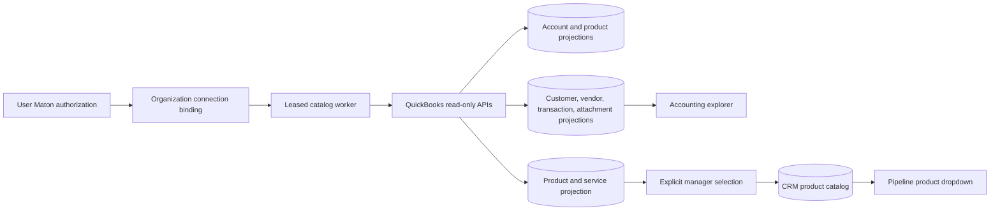

# QuickBooks Accounting Connector

## Purpose

Bind one QuickBooks Online company to the active ClawPilot organization without confusing a user's personal provider authorization with organization data ownership. The connector projects company metadata, accounts, products and services, customers, vendors, transaction forms, and attachment metadata into an organization-scoped read model. Financial writes remain locked until sandbox behavior, reconciliation, approval, and recovery controls are accepted.

## Connection And Tenancy Contract

- A user first authorizes QuickBooks through their own Maton account and selects one `ACTIVE` QuickBooks connection.
- An organization owner or administrator with access-management permission explicitly binds that selected connection to the active organization.
- The encrypted Maton API key remains user-owned. The organization stores only the credential owner, selected connection pointer, verified company name, status, and sync metadata.
- One Maton QuickBooks connection cannot be bound to two ClawPilot organizations. A user with multiple businesses switches workspace and binds each business to its own QuickBooks company.
- Every API read, cached record, worker job, Toast mapping, CRM import, and audit event is scoped by `organization_id`.
- Rebinding or disconnecting clears cached account and item rows and invalidates old account mappings. It never falls back to another organization or platform credential.

## Read-Only Accounting Flow

- The shared Railway poller claims snapshot jobs with a lease and bounded retries.
- Automatic refresh runs no more often than once every 24 hours for enabled active bindings. A manager can queue a refresh from Settings.
- Provider responses are size-bounded and parsed into sanitized projections before Postgres persistence.
- The Accounting workspace supports an overview, invoices, receipts, all transaction types, products and services, the chart of accounts, customers, vendors, and attachment metadata. Lists are paginated and searched server-side.
- Overview totals are operational views of synced transaction forms. They are not represented as a profit-and-loss statement, balance sheet, or other formal QuickBooks report.
- Organization owners can view accounting data. Administrators can grant the `viewAccounting` permission to selected organization members. Connector management remains restricted to owners and access administrators.
- Categories, inactive items, and ambiguous duplicate names are not imported as pipeline products.
- Product import is explicit and limited to 100 selected active products or services per request. It stages durable CRM product records, queues SuiteCRM projection, and refreshes the selected pipeline's product catalog.
- Read access does not create invoices, receipts, payments, journal entries, customers, or provider-side items.

## Toast Mapping Contract

Each selected Toast location can map sales, discounts, voids, refunds, taxes, tips, service charges, gift cards, tenders, payouts, fees, and over/short to active accounts from the organization-bound QuickBooks company. Unmapped values remain valid configuration choices and keep accounting drafts in `needs_mapping`.

Refreshing the chart of accounts clears any mapping whose provider account no longer exists or is inactive. Disconnecting QuickBooks clears every account pointer and returns unposted drafts to mapping review. Posted evidence is retained.

## Posting Boundary

The current release is read-only. QuickBooks posting will require a separate accepted slice with all of the following:

1. Intuit sandbox verification for invoices, receipts, journal entries, products, customers, and idempotent retries.
2. Explicit organization approval roles and immutable approval evidence.
3. Balanced Toast draft reconciliation and account-mapping validation.
4. Provider transaction references, reversal behavior, retry safety, and a tested recovery procedure.
5. Agent isolation: agents may summarize normalized records but cannot retrieve credentials, change mappings, approve drafts, or post transactions.

## Durable Data

- `organization_quickbooks_connections`
- `quickbooks_accounts`
- `quickbooks_items`
- `quickbooks_customers`
- `quickbooks_vendors`
- `quickbooks_transactions`
- `quickbooks_attachments`
- `quickbooks_sync_outbox`
- `toast_accounting_mappings`
- `toast_accounting_export_drafts`
- `audit_events`

## Verification

1. Run `npm run test:quickbooks` and `npm run test:toast`.
2. Select an active Maton QuickBooks connection, switch to the intended workspace, and bind it in **Settings > Integrations > QuickBooks**.
3. Confirm the company name matches the active organization before importing or mapping anything.
4. Refresh the catalog and confirm `/api/health` reports a current QuickBooks worker heartbeat.
5. Import a small selected item set and verify CRM, SuiteCRM outbox, and pipeline product dropdown results.
6. Save one Toast location mapping and confirm another organization cannot read or mutate it.
7. Confirm no QuickBooks mutation endpoint or automatic posting path exists in this release.

See [User Integrations and Credentials](user-integrations.md), [Toast Sales and Accounting](toast-and-accounting.md), and [Platform and Data Map](../maps/platform-data-map.md).
