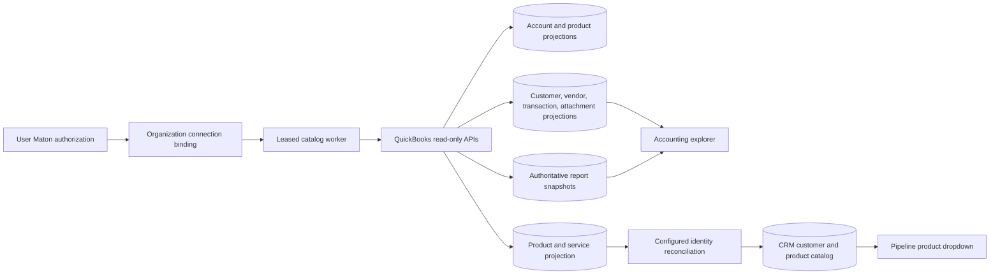

# QuickBooks Accounting Connector

## Purpose

Bind one QuickBooks Online company to the active ClawPilot organization without confusing a user's personal provider authorization with organization data ownership. The connector projects company metadata, accounts, products and services, customers, vendors, transaction forms, attachments, and formal reports into an organization-scoped accounting workspace. Customer, product or service, and invoice changes can be prepared and approved in ClawPilot. Provider posting remains locked until the matching QuickBooks environment has passed sandbox verification.

## Connection And Tenancy Contract

- A user first authorizes QuickBooks through their own Maton account and selects one `ACTIVE` QuickBooks connection.
- An organization owner or administrator with access-management permission explicitly binds that selected connection to the active organization.
- The encrypted Maton API key remains user-owned. The organization stores only the credential owner, selected connection pointer, verified company name, status, and sync metadata.
- One Maton QuickBooks connection cannot be bound to two ClawPilot organizations. A user with multiple businesses switches workspace and binds each business to its own QuickBooks company.
- Every API read, cached record, worker job, Toast mapping, CRM import, and audit event is scoped by `organization_id`.
- Rebinding or disconnecting clears cached account and item rows and invalidates old account mappings. It never falls back to another organization or platform credential.

## Accounting Snapshot Flow

- The shared Railway poller claims snapshot jobs with a lease and bounded retries.
- Entity pages are fetched serially with provider pacing. Rate limits and temporary provider failures honor `Retry-After` plus capped exponential backoff; a failed refresh leaves the last complete snapshot intact.
- Automatic refresh runs no more often than once every 24 hours for enabled active bindings. A manager can queue a refresh from Settings.
- Provider responses are size-bounded and parsed into sanitized projections before Postgres persistence.
- The Accounting workspace supports an overview, invoices, receipts, all transaction types, products and services, the chart of accounts, customers, vendors, attachment evidence, and formal financial statements. Lists are paginated and searched server-side.
- Profit & Loss and Cash Flow are cached for month-to-date, quarter-to-date, year-to-date, and six-month periods. Balance Sheet, A/R Aging, and A/P Aging are cached as-of snapshots. These views preserve the report basis and nested totals returned by the QuickBooks Reports API.
- Overview totals remain operational views of synced transaction forms. They are intentionally separated from authoritative QuickBooks statements.
- Selecting an invoice reconstructs a document view from its durable source payload, including customer and company addresses, dates, terms, item descriptions, quantities, rates, subtotal, tax, total, balance, and linked attachments.
- **POS posting parity** compares the active organization's complete cached Toast-marked QuickBooks history without writing to QuickBooks. It pairs Sales Receipts and Journal Entries by exact business date and document evidence first, uses a one-to-one date fallback only when that match is unambiguous, and leaves unmatched or ambiguous records visible for review.
- Parity checks Sales Receipt totals as net item sales plus tax, with tips retained in the settlement journal. Journal validation compares debit and credit account lines instead of assuming every settlement contains only card deposits, fees, and tips; historical cash and other settlement lines remain valid evidence.
- Historical item and account targets are explanatory evidence only. They never rewrite the current Toast mapping because a source label may have legitimately moved to a different QuickBooks target over time.
- Receipt and invoice attachments remain organization scoped. ClawPilot validates the signed-in user's accounting permission, resolves the organization binding on the server, and requests a short-lived QuickBooks download URL. Because Maton may reject QuickBooks' dedicated download resource, ClawPilot first refreshes the exact Attachable metadata and uses its temporary Intuit URL, retaining the documented download resource as a fallback. Provider credentials and durable download URLs are never returned by ClawPilot APIs.
- Organization owners can view accounting data. Administrators can grant `viewAccounting` to selected organization members. `prepareAccounting` separately allows a user to create and submit drafts. `approveAccounting` is restricted to owners and explicitly authorized organization administrators. Connector management remains restricted to owners and access administrators.
- An organization manager can independently enable **Customers to CRM** and **Products to CRM** for the selected organization-owned pipeline. Saving the configuration reconciles the current cache immediately; each successful daily catalog refresh reconciles it again.
- QuickBooks customer IDs map durably to CRM account Global IDs. Customers are placed beneath the active workspace CRM root. A person contact is created only when QuickBooks provides person-name evidence or a display name distinct from the company. Renames update the linked record instead of creating a duplicate.
- QuickBooks item IDs map durably to CRM product Global IDs. Categories are excluded; inactive products remain inactive and therefore do not enter the active pipeline dropdown. Reconciliation refreshes the selected pipeline's atomic multi-product catalog.
- `quickbooks_crm_links` retains provider entity ID, CRM record ID, source hash, pipeline, and organization. A provider ID never falls back across organizations or pipelines.
- Managers can leave automatic reconciliation off and use the existing explicit product import, limited to 100 selected active products or services per request.
- Read access does not create invoices, receipts, payments, journal entries, customers, or provider-side items.

## Toast Mapping Contract

Each selected Toast location can map sales, discounts, voids, refunds, taxes, tips, service charges, gift cards, tenders, payouts, fees, and over/short to active accounts from the organization-bound QuickBooks company. Unmapped values remain valid configuration choices and keep accounting drafts in `needs_mapping`.

Refreshing the chart of accounts clears any mapping whose provider account no longer exists or is inactive. Disconnecting QuickBooks clears every account pointer and returns unposted drafts to mapping review. Posted evidence is retained.

## Controlled Write Boundary

ClawPilot now supports controlled drafts for creating QuickBooks customers, service or non-inventory items, and invoices. Draft content is normalized and fingerprinted on the server and cannot be edited after creation. A preparer submits the draft; an owner or administrator with `approveAccounting` reviews the same fingerprint before approval. Every transition is written to `audit_events` and successful provider responses retain the QuickBooks entity ID and sync token.

The POS accounting mapper uses this same controlled path for missing Toast products. It may prepare a service or non-inventory item draft with a suggested name, SKU, sales price, expense cost, income account, description, and an optional active QuickBooks parent category. Nested category paths are displayed with their QuickBooks fully qualified names, such as `Breakfast:Breakfast Sandwiches`. ClawPilot validates the category inside the active organization and sends QuickBooks `SubItem` plus `ParentRef` fields only after approval; it never creates an item merely because a name is absent. After provider posting, the normal catalog refresh makes the new item available for explicit Toast mapping.

Provider posting has two independent gates and is disabled by default:

1. The organization connection must have `write_mode` set to the verified environment: `sandbox` or `production`.
2. The worker must have `QUICKBOOKS_WRITES_ENABLED=1` and a matching `QUICKBOOKS_WRITE_MODE`.
3. `QUICKBOOKS_WRITE_OPERATIONS` must explicitly allow the operation, using a comma-separated subset of `customer.create`, `item.create`, and `invoice.create`.

Production currently authorizes `item.create` only. This lets an approved missing Toast product enter the QuickBooks catalog while customer and invoice drafts remain review-only. Journal and sales-receipt previews are built from normalized POS data and mappings; they do not require permission to post those transaction types.

The worker sends the same durable `requestid` on every retry so an ambiguous network response cannot create a second provider record. Successful writes queue a complete catalog refresh before the new provider record is shown as current projection data. Failed attempts retain bounded retry state and become `dead` for explicit operator review after the retry budget is exhausted.

The following remain outside this accepted boundary:

1. Enabling production provider writes before Intuit sandbox acceptance evidence is recorded.
2. Payments, sales receipts, bills, expenses, journal entries, credits, voids, reversals, and deletes.
3. Balanced Toast posting until draft reconciliation and account-mapping validation are accepted.
4. Agent posting. Agents may summarize normalized records but cannot retrieve credentials, change mappings, approve drafts, or post transactions.

## Durable Data

- `organization_quickbooks_connections`
- `quickbooks_accounts`
- `quickbooks_items`
- `quickbooks_customers`
- `quickbooks_vendors`
- `quickbooks_transactions`
- `quickbooks_attachments`
- `quickbooks_financial_reports`
- `quickbooks_sync_outbox`
- `quickbooks_write_requests`
- `quickbooks_crm_links`
- `toast_accounting_mappings`
- `toast_accounting_export_drafts`
- `audit_events`

## Verification

1. Run `npm run test:quickbooks` and `npm run test:toast`.
2. Select an active Maton QuickBooks connection, switch to the intended workspace, and bind it in **Settings > Integrations > QuickBooks**.
3. Confirm the company name matches the active organization before importing or mapping anything.
4. Refresh the catalog and confirm `/api/health` reports migration `0065` plus a current QuickBooks worker heartbeat.
5. Open each Financial reports tab and verify its period, basis, nested rows, totals, and latest-sync state against QuickBooks Online.
6. Open an invoice and verify its item lines, quantity, rate, tax, total, balance, and customer addresses. Open one linked receipt image or PDF and confirm another organization cannot retrieve it.
7. Enable customer and product reconciliation for a test pipeline. Verify customer accounts remain children of the workspace root, person contacts are not fabricated from company-only rows, provider renames update the same Global IDs, SuiteCRM outbox records are scoped correctly, and the pipeline product dropdown contains atomic active products.
8. Save one Toast location mapping and confirm another organization cannot read or mutate it.
9. Create a customer, product, and invoice draft. Confirm submission and approval preserve the same request fingerprint and record distinct signed-user audit events.
10. With provider posting disabled, confirm an approved request remains approved and no QuickBooks mutation is sent.
11. In an Intuit sandbox only, enable both write gates, process each supported operation, retry the same provider request ID, and confirm exactly one QuickBooks entity exists.
12. Open **POS posting parity** across the full available date range. Confirm exact receipt/journal pairs report receipt and journal variances independently, ambiguous and unmatched records remain visible, and the API returns normalized comparison evidence rather than raw provider payloads.

QuickBooks report, attachment, and controlled-write behavior follows Intuit's official [Reports API workflow](https://developer.intuit.com/app/developer/qbo/docs/workflows/run-reports), [attachment workflow](https://developer.intuit.com/app/developer/qbo/docs/workflows/attach-images-and-notes), [invoice workflow](https://developer.intuit.com/app/developer/qbo/docs/workflows/create-an-invoice), and [`requestid` idempotency guidance](https://developer.intuit.com/app/developer/qbo/docs/learn/learn-basic-field-definitions).

See [User Integrations and Credentials](user-integrations.md), [Toast POS and Accounting](toast-and-accounting.md), and [Platform and Data Map](../maps/platform-data-map.md).
