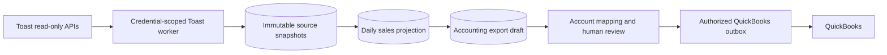

# Toast Sales and Accounting

## Purpose

Connect a restaurant organization's Toast data to ClawPilot without giving an agent access to restaurant credentials or allowing raw provider data to create accounting transactions. Toast ingestion produces durable sales evidence and reviewable accounting drafts. QuickBooks posting remains a separate authorized connector operation.

## Access Modes

Toast provides two independent machine-client credential types. ClawPilot stores and rotates them separately because access, locations, and intended data differ.

- **Analytics API** supplies read-only management-group reporting, including sales metrics and payouts. Analytics credentials discover the restaurant locations available to their management group.
- **Standard API** supplies read-only location data such as restaurant configuration and detailed orders. Each location is verified with its Toast restaurant GUID and every request includes `Toast-Restaurant-External-ID`.
- Both credentials are managed under **Settings > Integrations > Toast** by the organization owner or an administrator with access-management permission.
- A candidate credential is authenticated against Toast before encrypted material is committed. API responses expose only configuration status and final-four hints.

Official provider procedures remain authoritative for creating [Analytics API credentials](https://doc.toasttab.com/doc/devguide/apiAnalyticsAccessCreatingCredentials.html), [Standard API credentials](https://doc.toasttab.com/doc/devguide/devApiAccessCredentials.html), and understanding [Standard API scopes](https://doc.toasttab.com/doc/devguide/devApiAccessScopes.html).

## Ingestion Flow

1. A manager selects verified restaurant locations and queues a business date or enables daily synchronization.
2. A leased Postgres outbox claim retrieves Analytics sales, Analytics payouts, and Standard orders only when the relevant credential and location access exist.
3. Analytics reports are asynchronous. The job retains its Toast request GUID and defers without consuming retry attempts until the report is ready.
4. Provider records are stored as immutable, content-hashed snapshots. Retries cannot create duplicate source evidence.
5. Normalized daily sales and order counts are upserted per organization, restaurant, and business date.
6. Each completed projection refreshes one idempotent accounting draft. The draft remains `needs_mapping` or `needs_review`; this worker has no QuickBooks credential or posting capability.

## Accounting Boundary

Toast Analytics reporting is operational information, not a GAAP ledger. ClawPilot does not post raw Analytics rows directly to QuickBooks.

- Each restaurant maps sales, discounts, voids, refunds, taxes, tips, service charges, gift cards, tenders, payouts, fees, and over/short to its own QuickBooks chart of accounts.
- A draft must reconcile source coverage and pass mapping validation before approval is possible.
- Posting requires a separately connected QuickBooks company, current organization authorization, an explicit approval, and an idempotency key.
- Failed or ambiguous exports remain reviewable and retryable; they never silently fall back to another restaurant, organization, or QuickBooks company.
- Agents may summarize a normalized draft but cannot retrieve Toast or QuickBooks credentials, change mappings, approve a draft, or post a transaction.

## Durable Data

- `organization_toast_credentials`
- `toast_locations`
- `toast_sync_outbox`
- `toast_source_snapshots`
- `toast_daily_sales`
- `toast_accounting_mappings`
- `toast_accounting_export_drafts`

All rows are organization-scoped. Development and production use their own Postgres databases and credential records.

## Current Release Boundary

This release implements both Toast credential connections, location verification, scheduled and manual read-only ingestion, immutable source snapshots, daily projections, accounting draft generation, worker health, and audit events. QuickBooks authorization, account-mapping management, draft approval, and posting are intentionally locked for the next accounting connector slice.

## Verification

1. Run `npm run test:toast`.
2. Connect Analytics and Standard credentials independently and confirm no full secret returns from the API.
3. Refresh Analytics locations, verify a Standard location GUID, and select only the intended restaurants.
4. Queue one completed business date and confirm all jobs reach `succeeded` or a specific retryable error.
5. Confirm immutable snapshots and one daily projection exist for the same organization, restaurant, and business date.
6. Confirm the accounting draft is not posted and reports `needs_mapping` or `needs_review`.
7. Confirm `/api/health` reports the Toast worker heartbeat in Railway.
