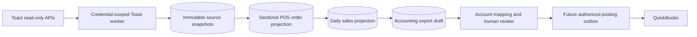

# Toast POS and Accounting

## Purpose

Connect a restaurant organization's Toast data to ClawPilot without giving an agent access to restaurant credentials or allowing raw provider data to create accounting transactions. The POS module gives permitted organization members an operational view of sales, orders, checks, items, tenders, tax, tips, and draft reconciliation. QuickBooks posting remains a separate authorized connector operation.

## Access Modes

Toast provides two independent machine-client credential types. ClawPilot stores and rotates them separately because access, locations, and intended data differ.

- **Analytics API** supplies read-only management-group reporting, including sales metrics and payouts. Analytics credentials discover the restaurant locations available to their management group.
- **Standard API** supplies read-only location data such as restaurant configuration and detailed orders. Each location is verified with its Toast restaurant GUID and every request includes `Toast-Restaurant-External-ID`.
- Both credentials are managed under **Settings > Integrations > Toast** by the organization owner or an administrator with access-management permission.
- A candidate credential is authenticated against Toast before encrypted material is committed. API responses expose only configuration status and final-four hints.

Official provider procedures remain authoritative for creating [Analytics API credentials](https://doc.toasttab.com/doc/devguide/apiAnalyticsAccessCreatingCredentials.html), [Standard API credentials](https://doc.toasttab.com/doc/devguide/devApiAccessCredentials.html), and understanding [Standard API scopes](https://doc.toasttab.com/doc/devguide/devApiAccessScopes.html).

## Ingestion Flow

1. A manager selects verified restaurant locations and queues a business date or enables daily synchronization.
2. A token-bound Postgres outbox lease retrieves Analytics sales, Analytics payouts, and Standard orders only when the relevant credential and location access exist. A stale lease is recoverable after 15 minutes, but a superseded worker cannot write or complete the replacement claim. A manual refresh of an active job records one durable follow-up run; a completed job can be explicitly rerun, while the automatic modified-order poll is throttled to one run per 15 minutes.
3. Analytics reports are asynchronous. The job retains its Toast request GUID and defers without consuming retry attempts until the report is ready.
4. Provider records are stored as immutable, content-hashed snapshots. Retries cannot create duplicate source evidence.
5. Standard orders are normalized into tenant-scoped order, check, item, tender, tax, tip, discount, service-charge, refund, and total fields. Guest identity, customer contact data, card numbers, and provider payment identifiers are not exposed through the POS projection.
6. Normalized order rows and daily sales are atomically replaced per organization, restaurant, and business date. The daily update job reads Toast's modified-order feed, then retrieves and replaces every affected business day so refunds or edits to older orders do not leave stale projections. Immutable source snapshots remain backend evidence for recalculation.
7. Automatic scheduling never revives failed or dead work. An operator must review the specific error before retrying a terminal job.
8. Each completed projection refreshes one idempotent legacy accounting draft. That draft remains `needs_mapping` and records that canonical readiness has not been verified. Only the canonical POS accounting preview may report review readiness after checking effective mappings, allocation, reconciliation, holds, open checks, and the current QuickBooks company binding. Neither path has a posting action.

## POS Workspace

POS is a first-class authenticated module in the desktop navigation and mobile More menu. It uses the active browser-session workspace and the existing accounting-view permission; switching businesses cannot reuse the prior organization's locations, orders, totals, or drafts.

- **Overview** shows business-date sales, order and guest counts, average check, discounts, refunds, and a daily trend for the selected location and date range.
- **Orders** provides server-paginated order search and an order drawer with checks, line items, modifiers, tax, tenders, and tips. All timestamps use the signed-in user's timezone.
- **Reports** provides business-day sales, check status, product and category performance, tender and card summaries, cash evidence, prior-period comparisons, and a transparent sales run rate. Wide tables collapse into stacked operational rows on phones.
- **Accounting** shows location/date reconciliation drafts, versioned posting profiles, QuickBooks reference catalogs, item/account mappings, immutable previews, and any missing mapping or source variance. It does not expose a posting shortcut.
- Owners receive access by role. Administrators can grant `viewAccounting` to selected members. Managing Toast credentials and selected locations remains limited to organization owners and access administrators.
- The protected demo workspace contains rolling synthetic POS data and no provider credential, provider identifier, customer identity, or live restaurant data.

### In-App Guide

The POS toolbar includes **How POS works**. The guide opens automatically the first time a browser visits POS for each active organization, then remains available from the help icon. It adapts its source-status labels to the current workspace and clearly identifies a protected demo account versus a live business.

The guide explains the Toast-to-ClawPilot data path, date and location scope, Orders drill-down, operational Reports, QuickBooks mapping and accounting-review workflow, manager-enabled CRM catalog synchronization, and the current posting boundary. Its section actions open the corresponding POS view. Demo users see the same workflow against rolling synthetic, read-only data without any provider credential.

## Operational Reports

The POS workspace replaces the useful reporting surfaces of the operator's previous Toast-to-accounting tool without reproducing its desktop tables on a phone. Reports are calculated server-side from organization-scoped projections and rendered as mobile-first summaries with drill-down detail.

- **Receipts** reconciles net sales, discounts, service charges, tips, tax, and total tender for the selected business dates.
- **Checks** exposes check number, open/close time, subtotal, discounts, tax, other charges, total, tender, and provider identity needed for an audit trail.
- **Products** groups quantity and sales by durable Toast menu item, item group, and sales category identifiers. Display-name matching is a fallback for old projections, never the canonical identity.
- **Payments** groups cash, card, and other tenders, including card brand when Toast supplies it.
- **Cash operations** reports cash sales and known over/short or payout values. Missing values remain unavailable instead of becoming zero-valued accounting assertions.
- **Comparisons** shows prior-period and prior-year results when source data exists. Weather, COGS, gross margin, and verified payout deposits are not inferred from Standard Orders.
- **Forecasting** is derived from business-date history and clearly labels model inputs, horizon, and unavailable periods; forecasts never become ledger transactions.

Standard Orders can reproduce the July 18, 2026 operational totals used for acceptance: 26 orders, 87 items, $551.74 net sales, $40.58 tax, $65.42 tips, $592.32 tender, and $657.74 total. Its payment rows also contain $28.21 in original processing fees, allowing a calculated net card settlement of $629.53. ClawPilot labels that result as calculated until Analytics payout or equivalent settlement evidence verifies the bank deposit.

## Menu Catalog

Toast selections include stable menu-item, item-group, and sales-category identifiers but not always their display names. ClawPilot therefore maintains a separate tenant-scoped catalog from Toast Menus V2.

1. Read `/menus/v2/metadata` before retrieving the full catalog.
2. Retrieve `/menus/v2/menus` only when Toast reports a newer revision or an authorized manager explicitly forces a refresh.
3. Normalize menu, group, item, category, PLU, price, visibility, and active state without storing order or customer identity.
4. Keep the last valid catalog if Toast rejects the scope or temporarily returns no published menu.
5. Use provider identifiers for reporting and accounting mappings; a renamed menu item does not create a new mapping.
6. Merge the stable menu catalog with observed sales before presenting accounting mappings. An active menu item remains configurable even when it has not appeared in the selected sales window.

## Accounting Configuration And Preview

Accounting is configured by organization with an optional restaurant override. A versioned posting profile replaces fixed application-wide mapping keys.

- Posting method, QuickBooks company binding, customer, clearing account, class, department, location, vendor, tax behavior, memo rule, and transaction-number suffix are explicit profile fields.
- Policies cover cash deposits, zero over/short suppression, tip payout behavior, open checks, refunds, fees, and delayed batches.
- Mapping rules support Toast item, item group, sales category, discount, tax, service charge, tender, card brand, payout, fee, and cash-operation sources. Destinations may be a QuickBooks item, account, tax code, class, department, location, customer, or vendor.
- Rules store both provider IDs and name snapshots. Provider ID and restaurant-specific scope determine precedence; name-only imports require review.
- ClawPilot may prefill a QuickBooks product suggestion only when an exact or normalized name resolves to one active QuickBooks item. The operator must still save the mapping; ambiguous matches remain unresolved.
- An unmatched Toast sales item can prepare an immutable QuickBooks product draft from its menu name, PLU, price, and location context. The operator may assign an existing active QuickBooks category, including a nested category shown by its fully qualified path. Categories are parent containers and are never offered as ordinary Toast item mapping targets. Product creation follows the normal submit, approval, provider-write, and catalog-refresh controls before the new item can be selected as a mapping target.
- Validation records the Toast catalog revision, QuickBooks catalog revision, outcome, reason, actor, and timestamp.

The attached legacy mapping workbook is an import source, not the runtime database. Its accepted baseline is Itemized Sales Receipt, per-line tax, a clearing account, a separate payments journal, 29 mapped sales-item targets, and six unresolved item mappings. Import must preserve aliases and mark unresolved rows for review rather than guessing QuickBooks destinations.

The preview produces two immutable documents for a business date:

1. An itemized Sales Receipt with mapped products, discounts, service charges, and tax.
2. A balanced Payments Journal that clears tenders, tips, deposits, fees, cash, and over/short only when their required sources are available.

An unresolved item, missing destination, unavailable payout, source variance, or unbalanced journal places the preview on hold. Saving a mapping regenerates only unapproved drafts; approved or posted evidence is never overwritten.

## Organization Reporting

The integration settings expose a reporting-readiness summary for the signed-in organization. It reports verified location profiles, successful business-date coverage, source record counts, daily order and guest totals, Analytics sales totals when available, sync failures, and accounting draft state. A completed sync that returns no orders is shown as a valid no-data result rather than a connection failure.

Standard and Analytics readiness remain independent. Standard Orders is sufficient for the POS operational view. Analytics remains optional for management reporting, payouts, and cross-source reconciliation. When both are present, a material net-sales difference marks the accounting draft as `variance` instead of silently treating the feeds as equal. Queries and API responses remain filtered by `organization_id`.

A completed sync with no Toast sales, tenders, tax, tips, discounts, fees, or refunds is retained as a valid no-data operational result but does not create a dated accounting draft. Reconciliation removes only empty drafts that have not entered the protected approval lifecycle; approved, posting, and posted evidence is never deleted by no-sales cleanup.

## Accounting Issue Notifications

ClawPilot turns confirmed accounting blockers into actionable, organization-scoped notifications instead of requiring an operator to repeatedly inspect every business date.

- A completed projection and every profile or mapping save re-evaluates the canonical POS accounting preview for the selected organization, restaurant, and business date.
- Confirmed blockers include missing mappings, an unverified QuickBooks company binding, an unbalanced payments journal, unallocated sales, and open checks when the profile policy requires a hold. Unavailable preview or payout data does not create a false alert.
- One durable issue state is maintained per organization, restaurant, and business date. The normalized issue fingerprint prevents repeated worker checks and threaded retries from creating duplicate alerts.
- A changed issue set or an issue that recurs after resolution creates a new occurrence. Resolving the underlying blockers closes the issue, cancels unsent mail, and records a resolution in Activity.
- The in-app Activity event and email action open the exact organization, POS Accounting view, restaurant, and business date that needs review.
- Email delivery uses a leased outbox with retry backoff, terminal failure visibility, and authorization checks immediately before delivery. It targets active owners and active organization administrators who hold both accounting-view and access-management permissions for that exact organization. Descendant organizations, global role alone, and inactive memberships do not confer recipient access.
- `/api/health` exposes pending, failed, dead, stale, and overdue accounting-notification deliveries. The Toast worker reconciles stale open issues independently from ingestion so a mail-provider failure cannot poison POS projections.

## Accounting Boundary

Toast Analytics reporting is operational information, not a GAAP ledger. ClawPilot does not post raw Analytics rows directly to QuickBooks.

- Each restaurant maps sales, discounts, voids, refunds, taxes, tips, service charges, gift cards, tenders, payouts, fees, and over/short to its own QuickBooks chart of accounts.
- A draft must reconcile source coverage and pass mapping validation before approval is possible.
- Posting requires a separately connected QuickBooks company, current organization authorization, an explicit approval, and an idempotency key.
- Failed or ambiguous exports remain reviewable and retryable; they never silently fall back to another restaurant, organization, or QuickBooks company.
- Accounting issue email is disabled by default and requires an organization accounting administrator to enable **Email issue alerts** on the effective accounting profile. Enabling it establishes a notification start date; ClawPilot does not backfill older business dates.
- Demo workspaces and reserved `.example`, `.invalid`, and `.test` recipients never enter the delivery queue. Activity remains available in-app without email delivery.
- Agents may summarize a normalized draft but cannot retrieve Toast or QuickBooks credentials, change mappings, approve a draft, or post a transaction.
- Account mapping uses the active organization's read-only QuickBooks catalog described in [QuickBooks Accounting Connector](quickbooks-accounting.md).

## Durable Data

- `organization_toast_credentials`
- `toast_locations`
- `toast_sync_outbox`
- `toast_source_snapshots`
- `toast_pos_orders`
- `toast_daily_sales`
- `toast_menu_revisions`
- `toast_menu_groups`
- `toast_menu_items`
- `toast_menu_categories`
- `toast_accounting_mappings`
- `toast_accounting_export_drafts`
- `pos_accounting_profiles`
- `pos_accounting_catalog_mappings`
- `pos_accounting_issue_states`
- `pos_accounting_notification_outbox`
- `quickbooks_accounts`
- `quickbooks_items`
- `quickbooks_classes`
- `quickbooks_departments`
- `quickbooks_tax_codes`

All rows are organization-scoped. A multi-business user connects, selects, and reports on Toast only within the active workspace membership; credentials and restaurant data never cross root businesses. Development and production use their own Postgres databases and credential records.

## Current Release Boundary

This release implements both Toast credential connections, location verification, scheduled and manual read-only ingestion, immutable source snapshots, sanitized order/check/item projections, menu catalogs, a dedicated responsive POS workspace, operational reports, daily projections, versioned accounting profiles, QuickBooks reference catalogs, immutable accounting previews, deduplicated accounting-issue notifications, worker health, and audit events. Organization-bound QuickBooks authorization and mapping management are available. Toast-to-QuickBooks financial posting remains intentionally locked pending complete mapping, reconciliation, independent approval, and sandbox acceptance.

## Verification

1. Run `npm run test:toast` and `npm run test:pos`.
2. Connect Analytics and Standard credentials independently and confirm no full secret returns from the API.
3. Refresh Analytics locations, verify a Standard location GUID, and select only the intended restaurants.
4. Queue one completed business date and confirm all jobs reach `succeeded` or a specific retryable error.
5. Confirm immutable snapshots, sanitized POS order rows, and one daily projection exist for the same organization, restaurant, and business date.
6. Open POS Overview, Orders, Reports, and Accounting on desktop, phone portrait, and phone landscape. Confirm order totals reconcile as net sales plus tax, with tips shown separately, and confirm another organization cannot retrieve the order.
7. Confirm the legacy accounting draft is not posted and reports `needs_mapping`; then confirm the canonical POS accounting preview independently reports mapping, allocation, reconciliation, and hold evidence.
8. Confirm `/api/health` reports the Toast worker heartbeat in Railway.
9. Bind the intended organization to QuickBooks, save one location's account mappings, and confirm financial posting remains unavailable.
10. Confirm an active Toast menu item with no observed sales remains available for mapping. Prepare a missing QuickBooks product draft, submit and approve it in Accounting, refresh the catalog after posting, and then save the Toast mapping.
11. Sync a business date with no sales or refund activity and confirm it produces no dated accounting draft.
12. Enable **Email issue alerts**, leave one confirmed current-date mapping issue, run the worker twice, and confirm one Activity item and one email delivery are created for that occurrence. Open the action and confirm the correct organization, location, date, and Accounting view load.
13. Resolve the issue and confirm Activity records the resolution. Reintroduce the issue and confirm exactly one new occurrence is queued.
14. Disable email alerts and confirm issue Activity continues without an outbox row. Confirm a demo or reserved recipient is rejected even if it has owner permissions.
