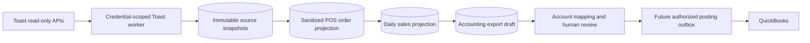

# Toast POS and Accounting

## Purpose

Connect a restaurant organization's Toast data to ClawPilot without giving an agent access to restaurant credentials or allowing raw provider data to create accounting transactions. The POS module gives permitted organization members an operational view of sales, orders, checks, items, tenders, tax, tips, and draft reconciliation. QuickBooks posting remains a separate authorized connector operation.

## Access Modes

Toast provides two independent machine-client credential types. ClawPilot stores and rotates them separately because access, locations, and intended data differ.

- **Analytics API** supplies read-only management-group reporting, including sales metrics and payouts. Analytics credentials discover the restaurant locations available to their management group.
- **Standard API** supplies read-only location data such as restaurant configuration and detailed orders. Each location is verified with its Toast restaurant GUID and every request includes `Toast-Restaurant-External-ID`.
- Both credentials are managed under **Settings > Integrations > Toast** by the organization owner or an administrator with access-management permission.
- A candidate credential is authenticated against Toast before encrypted material is committed. API responses expose only configuration status and final-four hints.

Official provider procedures remain authoritative for creating [Analytics API credentials](https://doc.toasttab.com/doc/devguide/apiAnalyticsAccessCreatingCredentials.html), [Standard API credentials](https://doc.toasttab.com/doc/devguide/devApiAccessCredentials.html), and understanding [Standard API scopes](https://doc.toasttab.com/doc/devguide/devApiAccessScopes.html).

## Ingestion Flow

1. A manager selects verified restaurant locations and queues a business date or enables daily synchronization.
2. A token-bound Postgres outbox lease retrieves Analytics sales, Analytics payouts, and Standard orders only when the relevant credential and location access exist. A stale lease is recoverable after 15 minutes, but a superseded worker cannot write or complete the replacement claim. A manual refresh of an active job records one durable follow-up run; a completed job can be explicitly rerun, while the automatic modified-order poll is throttled to one run per 15 minutes. The automatic poll covers both the previous and current restaurant-local business dates so a paid future order is visible shortly after it is entered instead of waiting for the next closeout.
3. Analytics reports are asynchronous. The job retains its Toast request GUID and defers without consuming retry attempts until the report is ready.
4. Provider records are stored as immutable, content-hashed snapshots. Retries cannot create duplicate source evidence.
5. Standard orders are normalized into tenant-scoped order, check, item, tender, tax, tip, discount, service-charge, refund, and total fields. The projection also preserves source-created, source-modified, promised, estimated-fulfillment, and payment timestamps so accounting can distinguish when money was received from when the sale is fulfilled. Guest identity, customer contact data, card numbers, and provider payment identifiers are not exposed through the POS projection.
6. Normalized order rows and daily sales are atomically replaced per organization, restaurant, and business date. The daily update job reads Toast's modified-order feed using a restaurant-timezone and daylight-saving-aware window, then retrieves and replaces every affected business day so future orders, refunds, or edits to older orders do not leave stale projections. Every payment and fulfillment business date affected by the order is re-evaluated for accounting. Immutable source snapshots remain backend evidence for recalculation.

The Payment Exceptions rollout stages one restaurant-local 31-day modified-order replay for each active Standard location. Migration-created jobs remain unavailable until the updated Railway app and worker pass health; startup then activates them in batches of four per minute. This expand-first sequence prevents the previous worker from consuming lifecycle backfill work during a Vercel/Railway rolling deployment.
7. Automatic scheduling never revives failed or dead work. An operator must review the specific error before retrying a terminal job.
8. Each completed sales projection refreshes the current canonical accounting draft from stored normalized orders, effective mappings, the active posting profile, allocation, reconciliation, holds, open checks, and the current QuickBooks company binding. A correlated accounting reload waits for every required sales source before generating one final revision. Neither path has a posting action.

## POS Workspace

POS is a first-class authenticated module in the desktop navigation and mobile More menu. It uses the active browser-session workspace and the existing accounting-view permission; switching businesses cannot reuse the prior organization's locations, orders, totals, or drafts.

- **Overview** shows business-date sales, order and guest counts, average check, discounts, refunds, and a daily trend for the selected location and date range.
- **Orders** provides server-paginated order search and an order drawer with checks, line items, modifiers, tax, tenders, and tips. Paid orders with a later fulfillment date appear on their payment date with a **Preorder** marker and retain their future fulfillment date. All timestamps use the signed-in user's timezone.
- **Reports** provides business-day sales, check status, product and category performance, tender and card summaries, cash evidence, prior-period comparisons, and a transparent sales run rate. Wide tables collapse into stacked operational rows on phones.
- **Accounting** provides one location/date posting queue with `Hold`, `Ready`, `Posting`, `Posted`, and `Failed` states, an issues-only filter, structured blocker reasons, and a direct action for the affected mapping, checks, configuration, or posting review. Selecting a row loads that exact date and location. The same workspace retains versioned posting profiles, QuickBooks reference catalogs, item/account mappings, immutable previews, and separate date-scoped sales reload and accounting regeneration controls.
- Owners receive access by role. Administrators can grant `viewAccounting` to selected members. Managing Toast credentials and selected locations remains limited to organization owners and access administrators.
- The protected demo workspace contains rolling synthetic POS data and no provider credential, provider identifier, customer identity, or live restaurant data.

### In-App Guide

The POS toolbar includes **How POS works**. The guide opens automatically the first time a browser visits POS for each active organization, then remains available from the help icon. It adapts its source-status labels to the current workspace and clearly identifies a protected demo account versus a live business.

The guide explains the Toast-to-ClawPilot data path, date and location scope, Orders drill-down, operational Reports, QuickBooks mapping and accounting-review workflow, manager-enabled CRM catalog synchronization, and the current posting boundary. Its section actions open the corresponding POS view. Demo users see the same workflow against rolling synthetic, read-only data without any provider credential.

## Operational Reports

The POS workspace replaces the useful reporting surfaces of the operator's previous Toast-to-accounting tool without reproducing its desktop tables on a phone. Reports are calculated server-side from organization-scoped projections and rendered as mobile-first summaries with drill-down detail.

- **Receipts** reconciles net sales, discounts, service charges, tips, tax, and total tender for the selected business dates.
- **Checks** exposes check number, open/close time, subtotal, discounts, tax, other charges, total, tender, and provider identity needed for an audit trail.
- **Products** groups quantity and sales by durable Toast menu item, item group, and sales category identifiers. Display-name matching is a fallback for old projections, never the canonical identity.
- **Payments** groups cash, card, and other tenders, including card brand when Toast supplies it.
- **Cash operations** reports cash sales and known over/short or payout values. Missing values remain unavailable instead of becoming zero-valued accounting assertions.
- **Comparisons** shows prior-period and prior-year results when source data exists. Weather, COGS, gross margin, and verified payout deposits are not inferred from Standard Orders.
- **Forecasting** is derived from business-date history and clearly labels model inputs, horizon, and unavailable periods; forecasts never become ledger transactions.

Standard Orders can reproduce the July 18, 2026 operational totals used for acceptance: 26 orders, 87 items, $551.74 net sales, $40.58 tax, $65.42 tips, $592.32 tender, and $657.74 total. Its payment rows also contain $28.21 in original processing fees, allowing a calculated net card settlement of $629.53. ClawPilot labels that result as calculated until Analytics payout or equivalent settlement evidence verifies the bank deposit.

## Menu Catalog

Toast selections include stable menu-item, item-group, and sales-category identifiers but not always their display names. ClawPilot therefore maintains a separate tenant-scoped catalog from Toast Menus V2.

1. Read `/menus/v2/metadata` before retrieving the full catalog.
2. Retrieve `/menus/v2/menus` only when Toast reports a newer revision or an authorized manager explicitly forces a refresh.
3. Normalize menu, group, item, category, PLU, price, visibility, and active state without storing order or customer identity.
4. Keep the last valid catalog if Toast rejects the scope or temporarily returns no published menu.
5. Use provider identifiers for reporting and accounting mappings; a renamed menu item does not create a new mapping.
6. Merge the stable menu catalog with observed sales before presenting accounting mappings. An active menu item remains configurable even when it has not appeared in the selected sales window.

## Accounting Configuration And Preview

Accounting is configured by organization with an optional restaurant override. A versioned posting profile replaces fixed application-wide mapping keys.

- Posting method, QuickBooks company binding, customer, clearing account, class, department, location, vendor, tax behavior, memo rule, and transaction-number suffix are explicit profile fields.
- Policies cover cash deposits, zero over/short suppression, tip payout behavior, open checks, refunds, fees, and delayed batches.
- Mapping rules support Toast item, item group, sales category, discount, tax, service charge, tender, card brand, payout, fee, and cash-operation sources. Destinations may be a QuickBooks item, account, tax code, class, department, location, customer, or vendor.
- Rules store both provider IDs and name snapshots. Provider ID and restaurant-specific scope determine precedence; name-only imports require review.
- ClawPilot may prefill a QuickBooks product suggestion only when an exact or normalized name resolves to one active QuickBooks item. The operator must still save the mapping; ambiguous matches remain unresolved.
- An unmatched Toast sales item can prepare an immutable QuickBooks product draft from its menu name, PLU, price, and location context. The operator may assign an existing active QuickBooks category, including a nested category shown by its fully qualified path. Categories are parent containers and are never offered as ordinary Toast item mapping targets. Product creation follows the normal submit, approval, provider-write, and catalog-refresh controls before the new item can be selected as a mapping target.
- Validation records the Toast catalog revision, QuickBooks catalog revision, outcome, reason, actor, and timestamp.

The attached legacy mapping workbook is an import source, not the runtime database. Its accepted baseline is Itemized Sales Receipt, per-line tax, a clearing account, a separate payments journal, 29 mapped sales-item targets, and six unresolved item mappings. Import must preserve aliases and mark unresolved rows for review rather than guessing QuickBooks destinations.

The preview normally produces two immutable documents for a business date:

1. An itemized Sales Receipt with mapped net product sales and tax. Item-level discounts and refunds are already reflected in normalized net item amounts and are not subtracted a second time. Tips remain outside the receipt.
2. A balanced Payments Journal that clears tenders, tips, deposits, fees, cash, and over/short only when their required sources are available.

A payment-date-only Payment Exceptions event produces only the balanced Payments Journal described below; it never manufactures an empty Sales Receipt.

An unresolved item, missing destination, unavailable payout, source variance, or unbalanced journal places the preview on hold. Profile and mapping saves create configuration revisions; the operator explicitly regenerates accounting when the revised rules should be applied to a business date. Approved, posting, and posted evidence is never overwritten.

### Future Orders And Payment Exceptions

Toast can receive a payment on one date and fulfill the related order on another. ClawPilot treats those as two linked accounting events instead of dropping the early payment or recognizing the sale twice.

1. On the payment date, ClawPilot immediately shows a provisional Payments Journal that debits the actual tender or settlement destination and credits the mapped **Payment Exceptions** clearing account. A payment-date-only draft does not create a zero-dollar Sales Receipt.
2. The provisional journal cannot be prepared or posted while that Toast business day is still active, until every included order has been refreshed from Toast after closeout, while an included card payment is not `CAPTURED`, or while a configured fee or payout hold lacks its required evidence. The operator sees the exact wait state and can reload Toast after closeout; merely regenerating from stored rows cannot clear the freshness hold.
3. On the fulfillment date, the Sales Receipt recognizes the mapped sale and the Payments Journal debits **Payment Exceptions** while crediting POS clearing and tips payable. Both documents remain blocked until every active Toast check is `CLOSED` with a valid closeout timestamp.
4. Split payments retain every payment business date. Missing payment timing is a blocking issue rather than an assumed date.
5. **Payment Exceptions** maps to one QuickBooks account-backed catalog source (`summary:payment_exceptions`). It must use the dedicated clearing account approved by accounting and cannot reuse the POS clearing account; ClawPilot does not guess the account type or silently repair that financial choice.
6. Capture and release rows retain non-customer Toast order, check, and payment keys plus both business dates, so the parity view can present one `Paid → fulfilled` lifecycle instead of two unrelated missing documents.
7. Toast tips remain a separate payment fact. They are compared against the Payments Journal or tips-payable line, never inferred from the Sales Receipt. A later Toast tip update creates a new correction revision without overwriting protected posting evidence.
8. Voided or deleted orders, checks, selections, and payments remain available as source evidence but do not contribute posting dates, totals, mappings, or closeout blockers.

Payment timing uses Toast's authoritative `paidBusinessDate` first, so overnight payments follow the restaurant's configured closeout boundary. Posting readiness requires a valid restaurant IANA timezone and uses the restaurant's `closeoutHour` rather than browser time or midnight. Until a legacy location is reverified, ClawPilot uses noon—the latest valid Toast cutoff—as a conservative active-day hold and says so in the blocker detail. An older payment without `paidBusinessDate` is inferred from `paidDate` only when the exact restaurant cutoff is stored or every valid Toast cutoff produces the same date; ambiguous overnight timing remains blocked instead of being assigned to a calendar day. Fulfillment follows `promisedDate`, matching Toast's scheduled-order model and Shogo's documented Payment Exceptions clearing workflow. The Orders drawer deliberately displays **Paid** and **Closed** separately so an applied payment is never presented as evidence that Toast finalized the check.

### Posting Status And Issue Coverage

ClawPilot uses Shogo's operator workflow as a comparison model, not as a runtime API dependency. Shogo does not publish a customer accounting-status API contract in its public documentation, so ClawPilot derives its status from its own durable Toast, mapping, draft, QuickBooks, and worker evidence.

- The queue normalizes the public Shogo concepts `NONE`, `POST`, `HOLD`, `POSTED`, `UPDATED`, `BATCHHOLD`, `FAILED`, `UPDATEFAILED`, `OPEN CHECKS`, and `OOB` into the five operator states while preserving the specific reason as the row label and blocker detail.
- Confirmed mapping, QuickBooks binding, out-of-balance, source-variance, allocation, open-check, invalid-timezone, post-closeout-source-freshness, active-payment-day, uncaptured-payment, unclosed-fulfillment-check, batch-detail, settlement, payment-timing, protected-update, provider-posting, missing-source-date, overdue-worker, and failed Toast-sync problems remain visible. The selected date range has no silent draft or issue cap. An unrecognized provider or worker error becomes a safe generic failure with its recorded message instead of disappearing.
- A mapping action names the exact target (for example **Choose settlement account**), explains that saving changes configuration rather than posting, and leaves a visible regeneration action until the selected date has been rebuilt.
- The parity view distinguishes a future fulfillment document as scheduled instead of missing. An authorized **Sync QuickBooks and recheck** action reads only the selected bounded date range, replaces that range's cached Sales Receipt and Journal Entry evidence, records the refresh timestamp, and then re-evaluates exact matches. Human acknowledgement remains separate from provider evidence and cannot manufacture a match.
- Preview readiness, the stored draft, issue state and notification, and prepare/approve authorization use the same canonical blocker evaluation. The posting endpoint rechecks that stored gate at both preparation and approval, requires drafts created under the current closeout gate, and rejects a prepared batch if its exact Sales Receipt or Journal Entry content has changed since preparation. Predeployment drafts must be regenerated before they can post.
- The posting review remains permission- and approval-controlled. Queue actions may navigate to the exact review date, but they do not bypass preparation, fingerprint confirmation, or approval.

Public comparison references: [Shogo Posting Status](https://support.shogo.io/hc/en-us/articles/49742464242580-Shogo-Posting-Status), [Shogo Accounting Status Report](https://support.shogo.io/hc/en-us/articles/17204444337044-Accounting-Status-Report), [Shogo Payment Exceptions](https://support.shogo.io/hc/en-us/articles/360042666771-Payment-Exceptions), [Toast payment fields](https://doc.toasttab.com/openapi/orders/operation/ordersChecksPaymentsPost/), and [Toast scheduled orders](https://doc.toasttab.com/doc/devguide/orders_api_future_orders.html).

### Date-Scoped Accounting Commands

The Accounting view provides two bounded Shogo-parity controls for the resolved organization, Toast location, and selected business date:

- **Reload sales** queues only the available `analytics_sales` and `standard_orders` jobs for that location and date. Toast payouts, menu catalogs, other locations, and other dates are outside the command. Analytics totals are replaced by the date-keyed projection; Standard orders are upserted by order GUID and stale orders for the date are removed. Retries and repeated reloads therefore do not append duplicate normalized sales.
- **Regenerate accounting** does not call Toast. It reads the stored daily sales and normalized Standard orders, then applies the currently effective organization/location profile and catalog mappings to produce a new canonical accounting revision.
- A durable command row reports `queued`, `running`, `succeeded`, or `failed` for that exact date. A reload remains queued until every required sales source completes, then the worker regenerates accounting once and reconciles the date's issue state.
- Both commands require `prepareAccounting` through the active organization membership. Organization identity comes from the signed-in workspace session; it is never accepted from the request body. Toast credential configuration remains restricted to owners and access administrators.
- Every explicit command records the actor, organization, restaurant GUID, business date, source revision, resulting draft revision, and outcome in Activity. Activity opens the same organization/location/date Accounting view.

### Historical Posting Parity

The Accounting workspace includes a read-only comparison against the active organization's complete cached Toast-marked QuickBooks corpus. Recent postings are useful debugging fixtures, but acceptance is based on all available history rather than one or two selected dates.

- Exact business-date and document evidence is preferred. A one-to-one date fallback is allowed only when it cannot hide ambiguity.
- One SHOGO posting marker may legitimately contain several Sales Receipts and one or more settlement journals. Those records are evaluated as one aggregate posting bundle instead of being labeled ambiguous solely because the relationship is not one-to-one.
- A balanced journal-only Payment Exceptions capture is a recognized prepaid-order posting, not an unmatched exception. The future Sales Receipt and release journal remain scheduled until fulfillment.
- Receipt and settlement-journal variances are reported separately. A balanced journal is validated from its account lines because historical postings may include cash, card, fees, tips, payouts, or other settlement entries.
- Unmatched and ambiguous records remain visible. ClawPilot does not manufacture a pair to make coverage appear complete.
- The comparison returns normalized summaries and line evidence, never raw QuickBooks source payloads, and cannot post, approve, regenerate, or change a mapping.
- Full-corpus metrics remain independent of the selected detail page. Historical pair and exception details are server-paged so a growing posting history does not inflate every browser response.
- Historical mapping targets are evidence for investigation, not instructions to mutate the current mapping.

Accounting drafts have a monotonically increasing revision per organization, location, and business date. Only one revision is current. Regeneration may refresh an unprotected automatic draft in place, but every explicit command creates a fresh revision. If the current draft is `approved`, `posting`, or `posted`, ClawPilot marks it historical without changing its source summary, proposed lines, QuickBooks payload, approval identity, or provider evidence, then creates a separate correction draft. A zero-sales reload likewise retains protected evidence and creates a reviewable correction rather than deleting that evidence.

## Organization Reporting

The integration settings expose a reporting-readiness summary for the signed-in organization. It reports verified location profiles, successful business-date coverage, source record counts, daily order and guest totals, Analytics sales totals when available, sync failures, and accounting draft state. A completed sync that returns no orders is shown as a valid no-data result rather than a connection failure.

Standard and Analytics readiness remain independent. Standard Orders is sufficient for the POS operational view. Analytics remains optional for management reporting, payouts, and cross-source reconciliation. When both are present, a material net-sales difference marks the accounting draft as `variance` instead of silently treating the feeds as equal. Queries and API responses remain filtered by `organization_id`.

A completed sync with no Toast sales, tenders, tax, tips, discounts, fees, or refunds is retained as a valid no-data operational result but does not create a dated accounting draft. Reconciliation removes only empty drafts that have not entered the protected approval lifecycle; approved, posting, and posted evidence is never deleted by no-sales cleanup.

## Accounting Issue Notifications

ClawPilot turns confirmed accounting blockers into actionable, organization-scoped notifications instead of requiring an operator to repeatedly inspect every business date.

- A completed projection and every profile or mapping save re-evaluates the canonical POS accounting preview for the selected organization, restaurant, and business date.
- Confirmed blockers include missing mappings, an unverified QuickBooks company binding, an unbalanced payments journal, source variance, unallocated sales, open checks when the profile policy requires a hold, missing delayed-batch evidence when its policy requires a hold, unavailable payment timing, and provider posting failures. Toast synchronization failures are surfaced in the same posting queue. Unavailable preview data does not create a false accounting issue.
- One durable issue state is maintained per organization, restaurant, and business date. The normalized issue fingerprint prevents repeated worker checks and threaded retries from creating duplicate alerts.
- A changed issue set or an issue that recurs after resolution creates a new occurrence. Resolving the underlying blockers closes the issue, cancels unsent mail, and records a resolution in Activity.
- The in-app Activity event and email action open the exact organization, POS Accounting view, restaurant, and business date that needs review.
- Email delivery uses a leased outbox with retry backoff, terminal failure visibility, and authorization checks immediately before delivery. It targets active owners and active organization administrators who hold both accounting-view and access-management permissions for that exact organization. Descendant organizations, global role alone, and inactive memberships do not confer recipient access.
- `/api/health` exposes pending, failed, dead, stale, and overdue accounting-notification deliveries. The Toast worker reconciles stale open issues independently from ingestion so a mail-provider failure cannot poison POS projections.

## Accounting Boundary

Toast Analytics reporting is operational information, not a GAAP ledger. ClawPilot does not post raw Analytics rows directly to QuickBooks.

- Each restaurant maps sales, discounts, voids, refunds, taxes, tips, service charges, gift cards, tenders, payouts, fees, and over/short to its own QuickBooks chart of accounts.
- A draft must reconcile source coverage and pass mapping validation before approval is possible.
- Posting requires a separately connected QuickBooks company, current organization authorization, an explicit approval, and an idempotency key.
- Failed or ambiguous exports remain reviewable and retryable; they never silently fall back to another restaurant, organization, or QuickBooks company.
- Accounting issue email is disabled by default and requires an organization accounting administrator to enable **Email issue alerts** on the effective accounting profile. Enabling it establishes a notification start date; ClawPilot does not backfill older business dates.
- Demo workspaces and reserved `.example`, `.invalid`, and `.test` recipients never enter the delivery queue. Activity remains available in-app without email delivery.
- Agents may summarize a normalized draft but cannot retrieve Toast or QuickBooks credentials, change mappings, approve a draft, or post a transaction.
- Account mapping uses the active organization's read-only QuickBooks catalog described in [QuickBooks Accounting Connector](quickbooks-accounting.md).

## Durable Data

- `organization_toast_credentials`
- `toast_locations`
- `toast_sync_outbox`
- `toast_source_snapshots`
- `toast_pos_orders`
- `toast_daily_sales`
- `toast_menu_revisions`
- `toast_menu_groups`
- `toast_menu_items`
- `toast_menu_categories`
- `toast_accounting_mappings`
- `toast_accounting_export_drafts`
- `pos_accounting_commands`
- `pos_accounting_profiles`
- `pos_accounting_catalog_mappings`
- `pos_accounting_issue_states`
- `pos_accounting_notification_outbox`
- `quickbooks_accounts`
- `quickbooks_items`
- `quickbooks_classes`
- `quickbooks_departments`
- `quickbooks_tax_codes`

All rows are organization-scoped. A multi-business user connects, selects, and reports on Toast only within the active workspace membership; credentials and restaurant data never cross root businesses. Development and production use their own Postgres databases and credential records.

## Current Release Boundary

This release implements both Toast credential connections, location verification, scheduled and manual read-only ingestion, current-day modified-order polling, future-order payment/fulfillment projection, immutable source snapshots, sanitized order/check/item projections, menu catalogs, a dedicated responsive POS workspace, operational reports, daily projections, Payment Exceptions accounting, a consolidated posting queue, versioned accounting profiles and date drafts, separate sales reload and stored-data regeneration commands, QuickBooks reference catalogs, bounded on-demand posting-evidence refresh, linked preorder parity, aggregate historical posting bundles, immutable accounting previews, deduplicated accounting-issue notifications, worker health, and audit events. Organization-bound QuickBooks authorization, mapping management, prepared posting batches, and independent approval are available. A canonical readiness gate prevents Toast-to-QuickBooks posting until mapping, reconciliation, hold, and authorization checks pass.

## Verification

1. Run `npm run test:toast`, `npm run test:pos`, `npm run test:pos-accounting`, `npm run test:pos-accounting-parity`, and `npm run test:pos-accounting-notifications`.
2. Connect Analytics and Standard credentials independently and confirm no full secret returns from the API.
3. Refresh Analytics locations, verify a Standard location GUID, and select only the intended restaurants.
4. Queue one completed business date and confirm all jobs reach `succeeded` or a specific retryable error.
5. Confirm immutable snapshots, sanitized POS order rows, and one daily projection exist for the same organization, restaurant, and business date.
6. Open POS Overview, Orders, Reports, and Accounting on desktop, phone portrait, and phone landscape. Confirm order totals reconcile as net sales plus tax, with tips shown separately, and confirm another organization cannot retrieve the order.
7. Confirm the legacy accounting draft is not posted and reports `needs_mapping`; then confirm the canonical POS accounting preview independently reports mapping, allocation, reconciliation, and hold evidence.
8. Confirm `/api/health` reports the Toast worker heartbeat in Railway.
9. Bind the intended organization to QuickBooks, save one location's account mappings, and confirm financial posting remains unavailable.
10. Confirm an active Toast menu item with no observed sales remains available for mapping. Prepare a missing QuickBooks product draft, submit and approve it in Accounting, refresh the catalog after posting, and then save the Toast mapping.
11. Sync a business date with no sales or refund activity and confirm it produces no dated accounting draft.
12. For a paid future order, confirm the payment date immediately shows one provisional Payment Exceptions journal but cannot prepare it until the Toast business-day cutoff has passed and card payments are `CAPTURED`. Confirm the fulfillment date shows a scheduled Sales Receipt plus release journal, remains held while the check is `PAID`, becomes ready only after the check is `CLOSED` with a close timestamp, and the parity view links both dates with the source tip total.
13. Post the payment journal externally, choose **Sync QuickBooks and recheck**, and confirm the evidence timestamp advances and exact provider evidence becomes acknowledgeable without creating a ClawPilot posting.
14. Confirm a general card-settlement mapping satisfies a single card brand, while reusing the POS clearing account for Payment Exceptions remains a visible blocker.
15. Confirm historical multiple-receipt settlement bundles and standalone Payment Exceptions capture journals are classified as valid history rather than ambiguous one-to-one failures.
12. Enable **Email issue alerts**, leave one confirmed current-date mapping issue, run the worker twice, and confirm one Activity item and one email delivery are created for that occurrence. Open the action and confirm the correct organization, location, date, and Accounting view load.
13. Resolve the issue and confirm Activity records the resolution. Reintroduce the issue and confirm exactly one new occurrence is queued.
14. Disable email alerts and confirm issue Activity continues without an outbox row. Confirm a demo or reserved recipient is rejected even if it has owner permissions.
15. Open the full-range historical parity view and verify matched, unmatched, and ambiguous receipt/journal evidence is organization scoped, read-only, and free of raw provider payloads.
16. Create a paid future order, confirm it appears on the payment date with its fulfillment date, and verify the payment-date journal credits Payment Exceptions while the fulfillment-date documents release Payment Exceptions without duplicating sales.
17. Force a missing mapping, open check, out-of-balance preview, incomplete fee batch, missing source date, overdue Toast job, Toast sync failure, and QuickBooks posting failure. Confirm each appears in the posting queue, the issues-only filter retains it, and its action opens the exact corrective surface.
