# Agent Security and Integration Isolation

## Security Model

A user's ChatGPT authorization determines which account executes a model request. It does not make task content trustworthy and does not authorize ClawPilot side effects. ClawPilot remains responsible for tenant isolation, data minimization, approvals, connector credentials, and every write to an external system.

```mermaid
flowchart LR
  Provider[Email, CRM, Calendar, Sheets] --> Ingest[Deterministic connector worker]
  Ingest --> Raw[(Immutable provider record)]
  Raw --> Project[Validated normalized projection]
  Project --> Context[Bounded agent context]
  Context --> Model[User-authorized agent, no connector tools]
  Model --> Proposal[Typed proposed action]
  Proposal --> Policy[Server authorization and approval]
  Policy --> Outbox[(Connector outbox)]
  Outbox --> Execute[Credential-scoped executor]
  Execute --> Provider
```

## Trust Zones

1. **Connector ingestion** owns provider credentials and deterministic retrieval. It never sends a prompt to a model.
2. **Raw provider records** retain immutable message or event identifiers for deduplication and audit. They are not instructions.
3. **Normalized projections** contain tenant-scoped, typed fields. Exact marker parsing, relationship resolution, date handling, and idempotency happen here.
4. **Agent reasoning** receives only the minimum bounded projection needed for the selected task. Task scope is separated from untrusted comments, documents, memory, and connector content.
5. **Action proposals** are data. A model cannot approve its own proposal or supply authorization identifiers.
6. **Action execution** rechecks the current signed user, organization membership, resource permission, target, risk class, and idempotency key before a connector-specific worker receives the request.

## Email Intake

The active Gmail intake already follows the non-agent path:

1. The CRM integration worker polls each configured mailbox through Maton.
2. It stores the provider message in `crm_inbound_messages` using the mailbox owner and provider message ID as the deduplication boundary.
3. It parses exact `%gslt<global-id>` markers, deduplicates repeated markers from quoted threads, honors `%xx`, and resolves conservative email-address matches.
4. It creates or links one normalized CRM interaction and queues the SuiteCRM projection.
5. An agent may later summarize a bounded interaction projection, but it does not access Gmail and cannot treat message text as an action request.

## Public Research Retrieval

The Projects role has one active read-only broker for current public evidence:

1. A durable Projects Work run may return a single `researchQuery` when current public evidence is required and absent from task context.
2. The application enqueues an idempotent `agent_research` outbox item scoped to the initiating operator, board, task, and Projects role.
3. The worker calls the user's configured OpenAI or ChatGPT execution account with only the built-in public web-search tool. The call receives no application connector, private-network, browser, shell, repository, or deployment capability.
4. A successful claim must return at least one verifiable HTTPS citation. The result and citations are stored in `agent_research_evidence`; uncited output is retried and eventually dead-lettered.
5. The worker queues a deterministic continuation on the same task. The evidence is serialized into the model request as untrusted reference data, and the Projects role writes the sourced deliverable to its task document.
6. The interim retrieval step does not post a card comment. The task receives one consolidated result after the continuation stops.

This is capability isolation at the model and queue boundary. The current Railway runtime still hosts several poll loops in one service process. Stronger infrastructure isolation requires separate Railway services, scoped database roles, and service-specific secrets; cron schedules alone do not provide that boundary.

## Scheduling Rules

- Prefer provider webhooks or the continuous Railway worker for responsive ingestion.
- Use scheduled polling for providers without reliable webhooks and as a missed-event reconciliation path.
- Use cron for bounded reconciliation, stale-lease recovery, and periodic integrity checks. Cron timing alone provides no isolation.
- Every worker operation must be idempotent, leased, retryable, dead-lettered, and visible through a heartbeat and audit event.
- A worker should receive only the credentials and database permissions required for its queue. When Railway services are split, connector ingestion, agent dispatch, and consequential action execution must use separate service identities and secrets.

## Approval Policy

Read-only summaries and drafts may run without confirmation when their context is tenant-scoped. Sending email, scheduling or cancelling meetings, modifying CRM relationships, sharing Drive resources, posting accounting transactions, changing access, running repository work, and deploying code require explicit server-side authorization. Destructive or externally visible operations also require a human confirmation unless a root administrator has approved a narrow, reversible automation policy.

## Prompt-Injection Response

- Never rely on a blocklist as the primary control.
- Preserve suspicious source content for audit without copying it into logs that expose secrets.
- Record generic security-signal categories, not the malicious payload.
- Do not learn durable or shared context from a signaled run.
- Keep model output inside a validated schema and treat it as untrusted until the server accepts each field.
- Review shared role-memory candidates before activation.
- Revoke or rotate affected connector credentials if an unauthorized external action or disclosure is suspected.

## Verification

1. Run `npm run test:agent-execution`.
2. Confirm inbound Gmail code has no agent-provider dependency.
3. Submit a card comment containing an instruction-override test string and verify the run records only a security-signal category, performs no external action, and creates no durable lesson.
4. Confirm the same task still supports ordinary Discuss and Work flows.
5. Verify the Railway agent dispatch, agent research, CRM integration, and pipeline worker heartbeats.
6. Run a Projects task that requires current public evidence and confirm the thread records a queued retrieval, `agent_research_evidence` contains citations, the continuation resumes automatically, and only the final sourced result appears as a card comment.
